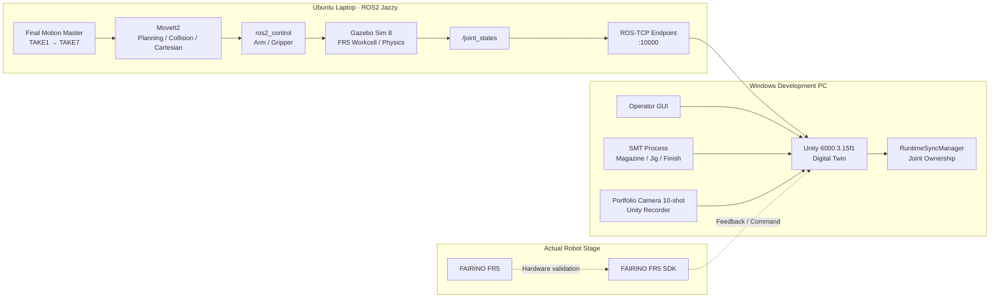
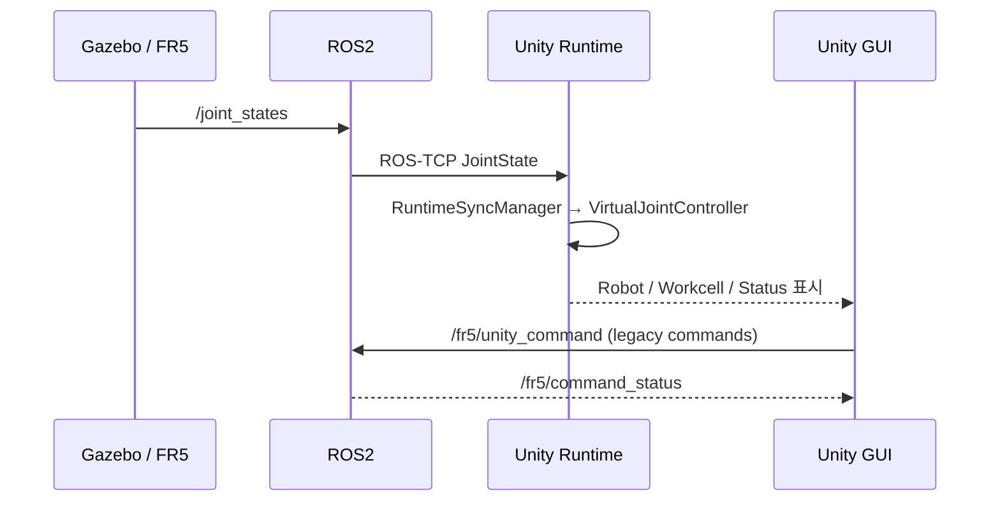
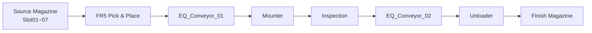
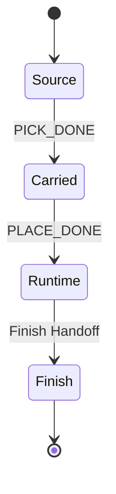
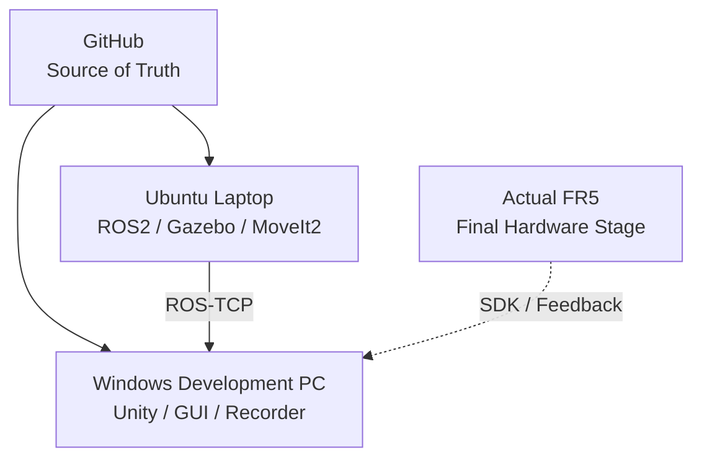

<a id="top"></a>

# FAIRINO FR5 Digital Twin

> **ROS2 · Gazebo · MoveIt2 · Unity를 분리된 책임 계층으로 연결하고, FAIRINO FR5의 Pick & Place·Workcell·공정 상태를 Simulation에서 검증한 뒤 실제 Robot 연동까지 확장하는 개인 디지털 트윈 프로젝트입니다.**

[문서 목차](docs/README.md) · [Architecture](docs/02_architecture.md) · [Validation](docs/05_validation.md) · [Unity](docs/09_unity_digital_twin.md) · [Laptop Runtime](docs/15_laptop_ros2_simulation_runtime.md)

## 프로젝트 한눈에 보기

| 항목 | 내용 |
|:---|:---|
| 프로젝트 | FAIRINO FR5 Digital Twin |
| 개발 형태 | 개인 개발 프로젝트 |
| 개발 기간 | 약 6개월 |
| Robot | FAIRINO FR5 |
| ROS2 환경 | Ubuntu 24.04.4 LTS, ROS2 Jazzy |
| Simulation | Gazebo Sim 8, ros2_control, MoveIt2, RViz2 |
| Digital Twin | Unity 6000.3.15f1, C# |
| 주요 언어 | Python, C# |
| 핵심 범위 | Motion Planning, Workcell Simulation, ROS2 JointState Sync, Unity GUI/Process, Camera/Recording, FR5 SDK Interface |
| 최종 Simulation 범위 | TAKE1~TAKE7 |
| 운영 제외 | TAKE8 / Slot08 Jig |
| 현재 단계 | Laptop Simulation Runtime 완료 → Windows Unity Live Integration 및 촬영 준비 |

## 핵심 성과

| 성과 | 결과 |
|:---|:---|
| Final Motion Master | TAKE1→TAKE7 전체 Simulation 실행 PASS |
| Motion Guard | 모든 검증 Trajectory에서 Negative-J6 Branch 검사 |
| Planning Scene | 주요 Facility Collision Object 4개 검증 |
| Laptop Runtime | fresh build + true headless Gazebo + MoveIt2 재검증 |
| Simulation 성능 | Gazebo headless RTF `0.998`, MoveIt2 포함 `0.997` |
| Unity Camera | 4 RT Camera + Main + 10 Portfolio Shot = 총 15 Camera |
| Unity Camera 출력 | Game View output 1개 / AudioListener 1개 |
| Unity Camera 전환 | `1~9`, `0`, `` ` `` 전환 Play Mode 확인 |
| Unity Recorder | `com.unity.recorder@5.1.7` 설치 및 FHD 1080p30 설정 |
| UI Button Audit | 96개 Button Read-only Audit, Missing Target/Method/Script 0 |
| STOP UI | 중복 listener 제거 후 단일 STOP entry point 확인 |
| Workcell GUI | Runtime 상태 Text binding 및 한국어 표시 구조 연결 |

## 전체 시스템 아키텍처



### 계층별 책임

| 계층 | 책임 | 하지 않는 일 |
|:---|:---|:---|
| ROS2 | State, Command, Status, TF 전달 | Unity 화면 연출 |
| Gazebo | Robot/Workcell Physics, Controller Runtime | UI/Portfolio Camera |
| MoveIt2 | IK, Joint/Cartesian Planning, Collision | Workcell 공정 연출 |
| Unity | Digital Twin, GUI, Jig Ownership, SMT Process, Camera | Robot Motion 재계산 |
| FR5 SDK | 실제 Robot State/Command Interface | Simulation PASS 대체 |

## End-to-End 데이터 흐름



`RUN_TAKE` Backend dispatch와 Actual FR5 Hardware 실행은 현재 별도 통합 단계입니다.

## 주요 구현

### ROS2 / Gazebo / MoveIt2

- FR5 Robot, Robot Table, Magazine, Conveyor, Jig를 포함한 Workcell 구성
- Gazebo 설비와 MoveIt Planning Scene의 Collision Object 정합
- Slot별 PREGRASP / PICK / Extract / Carry / Pre-Insert / Straight Insert / Retreat 구성
- LIVE TF 기반 Jig rigid follower
- Cartesian 접근·삽입 구간 검증
- Trajectory 전체 Point Negative-J6 Guard
- TAKE1~TAKE7 Final Master 누적 검증
- Slot08 Jig 미생성 및 TAKE8 운영 제외
- Laptop Runtime에서 true headless Gazebo 지원 및 RTF 재검증

### Unity Digital Twin

- ROS2 `/joint_states` → Unity J1~J6 Runtime Sync
- Runtime Source ownership 분리
- Source Magazine Slot01~07 / Slot08 EMPTY
- Source → Carried → Runtime → Finish Jig Visual Ownership
- Conveyor01 → Mounter → Inspection → Conveyor02 → Unloader → Finish Magazine 공정
- External FR5 Input과 Unity Offline Process 분리
- Workcell Runtime Status UI
- Camera 10-shot + Follow + Camera Director
- Unity Recorder 기반 포트폴리오 촬영 준비
- UI Button 96개 연결 상태 Read-only Audit

### FR5 SDK / Robot Interface

- Simulation / Read-only Feedback / Actual Command 경계 분리
- 실제 Robot Command 전 Read-only Feedback 우선
- Unity Runtime Source와 실제 SDK Source ownership 분리
- Simulation PASS와 Actual Robot PASS를 별도 상태로 관리

## Workcell 공정 흐름



### Jig Ownership



## Validation Matrix

상태는 서로 다른 검증 계층을 섞지 않고 기록합니다.

| 계층 | 검증 항목 | 상태 |
|:---|:---|:---:|
| ROS2 Source | Laptop local / origin parity | PASS |
| Build | Laptop fresh `colcon build --symlink-install` | PASS |
| Gazebo | Workcell / ros2_control / `/clock` / `/joint_states` | PASS |
| MoveIt2 | Planning Scene / Cartesian / Collision | PASS |
| Motion | TAKE1→TAKE7 Final Simulation `--execute` | PASS |
| Motion | TAKE8 / Slot08 Jig | 운영 제외 |
| Performance | true headless RTF `0.998`, + MoveIt2 `0.997` | PASS |
| Unity | Camera 01~10 switching | PASS |
| Unity | Game View output 1 / AudioListener 1 | PASS |
| Unity | STOP listener 1 | PASS |
| Unity | Workcell Status Text binding | PASS |
| Unity | UI Button 96개 static/read-only audit | AUDITED |
| Recorder | `com.unity.recorder@5.1.7` 설치 | PASS |
| Recorder | FHD 1080p30 H.264 설정 | PASS |
| Recorder | 실제 MP4 sample | PENDING |
| ROS2 ↔ Unity | Live JointState E2E | PENDING |
| Unity → TAKE | `RUN_TAKE` dispatch / correlation / BUSY / STOP | PENDING |
| Actual FR5 | Hardware Feedback / Command / Safety | PENDING |


> `AUDITED` = read-only/static connection audit completed; remaining Runtime source trace is not promoted to functional PASS.
## 주요 문제 해결

| 문제 | 원인 | 해결 |
|:---|:---|:---|
| 높은 Slot 접근 간섭 | Slot 높이 증가로 Magazine Frame 여유 감소 | PREGRASP + 짧은 Cartesian Approach |
| Wrist Branch 변경 | 끝점만 확인하면 중간 Trajectory Branch 전환 가능 | 전체 Point Negative-J6 Guard |
| Gazebo / MoveIt 정합 | Physics World와 Planning Scene 기준 차이 | Robot Base 고정 + Planning Scene 변환 보정 |
| Jig Carry 불연속 | Set Pose 방식은 Tool-Jig 관계를 잃음 | LIVE TF rigid follower |
| Unity Jig 중복 | Source/Tool/Process/Finish가 동시에 표시 | Visual Ownership State 분리 |
| Laptop Simulation timeout | GUI 부하로 RTF 저하 | true headless server-only 실행 |
| Camera 다중 출력 | Main + Process Camera 동시 출력 및 AudioListener 중복 | Camera Director + 단일 Game View output |
| STOP 중복 호출 | 동일 STOP path listener 중복 | 단일 STOP entry point |
| 촬영 자료 부족 | 화면 녹화만으로 공정별 컷 구성 어려움 | 10-shot Camera + Unity Recorder |

## 개발 / 배포 구조



ROS2 Final Runtime HEAD:

```text
f02799cfd3126210ef72238990861c9c027c84af
```

Final Motion Master SHA256:

```text
80009dda5e196e8afbc4242bd859a35b5982d0efef531fdcc9286293f4ae59be
```

## 기술 스택

| 구분 | 기술 |
|:---|:---|
| Robot | FAIRINO FR5 |
| Robotics | ROS2 Jazzy, MoveIt2, TF, JointState, ros2_control |
| Simulation | Gazebo Sim 8, RViz2 |
| Digital Twin | Unity 6000.3.15f1, C# |
| Recording | Unity Recorder 5.1.7 |
| Robot Interface | FAIRINO FR5 SDK |
| Programming | Python, C# |
| Validation | ROS2 CLI, Gazebo CLI, Python contract tests, Unity Editor/Play Mode Audit |
| Version Control | Git, GitHub |

## 상세 문서

| 문서 | 핵심 내용 |
|:---|:---|
| [01. Overview](docs/01_overview.md) | 목표, 범위, 결과, 현재 단계 |
| [02. Architecture](docs/02_architecture.md) | 전체 계층 구조와 책임 경계 |
| [03. Features](docs/03_features.md) | 기능별 구현/검증 상태 |
| [04. Data Flow](docs/04_data_flow.md) | JointState, Command, Jig, Process 흐름 |
| [05. Validation](docs/05_validation.md) | 계층별 검증 결과와 증거 |
| [06. Project Scope](docs/06_project_scope.md) | 포함/제외 범위와 남은 통합 |
| [07. Project Structure](docs/07_project_structure.md) | ROS2/Unity Source Tree |
| [08. ROS2 / Gazebo / MoveIt2](docs/08_ros2_gazebo_moveit.md) | Workcell, Planning Scene, Motion |
| [09. Unity Digital Twin](docs/09_unity_digital_twin.md) | Runtime Sync, GUI, Process, Camera |
| [10. FR5 SDK Integration](docs/10_fr5_sdk_integration.md) | 실제 Robot Interface와 안전 경계 |
| [11. Motion & Slot Validation](docs/11_motion_and_slot_validation.md) | TAKE1~07 / Slot / Trajectory 검증 |
| [12. Script Reference](docs/12_script_reference.md) | 핵심 Script와 책임 |
| [13. Design Decisions & Issues](docs/13_design_decisions_and_issues.md) | 문제-원인-결정-결과 |
| [14. Deployment & Laptop Handoff](docs/14_deployment_and_handoff.md) | Source of Truth, 배포, Hardware 경계 |
| [15. Laptop ROS2 Simulation Runtime](docs/15_laptop_ros2_simulation_runtime.md) | 노트북 Runtime / headless / RTF / Final TAKE |
| [16. Unity Camera & Recording](docs/16_unity_camera_and_recording.md) | Portfolio Camera, Recorder, UI Audit |

## 현재 남은 작업

1. Unity Recorder 5~10초 MP4 sample 생성 및 파일 검증
2. UI Reset 계열 2개 listener와 TAKE/Slot Runtime `AddListener` source trace 최종 확인
3. Laptop ROS-TCP Endpoint ↔ Windows Unity Live JointState E2E 검증
4. 최종 촬영 시 Camera pose/FOV 미세조정
5. Gazebo + RViz + Unity 동시 화면 및 Unity clean B-roll 촬영
6. Unity `RUN_TAKE` → Backend Master dispatch / status correlation / active STOP 통합
7. Actual FAIRINO FR5 SDK Feedback / Command / Safety 검증 및 최종 촬영

> 현재 가장 강하게 검증된 상태는 **Laptop Simulation Runtime + TAKE1→TAKE7 Final Simulation PASS**입니다. Unity Live Integration과 Actual Robot Hardware Validation은 별도 PASS 상태로 확정합니다.

---

[↑ 맨 위로](#top) · [문서 목차](docs/README.md)
