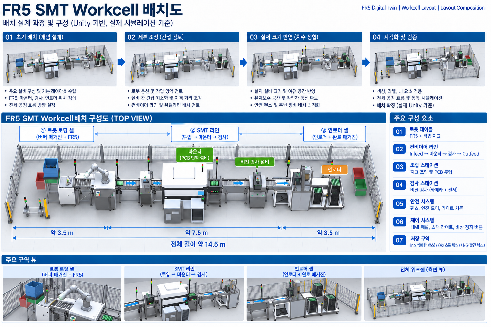
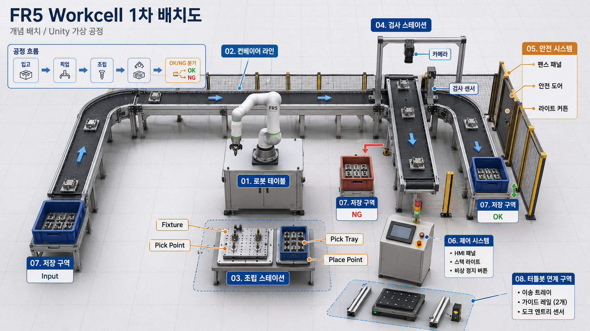
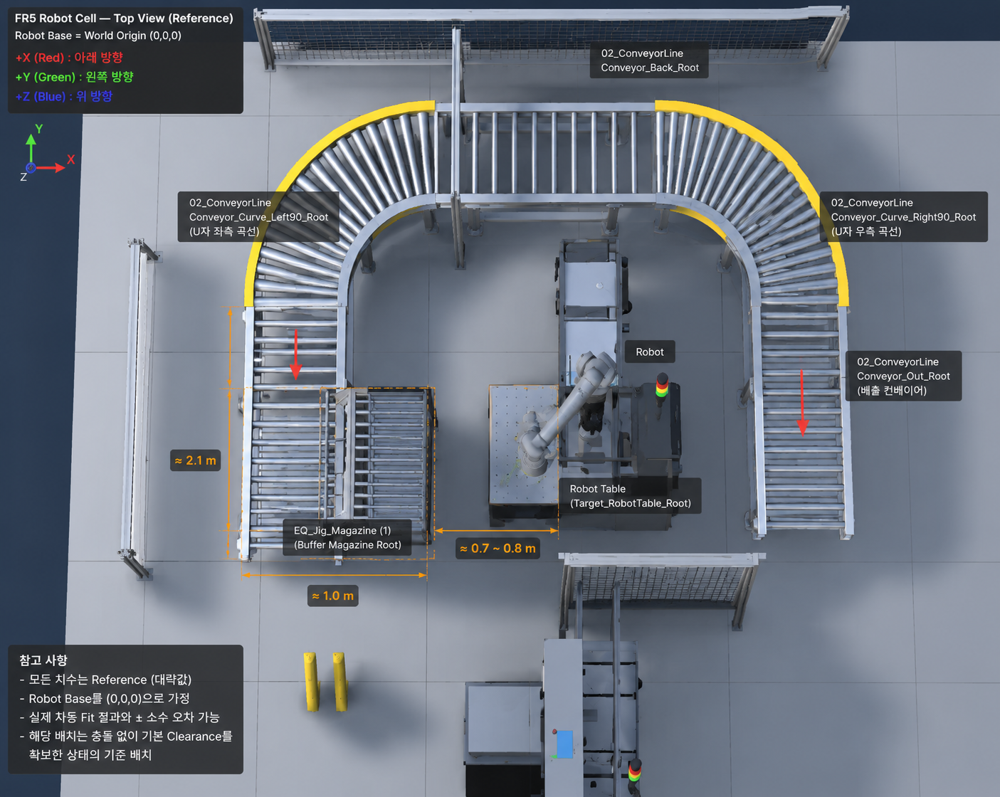
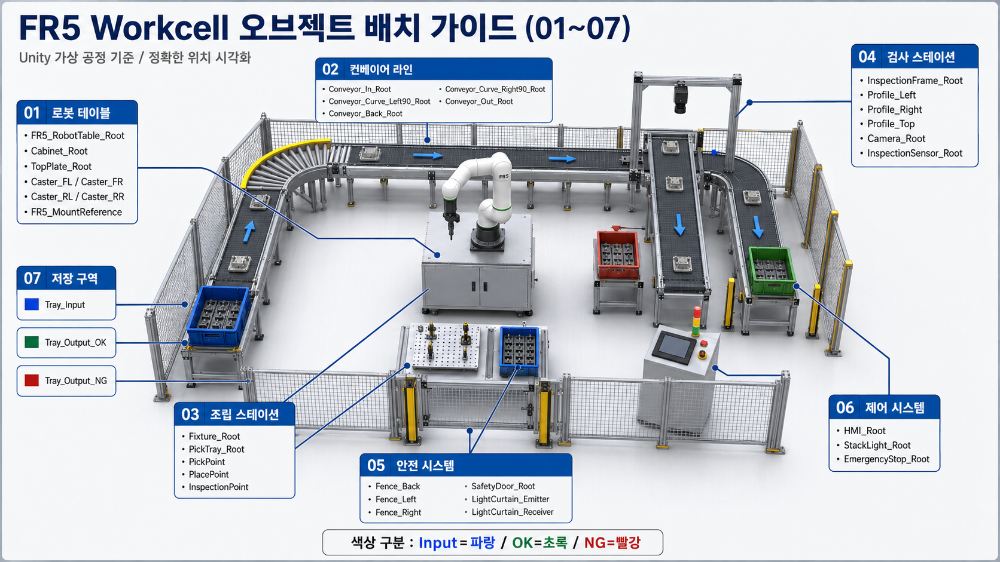
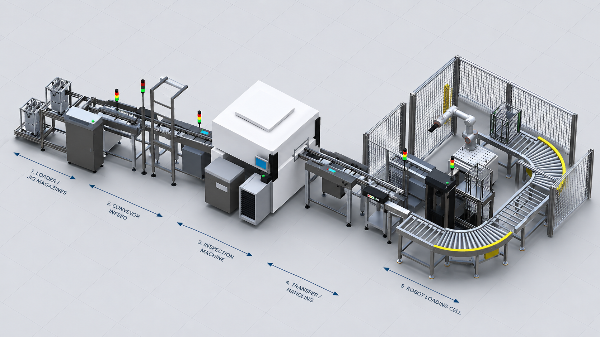
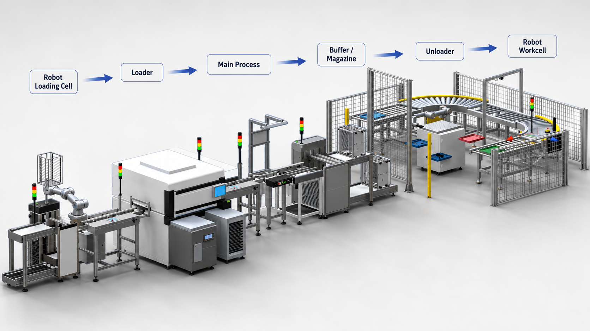
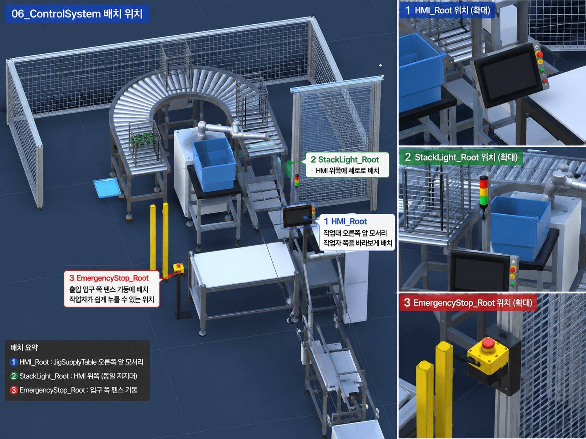
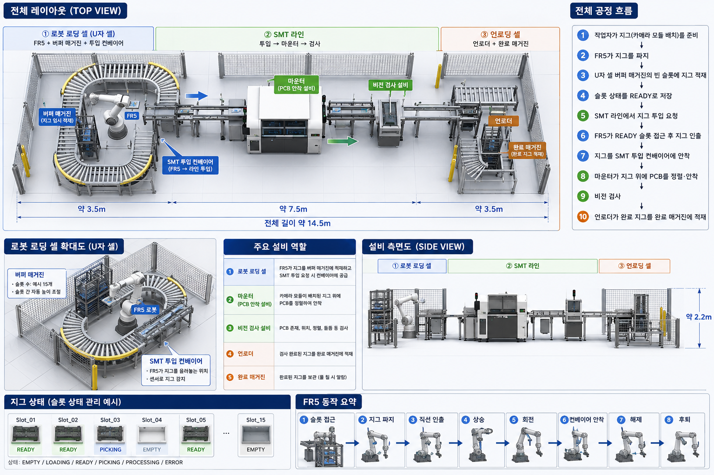
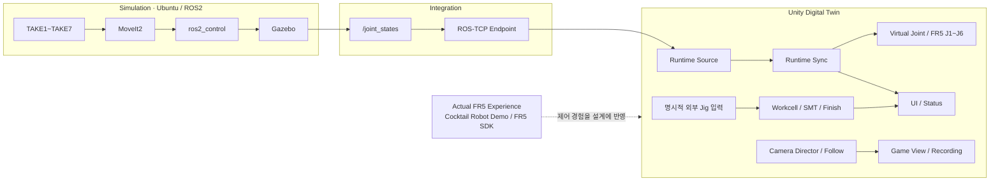
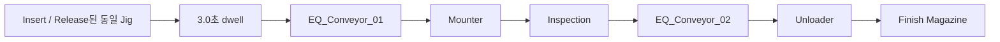

# FAIRINO FR5 Digital Twin

## 🎬 메인 시뮬레이션 영상

**FR5 Digital Twin · Unity ↔ ROS2 통합 시뮬레이션**

https://github.com/user-attachments/assets/6a58e340-b840-4f03-bba1-41d7353b24d7

ROS2 기반 FR5 동작과 Unity Digital Twin 연동 결과를 확인할 수 있는 대표 실행 영상입니다.

[▶ 원본 MP4 파일](media/portfolio/videos/01_unity_ros2.mp4)

---

> 실제 FR5 SDK 제어 경험을 바탕으로 ROS2·Gazebo·MoveIt2 시뮬레이션과 Unity의 관절 동기화, SMT 공정, 운영 UI, Camera/Recording을 구성한 개인 디지털 트윈 프로젝트입니다.

[문서 목록](docs/README.md) · [Architecture](docs/02_architecture.md) · [Validation](docs/05_validation.md) · [핵심 코드](docs/12_script_reference.md)

## 프로젝트 한눈에 보기

| 항목 | 내용 |
|---|---|
| 개발 형태 / 기간 | 개인 개발 / 약 6개월 |
| Robot | FAIRINO FR5 |
| Simulation | Ubuntu 24.04.4 LTS, ROS2 Jazzy, Gazebo Sim 8, ros2_control, MoveIt2, RViz2 |
| Digital Twin | Windows, Unity 6000.3.15f1, C# |
| 수학 검증 | Python/NumPy MDH FK, Unity C# FK, 좌표·축·pose 오차 비교 |
| 공정 | Source Slot01~07, Slot08 EMPTY, SMT 및 Finish Magazine |
| 촬영 | 10개 Portfolio Shot, Camera Director/Follow, FHD 1080p30 Recording |

---

## 배치 설계 과정

### 초기 배치 구성

아래 구성도는 FR5 Robot Loading Cell, SMT Line, Unloader Cell을 중심으로
설비 위치와 전체 공정 흐름을 검토하기 위해 작성한 초기 배치 구성입니다.

### 단계별 배치 검토

설비 간 간섭, FR5 작업 영역, 컨베이어 동선, 안전 설비 및 작업 공간을 검토하면서
Unity Workcell 배치를 단계적으로 조정했습니다.

| 단계 | 배치 검토 이미지 |
| --- | --- |
| 1차 배치 |  |
| 2차 배치 |  |
| 오브젝트 배치 01 |  |
| 오브젝트 배치 02 |  |
| 오브젝트 배치 03 |  |
| 오브젝트 배치 04 |  |
| 전체 레이아웃 검토 |  |

---

## 구현 및 실행 영상

### 01. Unity ↔ ROS2 통합 시뮬레이션

README 상단의 대표 영상과 동일한 영상입니다.
ROS2 JointState 기반 Unity Digital Twin 동기화 결과를 확인할 수 있습니다.

[▶ 원본 MP4 파일](media/portfolio/videos/01_unity_ros2.mp4)

### 02. SMT 공정

https://github.com/user-attachments/assets/37a3b3e5-2e98-4f9f-b839-cdc8ade48ca1

Jig 투입 → Mounter → Inspection → Conveyor → Unloader 공정을 확인할 수 있습니다.

[▶ 원본 MP4 파일](media/portfolio/videos/02_smt_process.mp4)

### 03. FR5 Jig 공급

https://github.com/user-attachments/assets/cacf7f8b-68bf-4510-889e-4aeaa54ac785

FR5의 Magazine Jig Pick, 이송, Insert 및 Release 동작을 확인할 수 있습니다.

[▶ 원본 MP4 파일](media/portfolio/videos/03_fr5_jig_supply.mp4)

---

## 핵심 성과

| 영역 | 결과 |
|---|---|
| ROS2 Motion | TAKE1~TAKE7 Pick·Carry·Insert·Release 시뮬레이션 실행 |
| Planning Scene | 주요 설비 Collision Object 4개 구성 및 검증 |
| Jig 운반 | LIVE Tool TF와 Tool-to-Jig 상대변환을 이용한 rigid follower |
| Trajectory 정책 | trajectory point별 negative J6 검사 |
| Runtime | 선택된 feedback source를 기존 FR5 joint mapping에 적용 |
| SMT | 동일 외부 Jig의 3초 dwell, 공통 선속도 이송, Finish 무회전 삽입 |
| UI / Camera | 공정 상태 표시, 단일 Game View 및 AudioListener, 수동 shot 전환 |
| Recording | FHD 1080p30 Recording 구성 완료 |
| 수학 검증 | 독립 FK 구현, joint case 및 position/rotation tolerance 기반 비교 구조 |

## 실제 FR5 SDK 경험과 Digital Twin 확장

FR5 SDK 기반 실제 로봇 제어는 [Cocktail Robot Demo](demos/README.md)에서 수행했으며,
Digital Twin 프로젝트에서는 해당 제어 경험을 바탕으로 ROS2/Gazebo/MoveIt2 시뮬레이션과 Unity Runtime/Interface 구조를 구성했습니다.

| Cocktail Robot Demo | Digital Twin |
|---|---|
| 실제 FR5 SDK와 Robot motion | MoveIt2 planning과 Gazebo controller |
| Gripper, DIO, Lua motion sequence | JointState, Runtime Source, Unity joint visualization |
| 메뉴 제조·Pick & Place 시연 | SMT 공정, 운영 UI, Camera/Recording |

두 프로젝트의 실행 환경과 결과는 각각 설명합니다. SDK 경험을 Digital Twin의 실물 공정 실행 결과로 바꾸어 표시하지 않습니다.

## 시스템 아키텍처

JointState는 로봇 관절 표시 입력입니다. SMT 시작은 외부 Jig 입력 API가 담당하며,
관절 시각화 자체가 공정을 자동 시작하지 않습니다.

## ROS2 / Simulation

[ROS2 저장소](https://github.com/seongyeop-dev/fr5_ros2_ws/tree/feat/fr5-gazebo-jig-attach-detach)는 별도로 관리합니다.

- 최종 `slot01_to_slot08_final_one_take.py`가 TAKE1~TAKE7을 실행합니다.
- Planning Scene, Cartesian 경로, negative J6 정책을 실행 경로에 적용합니다.
- LIVE Tool TF 기반 Jig follower와 release 후 conveyor flow를 구성했습니다.
- `/joint_states`는 Gazebo controller feedback이며 `/fr5/joint_states` 테스트 publisher와 구분합니다.
- 노트북 fresh build와 headless 실행에서 RTF `0.998`, MoveIt2 포함 `0.997`을 기록했습니다.

[Simulation 구현](docs/08_ros2_gazebo_moveit.md) · [노트북 실행 결과](docs/15_laptop_ros2_simulation_runtime.md)

## Unity Digital Twin

`scr_FR5RuntimeSyncManager`가 선택 source를 polling하고
`scr_VirtualJointController`가 기존 J1~J6 local rotation mapping에 값을 적용합니다.
UI 명령, feedback, SMT 공정, Camera는 책임을 분리했습니다.

기존 ROS2 명령은 `/fr5/unity_command`, 응답은 `/fr5/command_status`를 사용합니다.
Camera Director는 시간 기반 shot 전환을 수행하고 Follow는 자신의 Camera만 이동합니다.

[Unity Runtime 구조](docs/09_unity_digital_twin.md) · [Camera/Recording](docs/16_unity_camera_and_recording.md)

## Mathematical / Kinematic Validation

FR5 모델은 단순히 Unity Transform을 눈대중으로 맞춘 것이 아니라,
Python MDH 기반 Forward Kinematics와 Unity C# FK를 별도로 구현해
joint case, 좌표계, 축 방향, position/rotation error를 비교하는 검증 구조를 사용했습니다.

Python canonical MDH와 기존 C# FK는 transform order가 서로 다릅니다.
여기서 소개하는 성과는 독립 비교 구조와 개발 과정의 축·좌표 검증이며,
두 최종 구현 또는 제조사 기준의 완전 일치를 주장하지 않습니다.

[Python FK](Python/Phase1_Kinematics/Python_MDH/fr5_fk_solver.py) · [수학 검증 상세](docs/05_validation.md)

## Workcell

Source Magazine의 Slot01~07과 Finish Magazine의 `filledSlots[]`는 별도 설비입니다.
ExternalFr5 모드는 자동 Jig 생성과 자동 다음-cycle 시작을 차단합니다.
이송은 `duration = world_distance / 0.15 m/s`로 통일하고 공정 체류시간을 분리했습니다.
Finish는 world-Y Lift 정렬, 회전 없는 수평 삽입, runtime Jig→filledSlot 표시 전환을 수행합니다.

## Validation

| 구분 | 결과의 의미 |
|---|---|
| Python / C# FK | 독립 계산·좌표 변환·오차와 허용치 비교 구조 |
| ROS2 / Simulation | TAKE1~TAKE7, Planning Scene, Jig follower 실행 결과 |
| ROS2 ↔ Unity | JointState 기반 Runtime 연동 구조 구현 |
| Unity SMT | 외부 Jig 입력, 공통 이송, Finish hand-off 코드·공정 검증 |
| Unity Camera | Camera switching, 단일 출력·AudioListener 구성 |
| Recorder | FHD 1080p30 Recording 구성 완료 |
| 실제 FR5 SDK 경험 | Cocktail Robot Demo의 Robot·Gripper·DIO·Lua 시연 |

수치·실행 환경·코드 검증의 의미는 [Validation](docs/05_validation.md)에 구분해 기록했습니다.

## 문제 해결

| 문제 | 설계 및 결과 |
|---|---|
| 높은 Slot의 접근 간섭 | TAKE별 seed, PREGRASP와 Cartesian 접근 |
| 중간 trajectory의 wrist branch 변경 | 전체 point의 negative J6 검사 |
| Gazebo와 MoveIt 기준 차이 | Robot Base 고정, 설비/PlanningScene 좌표 변환 분리 |
| Jig Carry 불연속 | LIVE Tool TF와 고정 상대변환으로 pose 갱신 |
| SMT 구간별 속도 차이 | 거리/공통 속도로 duration 계산 |
| Finish 삽입 직전 회전 | 도착 orientation 보존, 수평 translation만 수행 |
| 노트북 RTF 저하 | Motion 재튜닝 없이 true headless 실행 |
| Camera 및 STOP 중복 출력 | Camera 출력 소유권과 버튼 entry point 분리 |

[설계 결정과 문제 해결](docs/13_design_decisions_and_issues.md)

## 기술 스택

| 영역 | 기술 |
|---|---|
| Robot 경험 | FAIRINO FR5 SDK, Gripper, DIO, Lua |
| Robotics | ROS2 Jazzy, JointState, TF, MoveIt2, ros2_control |
| Simulation | Gazebo Sim 8, RViz2 |
| Digital Twin | Unity 6000.3.15f1, C#, ROS-TCP Connector |
| Mathematical Validation | Python, NumPy, C# Matrix4x4 |
| Camera / Recording | Camera Director/Follow, Unity Recorder 5.1.7, H.264 MP4 |
| 관리 | Git, GitHub, Windows/Ubuntu 분리 환경 |

## 상세 문서

[구조와 책임](docs/02_architecture.md), [데이터 흐름](docs/04_data_flow.md),
[수학·공정 검증](docs/05_validation.md), [핵심 Script Reference](docs/12_script_reference.md),
[배포 구성](docs/14_deployment_and_handoff.md)에서 구현을 연결해 설명합니다.

## 프로젝트 완료 정리

실제 FR5 제어 경험을 시뮬레이션, 관절 feedback, 독립 FK 검증, SMT 공정,
운영 UI와 촬영 구조로 확장했습니다. ROS2와 Unity는 관절 데이터 및 명령 계약으로 연결하고,
Jig 공정과 Camera는 별도 입력·소유권을 갖도록 구성했습니다.

이 저장소는 Unity 핵심 소스, Python validation subset, read-only C# Bridge와 설명 문서를 제공합니다.
개발 Scene의 구성과 공개 소스 묶음의 관계는 [프로젝트 구조](docs/07_project_structure.md)에 정리했습니다.

---

## 문서 목차

### 기본 문서

| 번호 | 문서 | 내용 |
| ---: | --- | --- |
| **01** | [Overview](docs/01_overview.md) | 프로젝트 배경과 핵심 결과 |
| **02** | [Architecture](docs/02_architecture.md) | Simulation, Integration, Unity, 수학 검증 계층 |
| **03** | [Features](docs/03_features.md) | 구현 기능과 책임 |
| **04** | [Data Flow](docs/04_data_flow.md) | Joint, Command, Jig, Camera 흐름 |
| **05** | [Validation](docs/05_validation.md) | 수학·시뮬레이션·Unity 검증 |
| **06** | [Project Scope](docs/06_project_scope.md) | 프로젝트별 실행 환경과 설계 경계 |
| **07** | [Project Structure](docs/07_project_structure.md) | 공개 소스와 별도 ROS2 저장소 |

### 상세 기술 문서

| 번호 | 문서 | 내용 |
| ---: | --- | --- |
| **08** | [ROS2 / Gazebo / MoveIt2](docs/08_ros2_gazebo_moveit.md) | Workcell, Planning, TF follower |
| **09** | [Unity Digital Twin](docs/09_unity_digital_twin.md) | 핵심 Runtime Script 구조 |
| **10** | [FR5 SDK Interface](docs/10_fr5_sdk_integration.md) | 실제 제어 경험과 Read-only Bridge |
| **11** | [Motion & Slot Validation](docs/11_motion_and_slot_validation.md) | TAKE1~TAKE7 및 Trajectory 검사 |
| **12** | [Script Reference](docs/12_script_reference.md) | 실제 코드 경로·역할·의존 관계 |
| **13** | [Design Decisions](docs/13_design_decisions_and_issues.md) | 주요 문제와 해결 |
| **14** | [Deployment](docs/14_deployment_and_handoff.md) | Unity·Python·Bridge·ROS2 실행 환경 |
| **15** | [Simulation Runtime](docs/15_laptop_ros2_simulation_runtime.md) | Headless, RTF, 노트북 실행 결과 |
| **16** | [Camera & Recording](docs/16_unity_camera_and_recording.md) | 시점 전환·관찰·녹화 설정 |

### 추가 자료

| 구분 | 바로가기 |
| --- | --- |
| **전체 문서 인덱스** | [docs/README](docs/README.md) |
| **수학 · 기구학 검증** | [Validation](docs/05_validation.md) · [Motion Validation](docs/11_motion_and_slot_validation.md) · [MDH Parameters](Python/Phase1_Kinematics/Python_MDH/fr5_mdh_params.py) · [Python FK Solver](Python/Phase1_Kinematics/Python_MDH/fr5_fk_solver.py) · [Kinematics Tests](Python/Phase1_Kinematics/Tests/) |
| **실제 FR5 · Cocktail Demo** | [Demo Hub](demos/README.md) · [FR5 SDK Cocktail Robot Demo](demos/01_fr5_sdk_cocktail_robot_demo/README.md) |
| **ROS2 Simulation** | [ROS2 / Gazebo / MoveIt2](docs/08_ros2_gazebo_moveit.md) · [fr5_ros2_ws Repository](https://github.com/seongyeop-dev/fr5_ros2_ws) |

[맨 위로 이동](#fairino-fr5-digital-twin)

