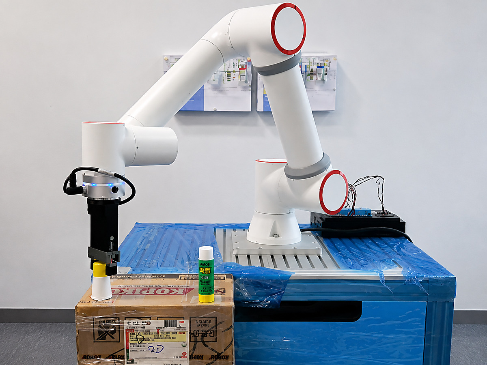
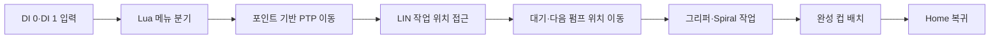

# FR5 Cocktail Robot Demo

> FR5 Unity Digital Twin 개발 과정에서 실제 FR5 로봇의 Pick & Place와 메뉴별 칵테일 제조 순서를 검증한 중간 시연 데모

  

  

## 프로젝트 정보

| 항목 | 내용 |
|:---|:---|
| 프로젝트 유형 | 교육과정 팀 평가·중간 시연 |
| 개발 기간 | 2026.04 |
| 팀 | JOINT Robotics Team |
| 대상 장비 | FR5 협동로봇, 전동 그리퍼, 칵테일 주입 설비 |
| 제어 방식 | Lua, PTP·LIN·Spiral, Digital Input |
| 개인 담당 | Pick & Place 포인트·Lua 스크립트 작성, 실제 로봇 테스트 |
| 팀 통합 결과 | DI 입력에 따른 메뉴 분기와 메뉴별 칵테일 제조 순서 시연 |
| 상태 | 실제 FR5 Pick & Place·칵테일 제조 시연 완료 |

## 프로젝트 개요

FR5 협동로봇으로 컵과 뚜껑을 이동하고, 선택된 메뉴에 맞는 펌프 위치를 순차 방문한 뒤 혼합·배치·Home 복귀까지 수행한 실제 장비 데모입니다.

개인 담당은 `src/pickplace_demo.lua`와 Pick & Place 포인트 작성·검증이며, 메뉴 분기와 칵테일 제조 전체 흐름은 팀 통합 결과로 구분했습니다. 이 저장소는 진행 중인 FR5 Unity Digital Twin 전체 프로젝트가 아니라, 실제 로봇 모션과 작업 순서를 먼저 검증한 완료된 중간 시연 결과입니다.

## 실제 시연

### 메뉴 1 칵테일 제조

https://github.com/user-attachments/assets/cf88de8c-905b-447e-8219-2e3397632f3b

[저장소 내 메뉴 1 MP4](media/videos/cocktail_menu_1_demo.mp4)

### 메뉴 2 칵테일 제조

https://github.com/user-attachments/assets/35344861-3f42-4fa2-84fd-417328b16050

[저장소 내 메뉴 2 MP4](media/videos/cocktail_menu_2_demo.mp4)

### Pick & Place

https://github.com/user-attachments/assets/8243ff3b-2c99-4359-b131-a1d3bf114007

[저장소 내 Pick & Place MP4](media/videos/pickplace_demo.mp4)

## 주요 기능

| 기능 | 구현 내용 |
|:---|:---|
| Pick & Place | Home·접근·파지·이송·배치·복귀 순서를 실제 FR5에서 수행 |
| 메뉴 분기 | `GetDI(0,0)`과 `GetDI(1,0)` 입력으로 메뉴 1·2 선택 |
| 메뉴별 제조 | 메뉴 1은 펌프 위치 1~3, 메뉴 2는 펌프 위치 4~6 순차 방문 |
| 모션 구분 | PTP로 주요 위치 이동, LIN으로 작업 위치 접근·이탈 |
| 그리퍼 제어 | 컵과 뚜껑의 파지·해제 시점에 `MoveGripper` 실행 |
| 혼합·복귀 | Spiral 모션 수행 후 완성 컵 배치와 Home 복귀 |

상세 작업 순서는 [주요 기능 문서](docs/03_features.md)에서 확인할 수 있습니다.

## 제어 구조

## 구현 근거

| 근거 | 내용 |
|:---|:---|
| `src/pickplace_demo.lua` | 개인 Pick & Place 제어 순서 |
| `src/cocktail_menu_demo.lua` | 팀 통합 메뉴 분기·칵테일 제조 순서 |
| `data/web_point.db` | `points` 테이블, 23개 컬럼, 107개 포인트 레코드 |
| `archive/` | 개인·팀 원본 프로그램 보관 자료 |
| 시연 자료 | 메뉴 1, 메뉴 2, Pick & Place 영상과 작업 순서 이미지 |

## 검증 결과

| 영역 | 검증 항목 | 결과 |
|:---|:---|:---:|
| Pick & Place | 접근·파지·이송·배치·Home 복귀 | PASS |
| 메뉴 1 | DI 0 분기와 펌프 위치 1~3 순차 방문 | PASS |
| 메뉴 2 | DI 1 분기와 펌프 위치 4~6 순차 방문 | PASS |
| 로봇 동작 | PTP·LIN·MoveGripper·Spiral 실행 | PASS |
| 공개 자료 | 영상 3개·이미지 6개·Lua 2개·포인트 DB 확인 | PASS |

정량적인 반복 성공률, 사이클타임과 위치 오차는 별도로 기록하지 않았습니다.

## 기술 스택

| 구분 | 기술 |
|:---|:---|
| Robot | FR5 Collaborative Robot |
| Language | Lua |
| Motion | PTP, LIN, Spiral |
| End Effector | Electric Gripper |
| Input | Digital Input |
| Data | SQLite Point Database |
| Documentation | Git, GitHub, Markdown |

## 프로젝트 범위

이 저장소의 최종 범위는 실제 FR5에서 Pick & Place와 메뉴 2종의 제조 순서를 시연하고, 이를 코드·포인트 DB·영상·이미지로 정리하는 것입니다.

Python FK, Unity Digital Twin, ROS2·Gazebo·MoveIt, 실제 SDK 실시간 연동 등은 별도 진행 중인 FR5 Digital Twin 프로젝트의 범위이며 이 저장소의 구현 성과에 포함하지 않습니다.

## 상세 문서

| 문서 | 내용 |
|:---|:---|
| [문서 목록](docs/README.md) | 상세 문서 전체 목록 |
| [01. 프로젝트 개요](docs/01_overview.md) | 배경, 목적과 담당 범위 |
| [02. 시스템 아키텍처](docs/02_architecture.md) | FR5·Lua·포인트·입력 구조 |
| [03. 주요 기능](docs/03_features.md) | Pick & Place와 메뉴별 제조 순서 |
| [04. 데이터 흐름](docs/04_data_flow.md) | 입력부터 Home 복귀까지의 흐름 |
| [05. 검증 결과](docs/05_validation.md) | 실제 장비 검증 결과 |
| [06. 프로젝트 범위](docs/06_project_scope.md) | 주요 구현 과제와 최종 범위 |
| [07. 프로젝트 구조](docs/07_project_structure.md) | 저장소 구조와 핵심 파일 |
| [실제 FR5 로봇 시연](docs/demo/README.md) | 실제 FR5 시연 영상 |

## 외부 리소스 및 공개 범위

외부 참고 사례는 [References](references/README.md)에 출처를 구분해 기록했습니다. 저장소에는 공개 가능한 Lua 스크립트, 포인트 DB, 실제 시연 영상과 이미지 자료만 포함하며 장비 계정·네트워크 주소·인증 정보는 포함하지 않습니다.
