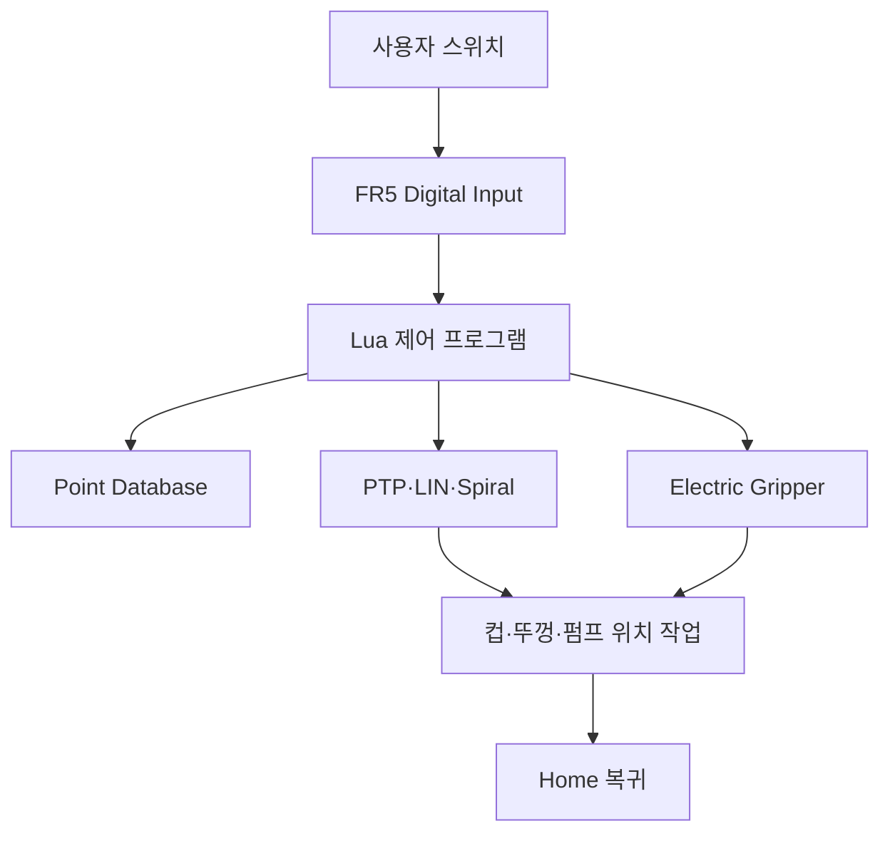

# 02. 시스템 아키텍처

## 전체 구조

## 주요 구성 요소

| 구성 | 역할 |
|:---|:---|
| FR5 Controller | Lua 실행과 포인트 기반 로봇 모션 수행 |
| `cocktail_menu_demo.lua` | DI 입력 분기와 메뉴별 제조 순서 |
| `pickplace_demo.lua` | 개인 Pick & Place 제어 순서 |
| `web_point.db` | 관절·TCP·속도·가속도와 작업 포인트 저장 |
| Electric Gripper | 컵과 뚜껑 파지·해제 |
| 시연 설비 | 메뉴별 펌프 위치와 컵·뚜껑 작업 영역 |

## 포인트 데이터

`data/web_point.db`에는 `points` 테이블 1개, 컬럼 23개와 포인트 레코드 107개가 있습니다. 관절값 `j1~j6`, TCP 좌표 `x·y·z·rx·ry·rz`, 속도·가속도와 Tool·Workpiece 번호를 저장합니다.

## 설계 기준

- PTP는 주요 작업 위치 간 이동에 사용
- LIN은 작업 위치의 접근·이탈에 사용
- `MoveGripper`는 파지·해제 단계에서 실행
- `Spiral`은 컵 혼합 단계에서 실행
- 작업 종료 후 Home으로 복귀

공개 Lua에서는 `GetDI`, `PTP`, `Lin`, `MoveGripper`, `Spiral`, `WaitMs`가 확인됩니다. 직접적인 DIO·Relay 출력 함수 호출은 확인되지 않으므로 문서는 공개 코드와 실제 시연 근거 범위로 한정합니다.

---

[문서 목차](README.md) · [프로젝트 README](../README.md)
