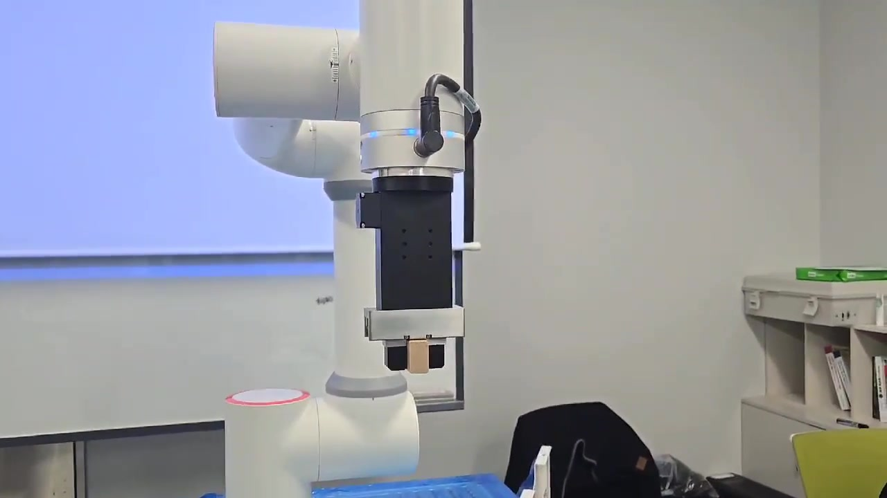
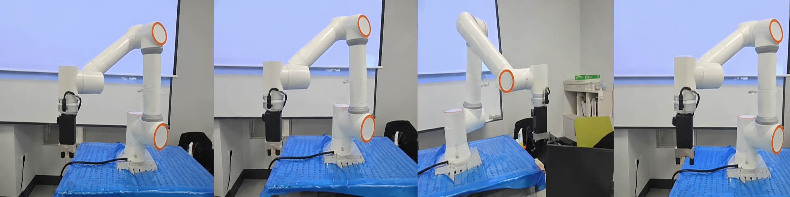
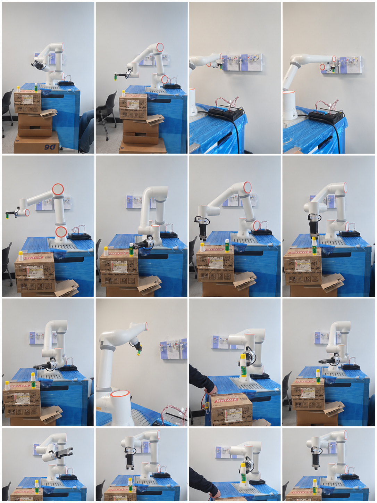
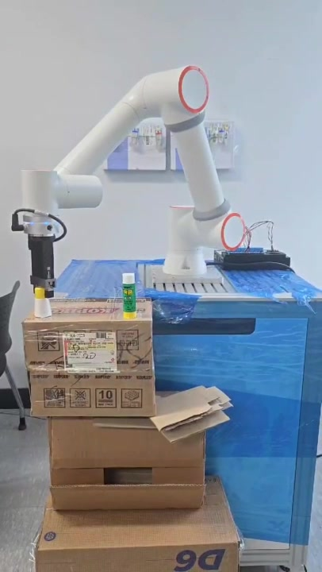
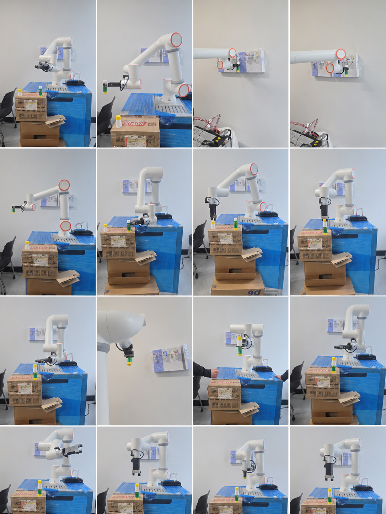

# 03. 주요 기능

## Pick & Place

개인 작성 포인트와 `src/pickplace_demo.lua`를 이용해 접근·파지·이송·배치·복귀 순서를 실제 FR5에서 수행했습니다.

  

  

| 단계 | 동작 |
|:---:|:---|
| 1 | Home에서 작업 시작 |
| 2 | 대상물 접근·파지 위치 이동 |
| 3 | 그리퍼를 닫아 대상물 파지 |
| 4 | Home을 경유해 배치 위치 이동 |
| 5 | 그리퍼를 열어 대상물 배치 |
| 6 | 반대 방향 Pick & Place 수행 |
| 7 | Home 복귀 |

## 메뉴 1 칵테일 제조

DI 0 입력 시 메뉴 1에 지정된 펌프 위치 1~3을 순차 방문합니다.

  

| 단계 | 동작 |
|:---:|:---|
| 1 | DI 0 입력 확인 |
| 2 | 컵 작업 위치 접근과 파지 |
| 3 | 펌프 위치 1~3 순차 방문 |
| 4 | 각 위치에서 LIN 하강·대기·상승 |
| 5 | 컵 내려놓기와 뚜껑 작업 |
| 6 | 컵 재파지와 Spiral 혼합 |
| 7 | 완성 컵 배치와 Home 복귀 |

## 메뉴 2 칵테일 제조

DI 1 입력 시 메뉴 2에 지정된 펌프 위치 4~6을 순차 방문합니다.

  

  

| 단계 | 동작 |
|:---:|:---|
| 1 | DI 1 입력 확인 |
| 2 | 컵 작업 위치 접근과 파지 |
| 3 | 펌프 위치 4~6 순차 방문 |
| 4 | 각 위치에서 LIN 하강·대기·상승 |
| 5 | 컵 내려놓기와 뚜껑 작업 |
| 6 | 컵 재파지와 Spiral 혼합 |
| 7 | 완성 컵 배치와 Home 복귀 |

## 공통 제어 요소

| 구분 | 적용 |
|:---|:---|
| PTP | Home과 주요 작업 포인트 간 이동 |
| LIN | 파지·펌프·배치 위치 접근과 이탈 |
| `MoveGripper` | 컵·뚜껑 파지와 해제 |
| `WaitMs` | 각 펌프 위치의 작업 대기 |
| Spiral | 컵 혼합 |
| DI | 메뉴 1·2 선택 |

---

[문서 목차](README.md) · [프로젝트 README](../README.md)
