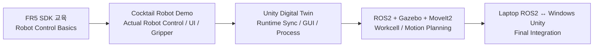

# FR5 Demo Archive

> 이 디렉터리는 현재 **FAIRINO FR5 Digital Twin**으로 확장되기 전, FR5 SDK 교육 과정에서 수행한 실제 로봇 제어 중간 시연을 보존합니다.

[프로젝트 README](../README.md) · [Digital Twin Overview](../docs/01_overview.md)

## 01. FR5 SDK Cocktail Robot Demo

| 항목 | 내용 |
|:---|:---|
| 역할 | FR5 SDK 기반 실제 로봇 제어 경험을 보여주는 중간 시연 단계 |
| 보존 위치 | [`01_fr5_sdk_cocktail_robot_demo/`](01_fr5_sdk_cocktail_robot_demo/) |
| Source 기준 | former standalone repository `main` @ `6dffa7995c9c68969b9d2b721ce952511422514c` |
| 보존 파일 | Source tracked file 31개 |
| 무결성 | 이관 시 Source ↔ Snapshot SHA256 31/31 일치 |
| 내부 수정 | 없음 — 기존 README, docs, source, media를 그대로 보존 |

### 포함된 시연

- 메뉴 1 칵테일 제조
- 메뉴 2 칵테일 제조
- Pick & Place
- Lua 제어 소스
- Point DB와 제어 참고 자료
- 실제 시연 이미지 및 MP4 영상

원본 Snapshot의 상세 설명은 아래 README를 그대로 확인합니다.

- [FR5 Cocktail Robot Demo README](01_fr5_sdk_cocktail_robot_demo/README.md)
- [원본 Demo 문서 목차](01_fr5_sdk_cocktail_robot_demo/docs/README.md)

## Digital Twin으로의 확장

Cocktail Demo는 현재 Digital Twin과 별개의 최종 제품이 아니라, **실제 FR5 제어 경험을 확보한 뒤 Digital Twin 아키텍처로 확장된 중간 시연 단계**로 보존합니다.

---

[↑ 맨 위로](#top) · [프로젝트 README](../README.md)
