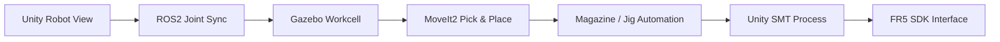
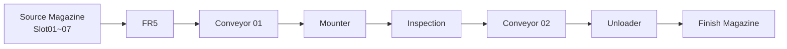

# 01. 프로젝트 개요

> FR5를 단순 3D 모델로 보여주는 수준을 넘어, **Motion Planning → Workcell Physics → ROS2 State → Unity Digital Twin → 실제 Robot Interface**까지 계층을 분리해 연결한 프로젝트입니다.

[문서 목차](README.md) · [프로젝트 README](../README.md) · [Architecture](02_architecture.md) · [Validation](05_validation.md)

## 핵심 요약

| 항목 | 내용 |
|:---|:---|
| 문제 | Robot Motion, Physics, UI, 공정 시각화를 하나의 계층에 섞으면 검증 기준이 불명확해짐 |
| 접근 | ROS2 / Gazebo / MoveIt2 / Unity / SDK 책임을 분리 |
| Motion 결과 | TAKE1~TAKE7 Final Simulation PASS |
| Unity 결과 | Joint Sync, Workcell Process, Camera/Recorder, UI Audit |
| Deployment 결과 | 개발 PC 기준본을 Laptop Runtime으로 재현 및 재검증 |
| 남은 단계 | ROS2↔Unity Live E2E, RUN_TAKE, Actual FR5 |

## 개발 배경

초기 목표는 FAIRINO FR5 Joint 상태를 Unity에 반영하는 것이었습니다. 개발이 진행되면서 단순한 시각화만으로는 실제 Robot 시스템의 Motion, Collision, Jig 이동, 공정 상태를 검증하기 어렵다는 문제가 드러났습니다.

따라서 프로젝트 범위를 다음 방향으로 확장했습니다.

## 개발 목표

- FR5 J1~J6 상태를 Unity Digital Twin에 실시간 반영
- Gazebo Workcell과 MoveIt Planning Scene의 공간 기준 정합
- Magazine Slot별 Pick & Place 자동화
- Jig Pick / Carry / Insert / Release 과정 Simulation 검증
- Unity에서 Source → SMT → Finish 공정 상태 표현
- Simulation과 Actual Robot 경로 분리
- READ-ONLY Audit, SHA, Contract Test로 회귀 방지
- 최종 포트폴리오 촬영을 위한 Camera/Recorder 구성

## 내가 구현한 범위

### ROS2 / Gazebo / MoveIt2

- ROS2 Jazzy 기반 Workspace
- Gazebo FR5 Workcell
- ros2_control Arm/Gripper
- Planning Scene Collision Object
- Joint / Cartesian Motion
- Slot01~07 One-Take
- Jig rigid follower
- Negative-J6 Trajectory Guard
- Laptop true headless Runtime

### Unity

- ROS2 JointState Runtime Sync
- Runtime Source ownership
- Source / Finish Magazine
- Jig Visual Ownership
- SMT Process
- Workcell Runtime Status UI
- Camera Director / Follow / Sequence
- Unity Recorder 5.1.7
- UI Button read-only connection audit

### Robot Interface

- FR5 SDK 계층 구조
- Read-only Feedback 우선 정책
- ROS2 Command / Status 경로
- Simulation / Actual Command 경계

## 최종 공정

Slot08은 Source Magazine geometry에는 존재하지만 Jig를 생성하지 않으며 TAKE8도 운영하지 않습니다.

## 최종 기준 자산

| Asset | 기준 |
|:---|:---|
| Final Motion Master | `src/fr5_moveit_config/scripts/slot01_to_slot08_final_one_take.py` |
| Master SHA256 | `80009dda5e196e8afbc4242bd859a35b5982d0efef531fdcc9286293f4ae59be` |
| Laptop ROS2 HEAD | `f02799cfd3126210ef72238990861c9c027c84af` |
| Unity Scene | `Assets/Project/Scenes/01_FR_Simulator.unity` |
| Unity | `6000.3.15f1` |
| Recorder | `com.unity.recorder@5.1.7` |

## 현재 상태

| 영역 | 상태 |
|:---|:---:|
| Laptop Simulation Runtime | PASS |
| TAKE1→TAKE7 | PASS |
| Unity Camera switching | PASS |
| Unity Recorder 설치/설정 | PASS |
| Recorder MP4 sample | PENDING |
| ROS2 ↔ Unity Live JointState | PENDING |
| Unity `RUN_TAKE` Backend | PENDING |
| Actual FR5 Hardware | PENDING |

---

[↑ 맨 위로](#top) · [문서 목차](README.md) · [프로젝트 README](../README.md)
