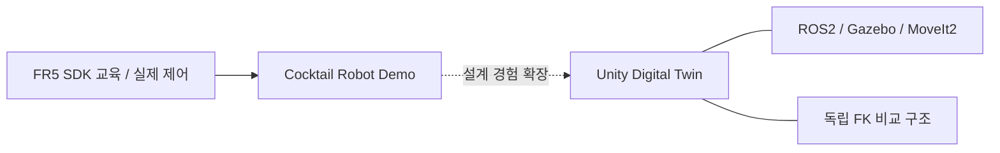

# 01. 프로젝트 개요

FR5 SDK 기반 실제 로봇 제어는 [Cocktail Robot Demo](../demos/README.md)에서 수행했으며,
Digital Twin에서는 그 경험을 ROS2/Gazebo/MoveIt2 시뮬레이션과 Unity Runtime/Interface 구조로 확장했습니다.

## 해결한 문제

Robot motion, physics, joint visualization, Jig 공정, UI를 하나의 계층에 섞으면
좌표 오차와 상태 소유권의 원인을 구분하기 어렵습니다.
본 프로젝트는 각 입력·계산·표시의 책임을 나누고 이를 독립적으로 비교했습니다.

| 계층 | 결과 |
|---|---|
| Motion | TAKE1~TAKE7 Pick·Carry·Insert·Release 시뮬레이션 |
| Planning | Facility Collision, Cartesian, negative J6 검사 |
| Unity | JointState 기반 Runtime 연동 구조 구현 |
| Workcell | 동일 외부 Jig의 SMT 이동과 Finish hand-off |
| Mathematics | Python MDH와 C# FK의 독립 계산·좌표/축 비교 |
| Presentation | 운영 UI, 10개 Camera shot, FHD 1080p30 Recording |
| Deployment | Ubuntu Laptop fresh build와 headless 실행 |

## 개발 배경

실물 Demo에서는 Robot, Gripper, DIO와 Lua sequence를 다뤘습니다.
Digital Twin에서는 Simulation과 UI를 분리하고, 관절값을 받아 기존 모델 축에 적용하는 구조를 구성했습니다.

## 공정 구성

Source Magazine은 Slot01~07을 사용하고 Slot08은 EMPTY입니다.
ROS2 TAKE는 Magazine에서 Jig를 가져와 Jig Place Conveyor에 삽입합니다.
Unity SMT는 Insert/Release된 Jig를 명시적으로 입력받아
Conveyor01 → Mounter → Inspection → Conveyor02 → Unloader → Finish Magazine을 실행합니다.

두 실행 경로의 경계는 외부 Jig 입력이며, JointState 수신은 SMT 시작 신호가 아닙니다.

## 문서에서 다루는 성과

- 시뮬레이션 경로와 trajectory policy.
- 기존 joint axis/sign을 보존하는 Runtime source 선택.
- MDH FK와 C# FK의 독립 비교 및 허용치 기반 오차 평가.
- 공정 체류시간과 이송 속도의 분리.
- 관찰 전용 Camera와 단일 화면/오디오 출력.
- 실제 FR5 SDK 경험과 Digital Twin interface 설계의 연결.

[Architecture](02_architecture.md) · [Validation](05_validation.md) · [Script Reference](12_script_reference.md)

---

## 문서 목차

[프로젝트 README](../README.md) · [문서 목록](README.md) · [맨 위로](#top)

**기본 문서**
[01 Overview](01_overview.md) · [02 Architecture](02_architecture.md) · [03 Features](03_features.md) · [04 Data Flow](04_data_flow.md) · [05 Validation](05_validation.md) · [06 Scope](06_project_scope.md) · [07 Structure](07_project_structure.md)

**상세 기술 문서**
[08 ROS2/Gazebo/MoveIt2](08_ros2_gazebo_moveit.md) · [09 Unity](09_unity_digital_twin.md) · [10 FR5 SDK](10_fr5_sdk_integration.md) · [11 Motion](11_motion_and_slot_validation.md) · [12 Scripts](12_script_reference.md) · [13 Decisions](13_design_decisions_and_issues.md) · [14 Deployment](14_deployment_and_handoff.md) · [15 Simulation](15_laptop_ros2_simulation_runtime.md) · [16 Camera](16_unity_camera_and_recording.md)
