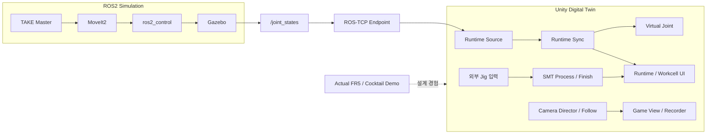
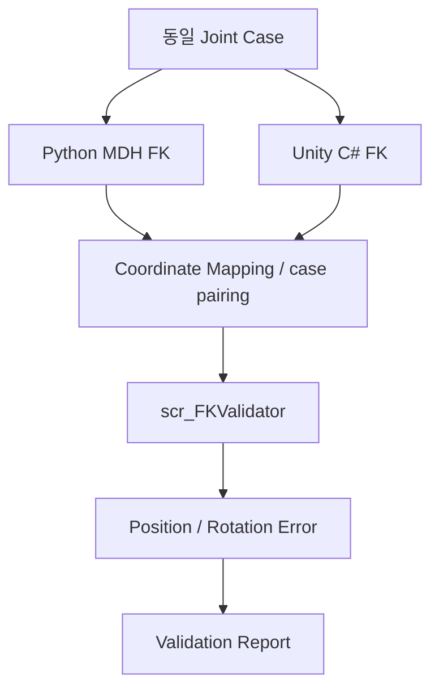

# 02. 시스템 아키텍처

## 전체 시스템

FR5 SDK로 Robot·Gripper·DIO·Lua sequence를 제어한 [Cocktail Robot Demo](../demos/README.md)의 경험을 바탕으로,
Simulation과 Digital Twin의 계산·입력·표시 책임을 분리했습니다.

| 계층 | 입력 | 출력 / 역할 |
|---|---|---|
| MoveIt2 | joint state, 목표 pose, Planning Scene | 검사된 joint/Cartesian trajectory |
| Gazebo / ros2_control | trajectory | Simulation state, joint feedback |
| ROS-TCP | ROS topic | Unity 메시지 전달 |
| RuntimeSync | 선택된 pose source | Virtual Joint에 유효한 joint degree 적용 |
| Workcell | 명시적으로 인계한 Jig | SMT 이동·처리·Finish 표시 |
| Camera | shot 선택, 관찰 target | Camera Transform 및 Game View |

## Unity 내부 Runtime 구조

`scr_FR5RuntimeSyncManager`는 `IFR5RuntimePoseSource` 계약으로 source를 다룹니다.
ROS2 client, JSON Bridge client, Replay는 입력 생산 방식만 다르고 joint 적용은 기존 `scr_VirtualJointController`가 맡습니다.

명령 계층은 `scr_FR5UICommandRouter`와 `scr_FR5Ros2CommandPublisher`,
상태 수신 계층은 `scr_FR5Ros2CommandStatusClient`입니다.
`EquipmentProcessSequenceController`는 외부 Jig 입력 API를 갖는 별도 공정 실행기입니다.

JointState에는 Jig GameObject 소유권이나 공정 시작 의미를 넣지 않습니다.
Camera Follow는 target을 읽고 자신의 Camera만 움직입니다.

[Unity Runtime Script 구조](09_unity_digital_twin.md)

## Mathematical Validation 구조

Python canonical convention과 C# chain의 transform order 차이는 비교의 전제에 포함합니다.
raw frame, Unity frame, Gazebo/MoveIt world offset을 같은 변환으로 취급하지 않습니다.

## Deployment 구조

| 저장소 / 환경 | 구성 |
|---|---|
| 본 저장소 / Windows | Unity 핵심 Runtime, Python validation, C# read-only Bridge, 문서 |
| [ROS2 저장소](https://github.com/seongyeop-dev/fr5_ros2_ws/tree/feat/fr5-gazebo-jig-attach-detach) / Ubuntu | Workcell, MoveIt2, controller, TAKE script, ROS-TCP Endpoint |
| Cocktail Demo | 실제 FR5 SDK 제어 source와 시연 자료 |

이 저장소는 개발 Scene 전체를 자동 복제하는 installer가 아닙니다.
기존 tracked Unity 파일을 보존하면서 핵심 누락 소스를 보완한 구성은 [Project Structure](07_project_structure.md)에 설명합니다.

---

## 문서 목차

[프로젝트 README](../README.md) · [문서 목록](README.md) · [맨 위로](#top)

**기본 문서**
[01 Overview](01_overview.md) · [02 Architecture](02_architecture.md) · [03 Features](03_features.md) · [04 Data Flow](04_data_flow.md) · [05 Validation](05_validation.md) · [06 Scope](06_project_scope.md) · [07 Structure](07_project_structure.md)

**상세 기술 문서**
[08 ROS2/Gazebo/MoveIt2](08_ros2_gazebo_moveit.md) · [09 Unity](09_unity_digital_twin.md) · [10 FR5 SDK](10_fr5_sdk_integration.md) · [11 Motion](11_motion_and_slot_validation.md) · [12 Scripts](12_script_reference.md) · [13 Decisions](13_design_decisions_and_issues.md) · [14 Deployment](14_deployment_and_handoff.md) · [15 Simulation](15_laptop_ros2_simulation_runtime.md) · [16 Camera](16_unity_camera_and_recording.md)
