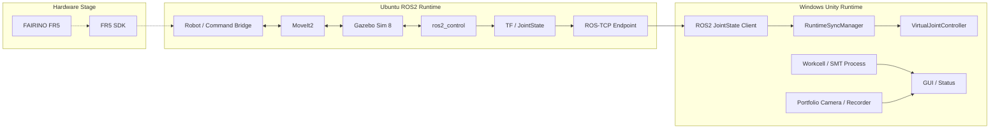
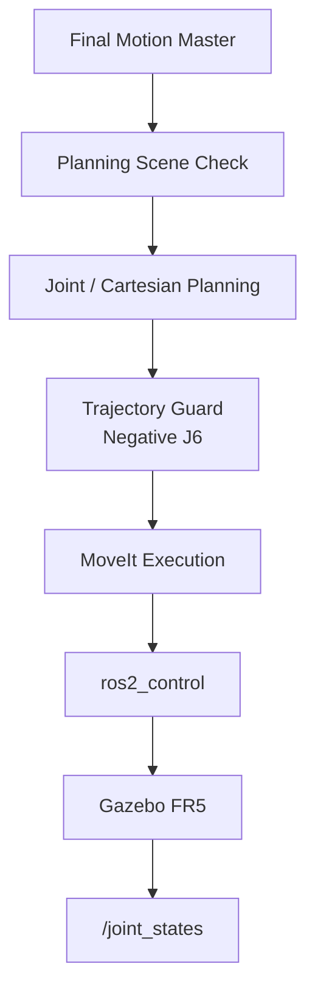
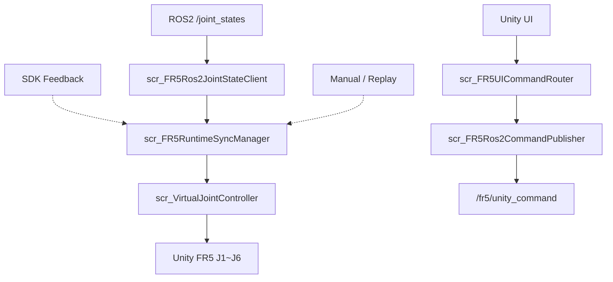
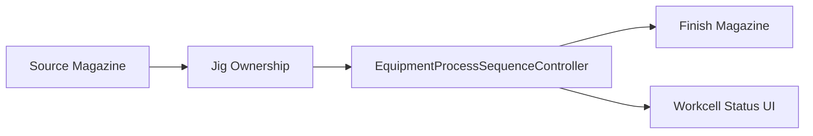
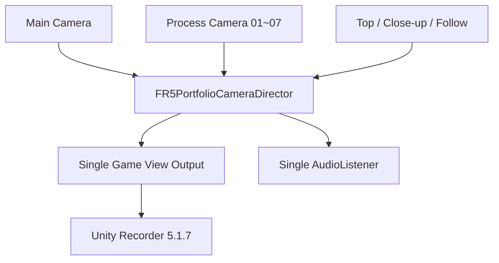
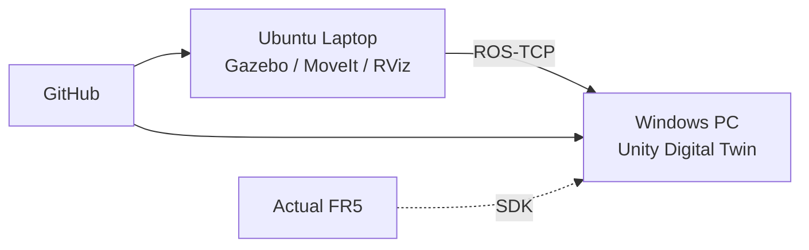

# 02. 시스템 아키텍처

> 각 계층이 서로의 책임을 대신하지 않도록 **Motion / Physics / Transport / Visualization / Hardware Interface**를 분리했습니다.

[문서 목차](README.md) · [프로젝트 README](../README.md) · [Data Flow](04_data_flow.md) · [Deployment](14_deployment_and_handoff.md)

## 핵심 요약

| 계층 | 책임 |
|:---|:---|
| FAIRINO FR5 / SDK | 실제 Robot State / Command |
| ROS2 | JointState, Command, Status, TF |
| MoveIt2 | IK, Planning, Collision, Trajectory |
| Gazebo | Physics, Controller, Workcell |
| Unity | Digital Twin, GUI, Process, Camera |
| Recorder | Unity clean shot 영상 출력 |

## 전체 연결 구조

실선은 현재 Simulation/Unity에서 구성된 주 경로, 점선은 Actual Robot 검증 단계입니다.

## 책임 경계

### ROS2

- `/joint_states`
- `/fr5/unity_command`
- `/fr5/command_status`
- TF
- ROS-TCP Network transport
- Command / Status 전달

### MoveIt2

- IK
- Joint Goal
- Cartesian Path
- Planning Scene
- Collision Check
- Trajectory 생성/실행

### Gazebo

- FR5 Workcell Physics
- Arm / Gripper Controller
- Jig Model / Conveyor
- `/clock`
- Simulation execution

### Unity

- JointState 시각 반영
- Runtime Source ownership
- Source / Finish Magazine
- Jig Ownership
- SMT Process
- GUI
- Portfolio Camera / Recording

## ROS2 / Gazebo / MoveIt2 구조

Gazebo에 설비가 보인다는 사실과 MoveIt이 해당 설비를 Collision Object로 알고 있다는 사실은 다릅니다. 주요 Facility를 별도 Planning Scene Object로 등록했습니다.

## Unity 내부 구조

`RuntimeSyncManager`가 Joint Pose의 현재 owner를 선택하고, 비활성 Source가 같은 Transform을 동시에 쓰지 않도록 합니다.

## Workcell 구조

Unity는 Robot trajectory를 다시 계산하지 않고 FR5 이후 공정과 시각 상태를 관리합니다.

## Portfolio Camera 구조

기존 RenderTexture Camera 4개는 UI 용도로 유지하며 Portfolio Shot switching의 enable/disable 대상과 분리합니다.

## Deployment Topology

현재 Laptop Simulation Runtime은 PASS, Windows Unity Live Integration과 Actual Robot은 별도 검증 상태입니다.

---

[↑ 맨 위로](#top) · [문서 목차](README.md) · [프로젝트 README](../README.md)
