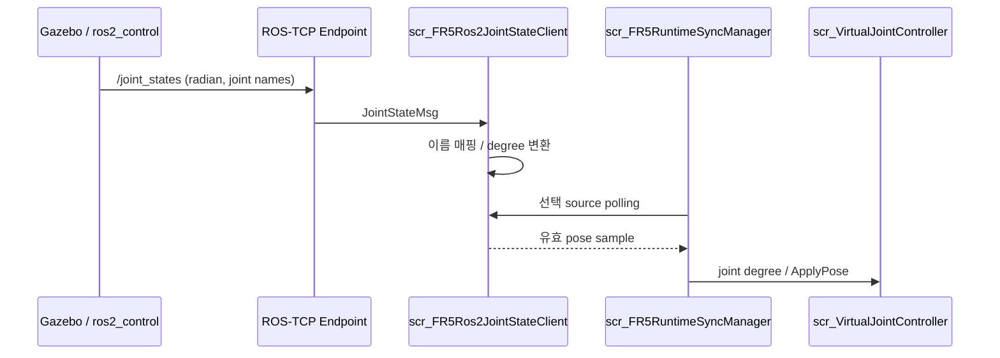
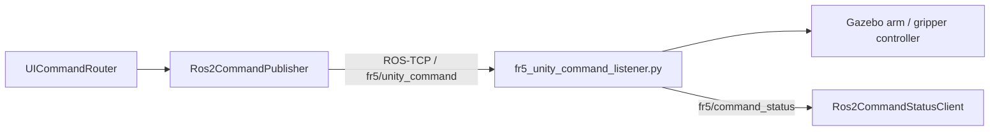
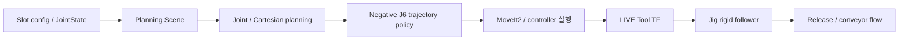
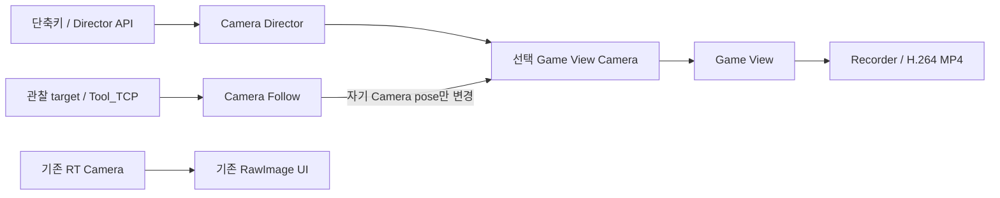

# 04. 데이터 흐름

## JointState flow

ROS2 `/joint_states` feedback과 테스트 publisher의 `/fr5/joint_states`는 서로 다른 입력입니다.
관절 회전은 기존 모델의 local axis/sign을 사용합니다.

## Command / status flow

Backend가 처리하는 명령은 MOVE_J, HOME, RESET, STOP,
GRIPPER_OPEN, GRIPPER_SMALL_CLOSE, GRIPPER_NORMAL_CLOSE, GRIPPER_RETURN_OPEN입니다.
응답의 accepted/executed/state를 구분하며, 발행 사실을 곧바로 공정 완료로 표현하지 않습니다.

## ROS2 TAKE simulation flow

TAKE 선택은 ROS2 Master의 `FR5_TAKE=1..7/ALL` 입력으로 설명합니다.

Unity command listener 경로와 ROS2 Master 실행 경로는 별개의 entry point입니다.

## Jig ownership

| 실행 영역 | 소유권 |
|---|---|
| ROS2/Gazebo Pick~Insert | Tool-to-Jig 상대변환 + LIVE TF로 Gazebo Jig pose 갱신 |
| ROS2 Release | follower 중단 후 Gazebo conveyor 이동 |
| Unity 외부 입력 | 호출자가 전달한 동일 Jig Transform을 Process Controller가 수락 |
| Unity Finish | runtime Jig 숨김 → 해당 filledSlot placeholder 표시 |

ROS2의 follower 종료가 자동으로 Unity GameObject를 전달한다는 의미는 아닙니다.
Unity 공정의 명시적 경계는 `TryAcceptFr5InsertedJig(Transform jig, int sourceSlot)`입니다.

## SMT Process flow

```mermaid
flowchart LR
    IN["동일 Jig 입력"] --> WAIT["3.0초 dwell"]
    WAIT --> C1["현재 Insert 위치 → Conveyor01 출구"]
    C1 --> M["Mounter / processing dwell"]
    M --> I["Inspection / processing dwell"]
    I --> C2["Conveyor02"]
    C2 --> U["Unloader"]
    U --> L["Finish Lift world-Y 정렬"]
    L --> INSERT["수평 삽입 / rotation 유지"]
    INSERT --> SLOT["runtime Jig hide / filledSlot show"]
```

ExternalFr5 모드는 `conveyorStart`로 snap하지 않고,
Mounter 완료 후 자동으로 새 Jig를 생성하지 않습니다.
공통 translation은 `distance / commonJigMetersPerSecond`이며 기본값은 `0.15 m/s`입니다.
Finish 삽입은 시작·완료 rotation drift `<= 0.01 degree`를 검사합니다.

## Camera flow

자동 sequence는 시간 기반 shot 전환입니다.
Follow는 Robot/Jig motion owner가 아니며 공정 단계별 target 전환을 대신하지 않습니다.

[Architecture](02_architecture.md) · [Unity](09_unity_digital_twin.md) · [SDK Interface](10_fr5_sdk_integration.md)

---

## 문서 목차

[프로젝트 README](../README.md) · [문서 목록](README.md) · [맨 위로](#top)

**기본 문서**
[01 Overview](01_overview.md) · [02 Architecture](02_architecture.md) · [03 Features](03_features.md) · [04 Data Flow](04_data_flow.md) · [05 Validation](05_validation.md) · [06 Scope](06_project_scope.md) · [07 Structure](07_project_structure.md)

**상세 기술 문서**
[08 ROS2/Gazebo/MoveIt2](08_ros2_gazebo_moveit.md) · [09 Unity](09_unity_digital_twin.md) · [10 FR5 SDK](10_fr5_sdk_integration.md) · [11 Motion](11_motion_and_slot_validation.md) · [12 Scripts](12_script_reference.md) · [13 Decisions](13_design_decisions_and_issues.md) · [14 Deployment](14_deployment_and_handoff.md) · [15 Simulation](15_laptop_ros2_simulation_runtime.md) · [16 Camera](16_unity_camera_and_recording.md)
