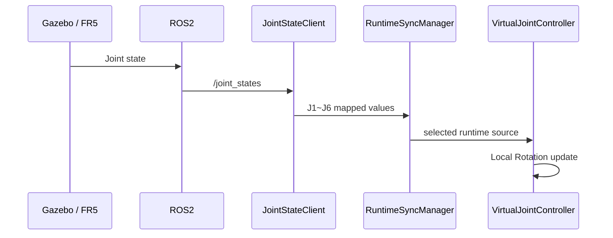
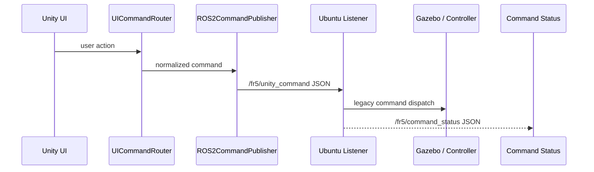
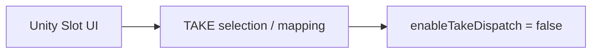
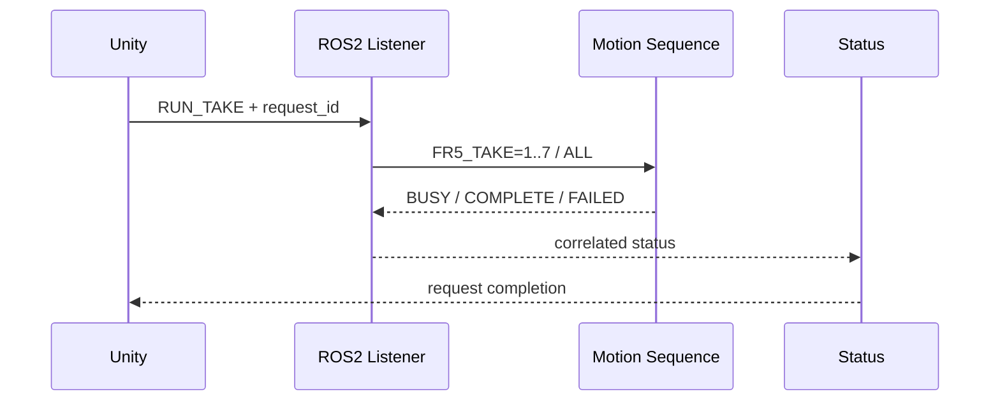
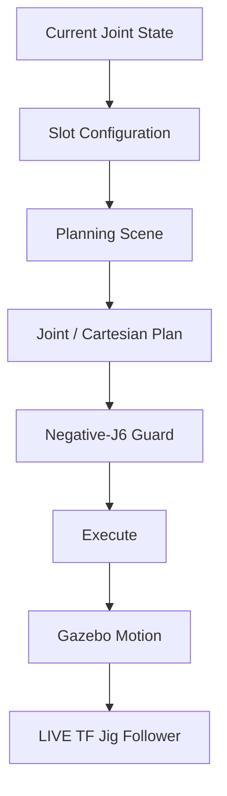
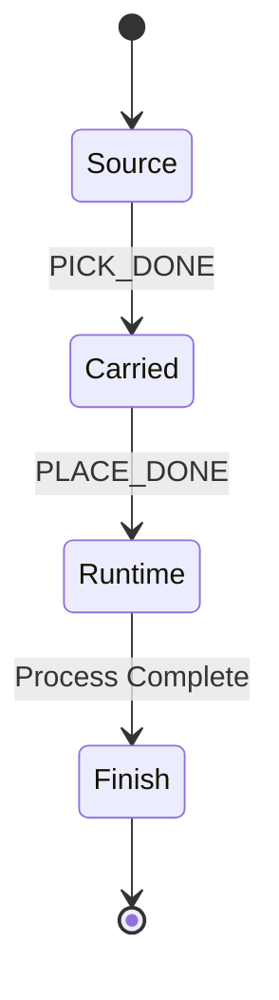
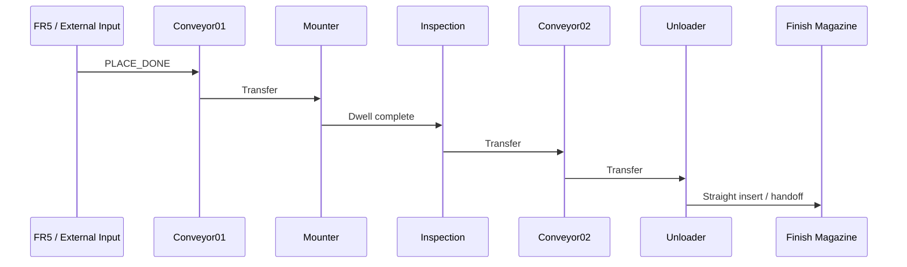
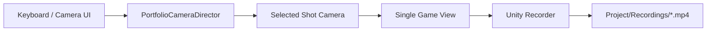
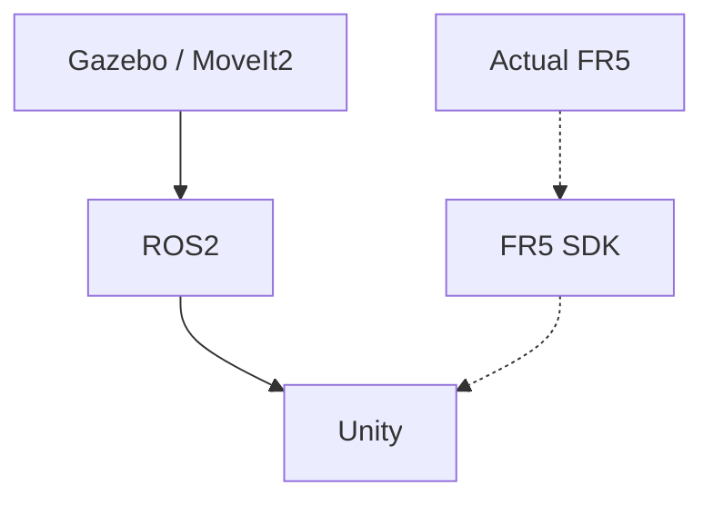

# 04. 데이터 흐름

> Robot State, UI Command, Jig Ownership, Process Event가 서로 다른 흐름을 가지도록 분리했습니다.

[문서 목차](README.md) · [프로젝트 README](../README.md) · [Architecture](02_architecture.md)

## 데이터 흐름 요약

| 흐름 | Source | Destination | 상태 |
|:---|:---|:---|:---:|
| Joint Feedback | Gazebo / FR5 | Unity J1~J6 | 시뮬레이션 경로 구성 |
| Unity Command | UI | ROS2 Listener | 기존 명령 처리 경로 구성 |
| Command Status | ROS2 Backend | Unity | Status Publisher 구성, TAKE 연동은 후속 단계 |
| Jig Ownership | Source / FR5 / SMT | Finish | 상태 전환 구현 |
| Camera | Camera Director | Game View / Recorder | 시점 전환 구현 |
| RUN_TAKE | Unity Slot | Motion Sequence | 후속 통합 단계 |

## JointState Flow

Joint name을 기준으로 J1~J6를 추출하고 ROS radian을 Unity Joint 기준에 맞춰 적용합니다.

## Unity Command / Status Flow

현재 Listener는 기존 MOVE_J / HOME / RESET / STOP / Gripper 명령을 처리합니다. `RUN_TAKE`는 아직 연결되지 않았습니다.

## TAKE Flow: 현재와 목표

현재:

목표:

위 목표 계약은 아직 구현 완료 상태가 아닙니다.

## MoveIt / Gazebo Motion Flow

## Jig Ownership Flow

위치는 물론 현재 visual owner 자체를 바꿔 동일 Jig가 여러 위치에 동시에 보이지 않게 합니다.

## SMT Process Flow

## Camera / Recording Flow

RenderTexture Camera는 기존 UI 용도로 계속 유지합니다.

## Simulation / Actual Feedback

두 입력이 동시에 Unity Joints를 소유하지 않도록 Runtime 입력 소유권을 유지합니다.

---

[↑ 맨 위로](#top) · [문서 목차](README.md) · [프로젝트 README](../README.md)
