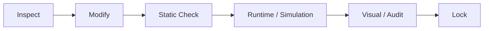

<a id="top"></a>

# 05. 검증 결과

> 이 프로젝트의 핵심 원칙은 **PASS의 범위를 계층별로 분리하는 것**입니다. Static PASS, Simulation PASS, Unity Live PASS, Actual Robot PASS는 서로 다른 상태입니다.

[문서 목차](README.md) · [프로젝트 README](../README.md) · [Motion Validation](11_motion_and_slot_validation.md)

## 검증 방법



이미 PASS한 Motion/Transform은 다음 기능 개발 때문에 임의 재튜닝하지 않았습니다.

## 최종 Validation Matrix

| 계층 | 검증 | 결과 |
|:---|:---|:---:|
| Git / Source | Laptop Local = origin | PASS |
| Build | fresh `colcon build --symlink-install` | PASS |
| Gazebo | Workcell / controller / `/clock` / `/joint_states` | PASS |
| MoveIt2 | Planning Scene / Cartesian / Collision | PASS |
| Planning Scene | Facility object 4개, unexpected 0 | PASS |
| Motion | TAKE1→TAKE7 | PASS |
| Motion | TAKE8 | OUT OF SCOPE |
| Trajectory | Negative J6 Guard | PASS |
| Jig | LIVE TF follower | PASS |
| Performance | headless RTF `0.998` | PASS |
| Performance | headless + MoveIt2 RTF `0.997` | PASS |
| Unity | Camera 01~10 switching | PASS |
| Unity | Game View output 1 | PASS |
| Unity | AudioListener 1 | PASS |
| Unity | STOP listener 1 | PASS |
| Unity | Workcell Status Text binding | PASS |
| Unity | Camera/Follow static regression | PASS |
| Unity | UI Button 96개 read-only audit | AUDITED |
| Recorder | Recorder 5.1.7 install | PASS |
| Recorder | FHD 1080p30 config | PASS |
| Recorder | 실제 MP4 sample | PENDING |
| ROS2↔Unity | Live JointState E2E | PENDING |
| Unity→TAKE | RUN_TAKE / correlation / BUSY / active STOP | PENDING |
| Actual FR5 | Feedback / Command / Safety | PENDING |

## ROS2 / Gazebo / MoveIt2

Final Master:

```text
src/fr5_moveit_config/scripts/slot01_to_slot08_final_one_take.py
```

SHA256:

```text
80009dda5e196e8afbc4242bd859a35b5982d0efef531fdcc9286293f4ae59be
```

최종 실행 결과:

```text
FINAL ONE-TAKE TAKE1 -> TAKE7 PASS
FINAL_MASTER_RETURN_CODE=0
TAKE1_TO_TAKE7_FINAL_SIMULATION=PASS
```

Slot08 Jig는 spawn하지 않고 TAKE8은 운영하지 않습니다.

### Planning Scene

| Object | Elements |
|:---|---:|
| `gazebo_fr5_robot_table_v2` | 6 |
| `gazebo_fr5_magazine_visual_probe` | 46 |
| `gazebo_fr5_magazine_conveyor_probe` | 7 |
| `gazebo_fr5_jig_place_conveyor_probe` | 200 |

```text
OBJECT_COUNT=4
UNEXPECTED_WORLD_OBJECTS=NONE
```

## Laptop Runtime 재현성

| 항목 | 결과 |
|:---|:---|
| Branch | `feat/fr5-gazebo-jig-attach-detach` |
| Laptop HEAD | `f02799cfd3126210ef72238990861c9c027c84af` |
| Remote parity | PASS |
| Fresh build | PASS |
| Master SHA 유지 | PASS |
| 기존 backup / untracked 보존 | PASS |

개발 PC의 build artifact를 복사하지 않고 Source에서 fresh build했습니다.

## Unity Static / Offline Validation

기존 작업에서 다음 검증을 사용했습니다.

| 검증 | 결과 |
|:---|:---:|
| Runtime C# static compile | Error 0 |
| Editor C# static compile | Error 0 |
| Workcell Status contract | 114 assertions PASS |
| ROS / Feedback contract | 171 PASS |
| RUN_TAKE offline regression | 2,527 PASS |
| Slot regression | 1,070 PASS |
| SMT regression | 24,241 PASS |
| Camera / Follow regression | 403 PASS |
| Korean UI / binding regression | 451 PASS |

이 결과는 코드/계약 검증이며 실제 ROS2 Live 또는 Actual Robot PASS를 의미하지 않습니다.

## Unity Scene Configuration Validation

Portfolio Scene 적용 후 Read-only Verify에서 확인한 기준:

```text
15 Cameras
= 4 RenderTexture Cameras
+ Main Camera
+ 10 Portfolio Shot Cameras

Game View output = 1
AudioListener = 1
STOP listener = 1
Workcell Text bound = PASS
```

Camera switching은 Play Mode에서 `1~9`, `0`, Main fallback 전환을 확인했습니다. 최종 pose/FOV는 실제 ROS2 촬영 시 미세조정합니다.

## UI Button Audit

Read-only Live Scene Audit에서 사용자 Button 96개를 수집했습니다.

| 항목 | 결과 |
|:---|---:|
| 전체 Button | 96 |
| Persistent listener 1개 | 85 |
| Persistent listener 0개 | 9 |
| Persistent listener 2개 | 2 |
| Missing Target | 0 |
| Missing Method | 0 |
| Missing Script | 0 |
| STOP listener | 1 |

추가 source trace가 필요한 항목:

- `Btn_ResetToolOffset`: 2 persistent listeners
- `Btn_RESET VIEW`: 2 persistent listeners
- `Btn_OneTakeAll`, `Btn_Slot01~08`: 0 persistent listener — Runtime `AddListener` 여부 별도 확인

따라서 96개 모두를 “실제 기능 실행 PASS”로 해석하지 않고, Scene binding audit와 Runtime execution을 구분합니다.

## Recorder Validation

현재 완료:

- `com.unity.recorder@5.1.7` UPM 설치
- Movie Clip
- Game View
- FHD 1080p
- 16:9
- H.264 MP4
- High
- Constant 30 FPS
- Audio OFF
- `Project/Recordings`

남은 검증:

- 5~10초 sample recording
- 실제 MP4 존재 / 재생 / 1920×1080 확인
- 촬영 시 Camera framing 미세조정

## Backend Command / TAKE 경계

| 항목 | 상태 |
|:---|:---:|
| Legacy Command Listener | IMPLEMENTED |
| `/fr5/command_status` Publisher | IMPLEMENTED |
| Master `FR5_TAKE=1..7/ALL` | 확인 |
| Unity Slot selection / mapping | 구현 |
| `RUN_TAKE` Listener dispatch | PENDING |
| request/status correlation | PENDING |
| BUSY / completion lifecycle | PENDING |
| active Master STOP | PENDING |

## Actual Robot 경계

Actual FR5에서 최종 확인해야 하는 항목:

- FR5 SDK Joint Feedback
- ROS2 ↔ Actual Joint mapping
- Unity Joint live sync
- Actual Command Full Path
- Speed / Safety
- 실제 Workcell calibration
- Emergency / Abort 범위

Simulation PASS와 Hardware PASS를 같은 표기로 사용하지 않습니다.

---

[↑ 맨 위로](#top) · [문서 목차](README.md) · [프로젝트 README](../README.md)
