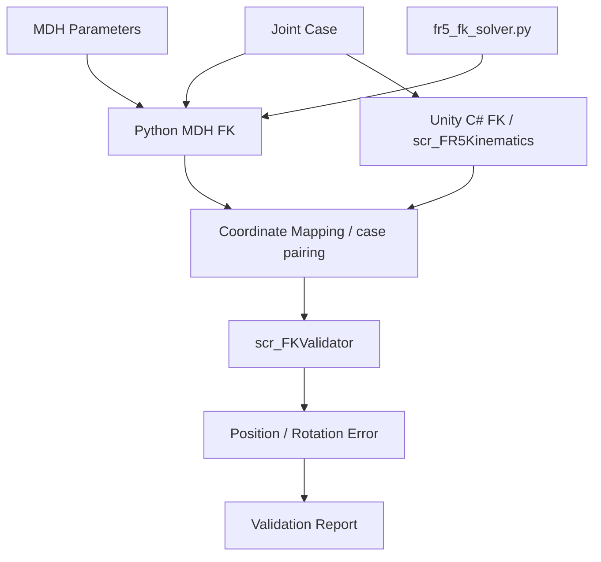

<a id="top"></a>

# 05. Mathematical / Simulation / Unity Validation

독립 계산, 시뮬레이션 실행, UI·공정 검증의 결과를 각 입력과 환경에 맞춰 설명합니다.
아래 실행 수치와 회귀 결과는 개발 과정에 기록한 결과입니다.

## Python MDH / FK Validation

FR5 모델은 Python MDH Forward Kinematics와 Unity C# FK를 별도로 구현해
joint case, 좌표계, 축 방향, position/rotation error를 비교하는 검증 구조를 사용했습니다.

[MDH table](../Python/Phase1_Kinematics/Python_MDH/fr5_mdh_params.py)는 다음 프로젝트 convention을 정의합니다.

```text
단위: meter, radian
a     = [0, -0.425, -0.395, 0, 0, 0]
d     = [0.152, 0, 0, 0.102, 0.102, 0.100]
alpha = [+pi/2, 0, 0, +pi/2, -pi/2, 0]
Ai = RotX(alpha) TransX(a) RotZ(theta) TransZ(d)
T = A1 A2 A3 A4 A5 A6
```

입력 degree를 radian으로 변환하고 4×4 `T_base_tcp`, position, rotation matrix,
RPY, case ID, convention, units를 반환합니다.
RPY 추출은 `Rz(yaw) Ry(pitch) Rx(roll)` 기준이며 특이점 분기를 포함합니다.
별도 tool calibration transform을 곱하는 모델과 MDH endpoint를 구분합니다.

[공식 프로젝트 case 데이터](../Python/Phase1_Kinematics/Python_MDH/fr5_pose_cases.json):

| Case | jointDegrees |
|---|---|
| ZERO | `[0, 0, 0, 0, 0, 0]` |
| SDK_HOME_CANDIDATE | `[0, -90, 90, -90, -90, 0]` |
| ROS2_DEMO_MOVEJ | `[0, -60, 90, -90, -90, 0]` |
| SMALL_SAFE_TEST | `[10, -45, 75, -30, -60, 15]` |

[case runner](../Python/Phase1_Kinematics/GroundTruth/fr5_pose_case_runner.py)가
JSON/CSV/TXT를 분리해 출력합니다. 생성 결과는 source에 포함하지 않습니다.

## Unity C# FK / Coordinate Validation



현재 Python canonical MDH와 C# FK는 transform order가 다릅니다.
Python의 row별 `Rx → Tx → Rz → Tz`와 C#의 `Rz(j1) → Tz(d1) → Rx(alpha1)` 시작 chain을
동일하다고 가정하지 않습니다. 개발 중 독립 FK 비교와 축/좌표 검증에 활용한 구조를 설명하며,
모든 case의 최종 일치나 제조사 Ground Truth와의 동일성을 주장하지 않습니다.

`scr_FR5CoordinateMapper`의 raw→Unity 축 변환은 `(-y, z, x)`입니다.
이는 Gazebo↔MoveIt world offset 및 설비 정합 변환과 별개입니다.
`scr_FR5AxisCompareDebugger`는 FK와 Shadow의 right/up/forward를 비교할 수 있도록 출력합니다.

| 측정 | 구현 | 기본 tolerance |
|---|---|---|
| position axis | 두 position의 축별 차이, meter | 0.001 m |
| position magnitude | 위치 오차 벡터 길이 | 0.0015 m |
| rotation axis | Euler 축별 `Mathf.DeltaAngle`, degree | 0.5 degree |
| rotation magnitude | Euler 오차 벡터 길이 | 1.0 degree |

rotation magnitude는 quaternion geodesic angle과 다른 척도입니다.

기존 Unity TXT 경로는 Manual Controller의 joint export → Python single runner →
TCPCompareManager load/map → FKValidator → report writer입니다.
현재 live Virtual Controller와 legacy Manual Controller는 다른 상태 저장소이므로,
파일 export가 항상 선택된 live joint를 의미한다고 일반화하지 않습니다.

## Python 테스트와 실행

| 테스트 | 검사 |
|---|---|
| [test_fr5_mdh_fk.py](../Python/Phase1_Kinematics/Tests/test_fr5_mdh_fk.py) | canonical 필드, ZERO 기대 position, degree→radian |
| [test_fr5_pose_cases.py](../Python/Phase1_Kinematics/Tests/test_fr5_pose_cases.py) | 4개 case와 JSON/CSV/TXT export |
| [test_groundtruth_single_runner_input.py](../Python/Phase1_Kinematics/Tests/test_groundtruth_single_runner_input.py) | 6줄·CSV·공백·잘못된 개수 |

저장소 root에서:

```powershell
python -m pip install -r Python/requirements.txt
python -B -m unittest discover -s Python/Phase1_Kinematics/Tests -p "test_*.py"
python -B Python/Phase1_Kinematics/GroundTruth/fr5_pose_case_runner.py --output-dir "$env:TEMP/FR5_MDH_Results"
```

테스트는 parser, 계산 계약 및 export를 확인합니다.
4개 case의 물리적 정확성을 제조사 측정값으로 독립 검증하는 테스트와는 구분합니다.

## ROS2 / Gazebo / MoveIt2 Simulation Validation

[최종 ROS2 branch](https://github.com/seongyeop-dev/fr5_ros2_ws/tree/feat/fr5-gazebo-jig-attach-detach)의
Master를 사용한 TAKE1~TAKE7 시뮬레이션 결과:

```text
FINAL ONE-TAKE TAKE1 -> TAKE7 PASS
FINAL_MASTER_RETURN_CODE=0
TAKE1_TO_TAKE7_FINAL_SIMULATION=PASS
```

| 항목 | 결과 |
|---|---|
| 노트북 source 기반 fresh build | PASS |
| Gazebo / ros2_control / clock / joint_states | 실행 확인 |
| Joint/Cartesian trajectory와 collision | 검사 및 실행 |
| Negative J6 trajectory policy | 전체 point 검사 |
| LIVE Tool TF Jig follower | 상대 pose 유지 |
| TAKE8 / Source Slot08 | UNUSED / EMPTY |
| Gazebo headless RTF | 0.998 |
| headless + MoveIt2 RTF | 0.997 |

## Planning Scene

| Object | Elements |
|---|---:|
| `gazebo_fr5_robot_table_v2` | 6 |
| `gazebo_fr5_magazine_visual_probe` | 46 |
| `gazebo_fr5_magazine_conveyor_probe` | 7 |
| `gazebo_fr5_jig_place_conveyor_probe` | 200 |

Object 수 4개, unexpected world object 없음으로 기록했습니다.
Collision primitive와 RViz visual mesh를 구분하며 Robot Base는 이동시키지 않았습니다.

## Unity Scene / UI / Camera Validation

개발 구성에서 Camera 15개(기존 RT 4 + Main 1 + shot 10),
Game View output 1개, AudioListener 1개, STOP entry point 1개를 확인했습니다.
Camera switching과 Main 복귀는 Play Mode에서 확인했습니다.

Button 연결 검사는 persistent listener와 Runtime AddListener를 구분합니다.
Scene의 Text나 버튼 개수만으로 실제 backend 실행을 판정하지 않습니다.

개발 과정의 static/offline 회귀 기록:

| 영역 | 기록 |
|---|---:|
| Workcell Status contract | 114 assertions |
| ROS / Feedback contract | 171 assertions |
| Slot regression | 1,070 assertions |
| SMT regression | 24,241 assertions |
| Camera / Follow regression | 403 assertions |

이 회귀 횟수는 개발 과정 기록이며, 공개 subset의 unittest 횟수와 합산하지 않습니다.

## Recording / Runtime Interface

- FHD 1080p30 Recording 구성 완료.
- ROS2↔Unity: JointState 기반 Runtime 연동 구조 구현.
- 외부 Jig API: 동일 Jig, 3초 dwell, 자동 중복 생성 방지.
- Finish: rotation drift 0.01 degree 이하, Lift world-Y, 수평 삽입과 단일 placeholder 전환.

## Actual FR5 SDK 경험: Cocktail Robot Demo

실제 FR5 SDK 제어, Robot motion, Gripper, DIO와 Lua motion sequence는
[Cocktail Robot Demo](../demos/README.md)의 시연과 source로 설명합니다.
Digital Twin의 시뮬레이션·interface 결과와 실물 Demo의 결과는 각 프로젝트의 실행 환경에 대응시킵니다.

---

## 문서 목차

| 구분 | 바로가기 |
| --- | --- |
| **프로젝트** | [프로젝트 README](../README.md) · [전체 문서 인덱스](README.md) |
| **기본 문서** | [01 Overview](01_overview.md) · [02 Architecture](02_architecture.md) · [03 Features](03_features.md) · [04 Data Flow](04_data_flow.md) · [05 Validation](05_validation.md) · [06 Scope](06_project_scope.md) · [07 Structure](07_project_structure.md) |
| **상세 기술 문서** | [08 ROS2 / Gazebo / MoveIt2](08_ros2_gazebo_moveit.md) · [09 Unity Digital Twin](09_unity_digital_twin.md) · [10 FR5 SDK](10_fr5_sdk_integration.md) · [11 Motion & Slot Validation](11_motion_and_slot_validation.md) · [12 Script Reference](12_script_reference.md) · [13 Design Decisions](13_design_decisions_and_issues.md) · [14 Deployment](14_deployment_and_handoff.md) · [15 Simulation Runtime](15_laptop_ros2_simulation_runtime.md) · [16 Camera & Recording](16_unity_camera_and_recording.md) |
| **수학 · 기구학 검증** | [Validation 문서](05_validation.md) · [Motion Validation](11_motion_and_slot_validation.md) · [MDH Parameters](../Python/Phase1_Kinematics/Python_MDH/fr5_mdh_params.py) · [Python FK Solver](../Python/Phase1_Kinematics/Python_MDH/fr5_fk_solver.py) · [Kinematics Tests](../Python/Phase1_Kinematics/Tests/) |
| **실제 FR5 · Cocktail Demo** | [Demo Hub](../demos/README.md) · [FR5 SDK Cocktail Robot Demo](../demos/01_fr5_sdk_cocktail_robot_demo/README.md) |
| **ROS2 Simulation** | [ROS2 / Gazebo / MoveIt2 문서](08_ros2_gazebo_moveit.md) · [fr5_ros2_ws Repository](https://github.com/seongyeop-dev/fr5_ros2_ws) |

[문서 목록으로 이동](README.md)
