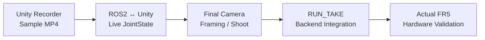

# 06. 프로젝트 범위

> 구현한 범위와 아직 검증하지 않은 범위를 명시해 포트폴리오의 기술적 경계를 분명하게 합니다.

[문서 목차](README.md) · [프로젝트 README](../README.md)

## 범위 요약

| 영역 | 포함 |
|:---|:---|
| Motion | Gazebo + MoveIt2 Slot01~07 Pick & Place |
| Physics | FR5 Workcell / ros2_control / Jig |
| Digital Twin | Unity Joint Sync / GUI / Process |
| Workcell | Source / Finish Magazine / SMT |
| Visualization | 10-shot Camera / Follow / Recorder |
| Interface | ROS2 Command / Status / SDK 구조 |
| Deployment | Laptop Simulation Runtime |
| Hardware | 구조/경계만 포함, 최종 실제 실행은 PENDING |

## 포함 범위

### Robot / Motion

- FR5 Gazebo Simulation
- Planning Scene
- Joint / Cartesian Motion
- TAKE1~TAKE7
- Jig follower
- Negative-J6 Guard
- Conveyor release

### Unity Digital Twin

- J1~J6 Runtime Sync
- Source / Finish Magazine
- Jig Ownership
- SMT Process
- External FR5 Input
- Workcell Status GUI
- Camera Director / Follow
- Unity Recorder

### Robot Interface

- FR5 SDK Integration architecture
- Read-only Feedback 우선
- ROS2 legacy Command Publisher / Listener
- Backend Status
- Runtime Source separation

## 의도적으로 제외 / 보수적 유지

- TAKE8 / Slot08 Jig는 운영 제외
- Unity를 Robot Physics Simulator로 사용하지 않음
- Simulation PASS를 Actual FR5 PASS로 표현하지 않음
- 실제 Speed/Safety는 Hardware 검증 전 확정하지 않음
- `RUN_TAKE`를 Backend 미구현 상태에서 실행 완료 기능처럼 표시하지 않음
- Camera framing은 실제 동작 촬영 전에 최종 조정

## 주요 해결 문제

| 문제 | 해결 |
|:---|:---|
| 높은 Slot 접근 간섭 | PREGRASP + Cartesian Approach |
| Wrist Branch 전환 | Negative-J6 Guard |
| Gazebo / MoveIt 좌표 차이 | Planning Scene 변환 |
| Carry Jig 불연속 | LIVE TF rigid follower |
| Jig 중복 표시 | Ownership State |
| SMT 속도 불일치 | 공통 World-space speed |
| Finish 회전 | Rotation 유지 Straight Insert |
| Laptop RTF 저하 | true headless |
| Camera 중복 출력 | Camera Director |
| UI STOP 중복 | single listener |

## 현재 남은 통합

큰 구조나 검증된 Motion을 다시 설계하는 단계는 종료했고, 현재는 Integration과 최종 촬영 단계입니다.

---

[↑ 맨 위로](#top) · [문서 목차](README.md) · [프로젝트 README](../README.md)
