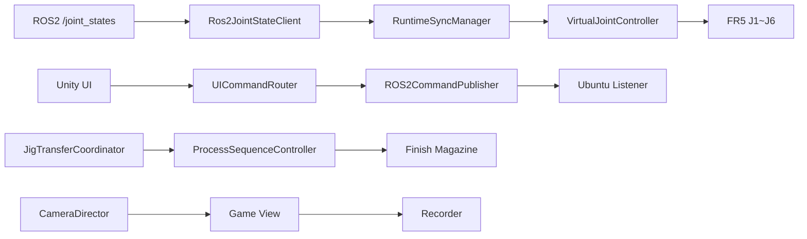

<a id="top"></a>

# 07. 프로젝트 구조

> Ubuntu ROS2 Runtime과 Windows Unity Project를 물리적으로 분리하고 Git으로 기준을 연결했습니다.

[문서 목차](README.md) · [프로젝트 README](../README.md) · [Script Reference](12_script_reference.md)

## 전체 구조

```text
Ubuntu Laptop
~/fr5_ros2_ws
└─ src/
   ├─ fr5_gazebo/
   ├─ fr5_moveit_config/
   ├─ fr5_ros2_bridge/
   └─ ros_tcp_endpoint / interface packages

Windows Development PC
FAIRINO_FR5_DigitalTwin/
├─ Assets/
│  └─ Project/
│     ├─ Scenes/
│     ├─ Scripts/
│     │  ├─ RuntimeSources/
│     │  ├─ UI/
│     │  ├─ Workcell/
│     │  └─ Camera/
│     └─ Editor/
│        └─ FR5/
├─ Packages/
└─ ProjectSettings/
```

## 보존된 SDK 중간 시연

Digital Twin 저장소 안에는 이전 FR5 SDK 중간 시연을 별도 Demo으로 보존합니다.

```text
demos/
├─ README.md
└─ 01_fr5_sdk_cocktail_robot_demo/
   ├─ README.md
   ├─ archive/
   ├─ data/
   ├─ docs/
   ├─ media/
   ├─ references/
   └─ src/
```

- Demo 내부 파일: 수정 없음
- `.git`은 중첩 저장소 방지를 위해 포함하지 않음

Demo 내부의 기존 `.gitattributes`, `.gitignore`, README, docs, source, media는 원본 내용을 유지합니다.

## ROS2 핵심 파일

| Path | 역할 |
|:---|:---|
| `src/fr5_moveit_config/config/slot01_to_slot08_final_one_take_v1.yaml` | Slot Motion 설정 |
| `src/fr5_gazebo/worlds/fr5_workcell.sdf` | Workcell World |
| `src/fr5_gazebo/launch/fr5_workcell.launch.py` | Workcell launch / headless args |
| `src/fr5_gazebo/launch/fr5_gazebo_control.launch.py` | Gazebo control / command listener |
| `src/fr5_ros2_bridge/fr5_ros2_bridge/fr5_unity_command_listener.py` | Unity Command Backend |
| `scripts/run_fr5_gazebo_command_bridge.sh` | Bridge runner |

## Unity Runtime Sync

| Script | 역할 |
|:---|:---|
| `scr_FR5Ros2JointStateClient.cs` | ROS2 JointState 수신 |
| `scr_FR5RuntimeSyncManager.cs` | Runtime 입력 소유권 |
| `scr_VirtualJointController.cs` | J1~J6 Transform 적용 |
| `scr_FR5Ros2CommandPublisher.cs` | ROS2 Command publish |
| `scr_FR5Ros2CommandStatusClient.cs` | Command Status client 구조 |
| `scr_FR5UICommandRouter.cs` | UI → Command routing |
| `scr_FR5RuntimeStatusPanelUI.cs` | Runtime / Workcell 상태 표시 |

## Unity Workcell

| Script | 역할 |
|:---|:---|
| `MagazineConveyorController.cs` | Source Magazine conveyor |
| `MagazineSupplyController.cs` | Magazine supply state |
| `FR5JigTransferCoordinator.cs` | Jig ownership transfer |
| `EquipmentProcessSequenceController.cs` | SMT process |
| `EquipmentStackLightController.cs` | Equipment state light |
| `FR5InsertedJigTestTrigger.cs` | External input / Finish validation |

## Unity Camera / Recording

| Script / Package | 역할 |
|:---|:---|
| `FR5PortfolioCameraDirector.cs` | Shot switching / Main fallback / sequence |
| `FR5PortfolioCameraFollow.cs` | Jig / Tool follow |
| `FR5PortfolioSetup.cs` | Camera/UI/STOP Editor setup & verify |
| `FR5RecorderSetupWindow.cs` | Recorder package check/install helper |
| `com.unity.recorder@5.1.7` | FHD Movie Clip recording |

## Unity Editor / Validation

| Script | 역할 |
|:---|:---|
| `FR5SourceFinishSetup.cs` | Source/Finish no-save setup |
| `FR5LiveSceneAlignmentAudit.cs` | Scene / UI / binding 구조 점검 |
| `FR5WorkcellEditLayoutTool.cs` | Workcell edit tool |
| `FR5RobotCellCriticalTool.cs` | Robot cell critical audit |
| `FR5SmtCellLayoutTool.cs` | SMT layout tool |

## 연결 관계



## Version / Generated File 원칙

- `Library`, `Temp`, `Logs`, `UserSettings`는 Git 제외
- `Recordings/`는 영상 생성물로 Git stage하지 않음
- Backup/Recovery artifact는 Source와 분리
- 실제 장비 내부 민감 정보는 공개 문서에 기록하지 않음
- Docs-only 변경은 Unity dirty working tree와 분리한 worktree에서 수행

---

[↑ 맨 위로](#top) · [문서 목차](README.md) · [프로젝트 README](../README.md)
