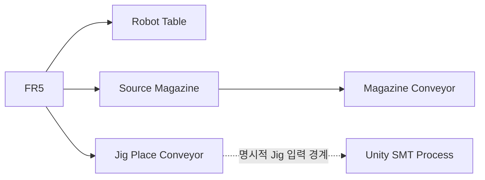
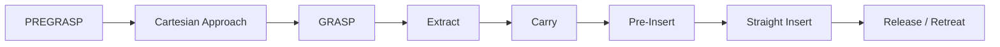
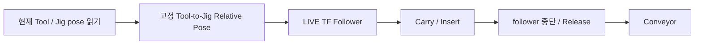

<a id="top"></a>

# 08. ROS2 / Gazebo / MoveIt2

> Simulation 계층에서 FR5 Motion, Workcell Physics, Planning Scene을 어떻게 분리해 검증했는지 정리합니다.

[문서 목차](README.md) · [프로젝트 README](../README.md) · [Motion Validation](11_motion_and_slot_validation.md) · [Laptop Runtime](15_laptop_ros2_simulation_runtime.md)

## 역할

| 계층 | 담당 |
|:---|:---|
| ROS2 | State / Command / TF |
| Gazebo | Physics / Controller / Workcell |
| MoveIt2 | Planning / Collision / Trajectory |
| RViz2 | Planning Scene / Robot visualization |
| 통합 모션 시퀀스 | Slot sequence / guards / execution |

## Workcell



FR5 Base는 고정하고 설비 정합 문제를 Robot Base 이동으로 해결하지 않습니다.

## Planning Scene

주요 Collision Object:

- `gazebo_fr5_robot_table_v2`
- `gazebo_fr5_magazine_visual_probe`
- `gazebo_fr5_magazine_conveyor_probe`
- `gazebo_fr5_jig_place_conveyor_probe`

Gazebo와 MoveIt의 기준 차이는 Planning Scene 변환에서 처리합니다.

## Slot Motion

### Slot01

초기 검증 기준을 유지하는 Direct Pick 계열입니다.

### Slot02 이상

높이가 증가하는 Magazine에서 Frame 간섭 여유를 확보하기 위해 PREGRASP 후 짧은 Cartesian Approach를 사용합니다.



## Cartesian 구간

- Pick 직전 접근
- Extract
- Final Pre-Insert → Insert
- Release 후 Retreat

Full path가 만들어지지 않는 branch는 실행하지 않습니다.

## Negative-J6 Guard

```text
require_negative_j6_trajectory
→ every trajectory point: J6 < 0
```

끝점뿐 아니라 전체 trajectory를 검사합니다.

## Jig Follower



LIVE Tool TF에 고정 상대변환을 합성해 Gazebo Jig pose를 갱신합니다. 최종 TAKE의 추종은 physics attach/detach만으로 이루어지는 방식과 다릅니다.

Gazebo release 이후 conveyor flow와 Unity의 외부 Jig 입력 API는 각각의 실행 경계입니다. JointState만으로 Unity SMT를 시작하지 않습니다.

## ACTION 단계 설명 원칙

ACTION05는 TAKE별 실행 시퀀스에서 다르게 적용되므로 Slot 범위 전체에 동일한 규칙으로 일반화하지 않았습니다. 실제 동작은 통합 모션 스크립트의 TAKE별 sequence를 기준으로 설명합니다.


## 통합 모션 실행 구조

[최종 Master](https://github.com/seongyeop-dev/fr5_ros2_ws/blob/feat/fr5-gazebo-jig-attach-detach/src/fr5_moveit_config/scripts/slot01_to_slot08_final_one_take.py)
TAKE1~TAKE7 Final Simulation PASS, TAKE8은 운영 제외입니다.

## Laptop Performance 문제 해결

GUI + RViz 동시 실행 시 RTF 저하로 Master wall-clock timeout이 먼저 발생했습니다. Robot pose를 재튜닝하지 않고 true headless Gazebo를 추가했습니다.

```bash
ros2 launch fr5_gazebo fr5_workcell.launch.py \
  gz_args:="-s -r"
```

| Runtime | RTF |
|:---|---:|
| Gazebo true headless | `0.998` |
| headless + MoveIt2 | `0.997` |

Motion 문제가 아니라 Runtime performance 문제로 분리해 해결했습니다.

## 운영 확인 항목

- `/joint_states`
- Controller active
- Planning Scene
- Current Joint State
- Cartesian fraction
- Negative J6
- Jig follower
- Insert / Retreat
- Conveyor release

---

## 문서 목차

[프로젝트 README](../README.md) · [문서 목록](README.md) · [맨 위로](#top)

**기본 문서**
[01 Overview](01_overview.md) · [02 Architecture](02_architecture.md) · [03 Features](03_features.md) · [04 Data Flow](04_data_flow.md) · [05 Validation](05_validation.md) · [06 Scope](06_project_scope.md) · [07 Structure](07_project_structure.md)

**상세 기술 문서**
[08 ROS2/Gazebo/MoveIt2](08_ros2_gazebo_moveit.md) · [09 Unity](09_unity_digital_twin.md) · [10 FR5 SDK](10_fr5_sdk_integration.md) · [11 Motion](11_motion_and_slot_validation.md) · [12 Scripts](12_script_reference.md) · [13 Decisions](13_design_decisions_and_issues.md) · [14 Deployment](14_deployment_and_handoff.md) · [15 Simulation](15_laptop_ros2_simulation_runtime.md) · [16 Camera](16_unity_camera_and_recording.md)
