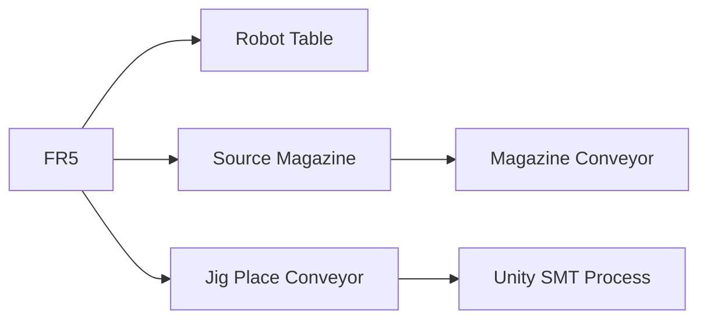
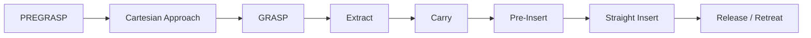
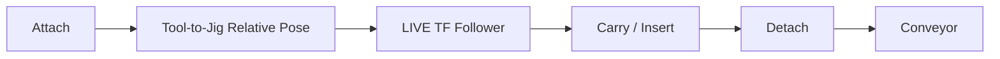

<a id="top"></a>

# 08. ROS2 / Gazebo / MoveIt2

> Simulation 계층에서 FR5 Motion, Workcell Physics, Planning Scene을 어떻게 분리해 검증했는지 정리합니다.

[문서 목차](README.md) · [프로젝트 README](../README.md) · [Motion Validation](11_motion_and_slot_validation.md) · [Laptop Runtime](15_laptop_ros2_simulation_runtime.md)

## 역할

| 계층 | 담당 |
|:---|:---|
| ROS2 | State / Command / TF |
| Gazebo | Physics / Controller / Workcell |
| MoveIt2 | Planning / Collision / Trajectory |
| RViz2 | Planning Scene / Robot visualization |
| Final Master | Slot sequence / guards / execution |

## Workcell



FR5 Base는 고정하고 설비 정합 문제를 Robot Base 이동으로 해결하지 않습니다.

## Planning Scene

주요 Collision Object:

- `gazebo_fr5_robot_table_v2`
- `gazebo_fr5_magazine_visual_probe`
- `gazebo_fr5_magazine_conveyor_probe`
- `gazebo_fr5_jig_place_conveyor_probe`

Gazebo와 MoveIt의 기준 차이는 Planning Scene 변환에서 처리합니다.

## Slot Motion

### Slot01

초기 검증 기준을 유지하는 Direct Pick 계열입니다.

### Slot02 이상

높이가 증가하는 Magazine에서 Frame 간섭 여유를 확보하기 위해 PREGRASP 후 짧은 Cartesian Approach를 사용합니다.



## Cartesian 구간

- Pick 직전 접근
- Extract
- Final Pre-Insert → Insert
- Release 후 Retreat

Full path가 만들어지지 않는 branch는 실행하지 않습니다.

## Negative-J6 Guard

```text
require_negative_j6_trajectory
→ every trajectory point: J6 < 0
```

끝점뿐 아니라 전체 trajectory를 검사합니다.

## Jig Follower



Jig를 목적지로 순간 이동시키지 않고 Tool과의 상대관계를 유지합니다.

## ACTION 단계 설명 원칙

초기 문서에는 Slot 범위별 ACTION05 정책을 단순화한 표현이 있었지만, 최종 Laptop Runtime log에는 후반 TAKE에서도 ACTION05 step이 관찰됩니다. 따라서 최종 포트폴리오에서는 ACTION05를 전역 규칙으로 일반화하지 않고 **Final Master에 고정된 TAKE별 실행 sequence를 source of truth**로 취급합니다.

즉, 면접용 설명에서는 “Slot03~07은 무조건 ACTION05 미사용”처럼 과도하게 일반화하지 않고 실제 Final Master / Runtime evidence를 기준으로 설명합니다.

## Final Master

```text
src/fr5_moveit_config/scripts/slot01_to_slot08_final_one_take.py
```

SHA256:

```text
80009dda5e196e8afbc4242bd859a35b5982d0efef531fdcc9286293f4ae59be
```

TAKE1~TAKE7 Final Simulation PASS, TAKE8은 운영 제외입니다.

## Laptop Performance 문제 해결

GUI + RViz 동시 실행 시 RTF 저하로 Master wall-clock timeout이 먼저 발생했습니다. Robot pose를 재튜닝하지 않고 true headless Gazebo를 추가했습니다.

```bash
ros2 launch fr5_gazebo fr5_workcell.launch.py \
  gz_args:="-s -r"
```

| Runtime | RTF |
|:---|---:|
| Gazebo true headless | `0.998` |
| headless + MoveIt2 | `0.997` |

Motion 문제가 아니라 Runtime performance 문제로 분리해 해결했습니다.

## 운영 확인 항목

- `/joint_states`
- Controller active
- Planning Scene
- Current Joint State
- Cartesian fraction
- Negative J6
- Jig follower
- Insert / Retreat
- Conveyor release

---

[↑ 맨 위로](#top) · [문서 목차](README.md) · [프로젝트 README](../README.md)
