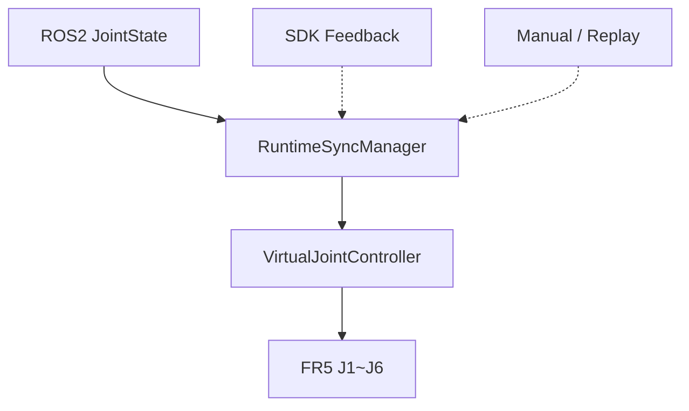
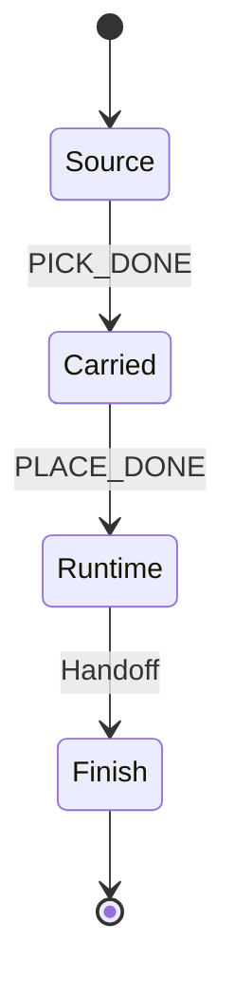
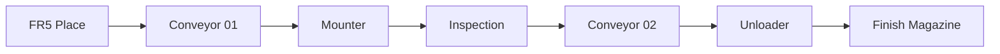

<a id="top"></a>

# 09. Unity Digital Twin

> Unity는 Motion Planner가 아니라 **Robot State·Workcell Process·GUI·Camera를 통합해 보여주는 Digital Twin 계층**입니다.

[문서 목차](README.md) · [프로젝트 README](../README.md) · [Camera & Recording](16_unity_camera_and_recording.md)

## Unity 역할

- FR5 Joint Runtime Sync
- Runtime 입력 소유권
- Robot / Workcell visualization
- Source / Finish Magazine
- Jig Visual Ownership
- SMT Process
- Operator GUI
- Workcell Status
- Portfolio Camera / Recording

## Runtime 입력 소유권



한 번에 하나의 Source만 Joint Transform을 소유하도록 합니다.

## Edit Mode / Runtime 분리

| Edit Mode 기준 | Runtime 상태 |
|:---|:---|
| Robot / Table Transform | Joint Feedback |
| Equipment layout | Jig Ownership |
| Slot 기준 | Conveyor movement |
| Material / Prefab | Process phase |
| Camera 기본 Transform | Camera switching |
| UI hierarchy | Status text |

Editor Utility와 Scene 구성 점검 도구를 사용해 Runtime 테스트가 기준 Scene을 임의로 변경하지 않도록 했습니다.

## Source Magazine

```text
Slot01~07 = Jig
Slot08    = EMPTY
```

Slot08은 Source supply 대상이 아닙니다.

## Jig Ownership



한 시점에 하나의 Owner만 Jig를 표현합니다.

## SMT Process



### 공통 Transfer Speed

```text
speed = 0.15 m/s
duration = world_distance / speed
```

Process dwell과 Translation을 분리합니다.

### Finish Straight Insert

Unloader 출력 시 Jig world rotation을 저장하고 Height Alignment / Approach / Insert 동안 유지합니다.

```text
Quaternion.Angle(startRotation, endRotation) <= 0.01°
```

Static/Offline 검증은 완료했고 최종 공정 시각 검증은 촬영 단계에서 다시 확인합니다.

## Workcell Status GUI

Runtime Panel에 Process / Phase / Source / Finish 요약을 0.2초 throttle/cache 구조로 표시합니다.

표시 예:

```text
공정 실행 중 / 단계 슬롯 삽입
완료 2 / 최근 공급 03
적재 4 / 대상 10
```

기술명 `FR5`, `ROS2`, `SDK`, `TCP`는 영문으로 유지하고 사용자 동작/상태 문구만 한국어 중심으로 정리합니다.

## UI 이벤트 구성

Scene 구성 점검 기준:

| 항목 | 결과 |
|:---|---:|
| Button | 96 |
| 1 persistent listener | 85 |
| 0 persistent listener | 9 |
| 2 persistent listeners | 2 |
| Missing Target | 0 |
| Missing Method | 0 |
| Missing Script | 0 |
| STOP listener | 1 |

Runtime `AddListener`는 Edit Mode Persistent UnityEvent와 별도로 추적합니다.

## Portfolio Camera

기존 RenderTexture Camera를 보존하면서 Game View shot Camera를 분리했습니다.

```text
Main
+ Process Camera 01~07
+ Top Overview
+ FR5 Close-up
+ Cinematic Follow
```

Game View output과 AudioListener는 각각 하나만 활성화합니다.

Camera 전환:

```text
1~7 Process
8 Top
9 Close-up
0 Follow
` Main
```

Play Mode에서 switching 자체는 확인했습니다.

## Unity Recorder

- `com.unity.recorder@5.1.7`
- FHD 1080p
- 16:9
- H.264 MP4
- High
- 30 FPS
- Audio OFF
- `Project/Recordings`

Recorder는 Unity clean B-roll 용도로 사용하며 Gazebo/RViz/Unity 동시 화면은 외부 capture와 역할을 분리합니다.

## 현재 검증 경계

| 항목 | 상태 |
|:---|:---:|
| Camera switching | PASS |
| AudioListener 1 | PASS |
| STOP listener 1 | PASS |
| Workcell Text binding | PASS |
| Recorder 설치/설정 | PASS |
| MP4 sample | 최종 촬영 단계에서 확인 예정 |
| ROS2 live JointState E2E | 최종 통합 검증 예정 |
| Actual FR5 SDK E2E | 실제 장비 검증 예정 |

---

[↑ 맨 위로](#top) · [문서 목차](README.md) · [프로젝트 README](../README.md)
