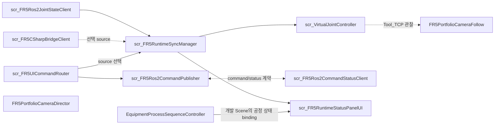

<a id="top"></a>

# 09. Unity Digital Twin

Unity는 로봇 motion planner가 아니라 joint feedback, 운영 UI, SMT 공정과 Camera를 구성하는 계층입니다.

## Unity Runtime Script 구조

아래 11개 클래스는 개발 Scene의 Runtime 역할을 나타냅니다.
실선은 입력·호출, 점선은 선택 경로 또는 관찰입니다.
공개 소스 묶음은 기존 tracked 버전을 보존하므로 Scene 연결을 자동 설치하는 구조와는 다릅니다.



| 외부 입력/출력 | 연결 |
|---|---|
| `/joint_states` | Ros2JointStateClient 입력 |
| 기존 FR5 J1~J6 Transform | VirtualJointController 출력 |
| `/fr5/unity_command` / `/fr5/command_status` | Publisher / StatusClient |
| 명시적으로 전달한 동일 Jig | Process Controller 입력 API |
| SMT / Finish Magazine | Process Controller 출력 |
| Game View | Director의 Camera 선택 + Follow의 관찰 pose |

Publisher와 StatusClient 사이 점선은 topic 기반 command/status 계약입니다.
이 공개 묶음의 보존된 Publisher가 새 StatusClient를 자동 생성·구독한다는 뜻은 아닙니다.

## Source 선택과 관절 적용

`scr_FR5RuntimeSyncManager`는 `IFR5RuntimePoseSource`에서 sample을 받아
`scr_VirtualJointController`의 `SetJointAngleByIndex`, `ApplyPose`로 전달합니다.
실제 관절 적용 클래스는 `scr_VirtualJointController`입니다.

ROS2 joint name으로 joint1~6을 대응시키고 radian을 degree로 변환합니다.
JSON Bridge와 Replay도 같은 입력 계약을 사용하며 joint axis/sign은 기존 모델 기준을 유지합니다.
Manual UI의 입력/preview와 live 적용의 소유권도 구분합니다.

## Command와 공정의 경계

기존 UI 명령 경로는 Router → Publisher → ROS2 listener입니다.
Backend가 처리하는 MOVE_J/HOME/RESET/STOP/Gripper와
ROS2 Master의 TAKE sequence는 별도 entry point입니다.

JointState 수신이나 Virtual Joint 갱신은 SMT 자동 시작 조건이 아닙니다.
공정의 입력은 다음 API입니다.

```csharp
TryAcceptFr5InsertedJig(Transform jig, int sourceSlot)
```

API는 전달한 동일 Jig를 수락하며 sourceSlot 1~7, 중복 입력, 공정 busy와 Finish 상태를 확인합니다.

## SMT / Finish

- Source Slot01~07, Slot08 EMPTY.
- Source Magazine과 Finish `filledSlots[]`는 별개.
- ExternalFr5는 3.0초 dwell 후 현재 insert 위치에서 이동.
- Conveyor01 → Mounter → Inspection → Conveyor02 → Unloader → Finish.
- 공통 `0.15 m/s` 선속도와 거리 기반 duration.
- Mounter/Inspection processing dwell과 Lift timing은 별도.
- 자동 Jig 생성 및 자동 다음-cycle 시작 차단.

Finish는 `unloaderEnd` 도착 rotation을 저장한 다음 Lift를 world-Y로 이동시킵니다.
Jig는 회전하지 않고 slot position까지 world-horizontal 직선으로 이동합니다.
`RotationDriftDegrees(start, end) <= 0.01`을 검사하며,
slot.rotation을 이동 목표로 삼지 않습니다.
완료 시 runtime Jig hide와 filledSlot 활성화 사이에 frame을 넘기지 않습니다.

## Runtime / Workcell Status

개발 Scene에서는 Runtime 연결 상태와 Process Controller의
`ExternalPhase`, `ExternalCompletedCount`, `LastSourceSlot`, `FilledSlotCount`를 표시하도록 구성했습니다.
주기 제한, 같은 문자열 재대입 억제, 숫자 deadband와 last-value 보존으로 재표시를 줄였습니다.

공개 저장소에 추가한 Process Controller는 이 상태 API를 제공하지만,
기존 tracked StatusPanel이나 Scene binding을 이번 소스 묶음에서 덮어쓰지는 않습니다.

## Camera와 기존 RenderTexture

Director는 Main + Portfolio shot 10개를 전환하고 Game View와 AudioListener를 각각 하나로 관리합니다.
기존 RenderTexture Camera는 이 출력 전환 대상에서 제외합니다.

Follow는 serialized target과 offset/damping으로 자기 Camera의 position/rotation만 갱신합니다.
개발 Scene의 target은 Tool_TCP이며, 이 클래스 자체가 공정 단계별 Jig target을 자동 선택하지 않습니다.
시간 기반 Camera sequence는 Robot/Conveyor 명령을 실행하지 않습니다.

[Camera/Recording](16_unity_camera_and_recording.md) · [Script Reference](12_script_reference.md)

---

## 문서 목차

[프로젝트 README](../README.md) · [문서 목록](README.md) · [맨 위로](#top)

**기본 문서**
[01 Overview](01_overview.md) · [02 Architecture](02_architecture.md) · [03 Features](03_features.md) · [04 Data Flow](04_data_flow.md) · [05 Validation](05_validation.md) · [06 Scope](06_project_scope.md) · [07 Structure](07_project_structure.md)

**상세 기술 문서**
[08 ROS2/Gazebo/MoveIt2](08_ros2_gazebo_moveit.md) · [09 Unity](09_unity_digital_twin.md) · [10 FR5 SDK](10_fr5_sdk_integration.md) · [11 Motion](11_motion_and_slot_validation.md) · [12 Scripts](12_script_reference.md) · [13 Decisions](13_design_decisions_and_issues.md) · [14 Deployment](14_deployment_and_handoff.md) · [15 Simulation](15_laptop_ros2_simulation_runtime.md) · [16 Camera](16_unity_camera_and_recording.md)
