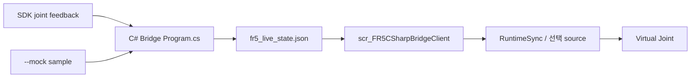

<a id="top"></a>

# 10. FR5 SDK Interface

## 실제 제어 경험과 설계 배경

FR5 SDK 기반 실제 로봇 제어는 [Cocktail Robot Demo](../demos/README.md)에서 수행했으며,
Digital Twin에서는 해당 제어 경험을 바탕으로 ROS2/Gazebo/MoveIt2 시뮬레이션과
Unity Runtime/Interface 구조를 구성했습니다.

Cocktail Demo는 Robot motion, Gripper, DIO, Lua motion sequence를 다룹니다.
Digital Twin에서는 feedback source와 simulation command를 분리했습니다.

## C# read-only Bridge

[Program.cs](../BridgeTools/FR5_CSharp_Bridge/FR5_CSharp_Bridge/Program.cs)는
Unity 밖에서 실행되는 Console 프로그램입니다.



- config의 `readOnly=true`를 요구합니다.
- `RPC`, `GetSDKComState`, `GetActualJointPosDegree`로 연결·상태·관절 feedback을 읽습니다.
- SDK logging/reconnect 설정과 종료 시 `CloseRPC`가 포함됩니다.
- `--mock`은 SDK 연결을 하지 않고 6축 sample을 생성합니다.
- default/mock minimum polling은 200 ms이며 unique temp 파일과 IOException retry를 사용합니다.
- motion command를 구현하는 Bridge가 아닙니다.

Unity의 `scr_FR5CSharpSdkClient`/`FR5HardwareAdapterStub`와 별도 경로입니다.
stub의 command interface가 실제 SDK command 구현을 의미하지 않습니다.

## 최소 build dependency

[project](../BridgeTools/FR5_CSharp_Bridge/FR5_CSharp_Bridge/FR5_CSharp_Bridge.csproj)와
[config](../BridgeTools/FR5_CSharp_Bridge/config/fr5_bridge_config.json)를 제공합니다.

Windows의 .NET Framework 4.8.1 개발/targeting 환경과 .NET SDK를 사용합니다.
FAIRINO SDK의 `libfairino.dll` 및 `CookComputing.XmlRpcV2.dll`은 외부 dependency로 전달합니다.
SDK example executable, bin/obj, logs는 이 소스 묶음에 포함하지 않습니다.

```powershell
dotnet build BridgeTools/FR5_CSharp_Bridge/FR5_CSharp_Bridge/FR5_CSharp_Bridge.csproj -p:FairinoSdkDir="C:/SDK/fairino/net481"
```

두 DLL이 다른 폴더에 있다면 `-p:FairinoSdkAssembly=...`와 `-p:XmlRpcAssembly=...`로 각각 지정합니다.
필요 DLL이 없으면 build가 명확한 dependency 오류로 중단됩니다.
mock도 동일 assembly로 build하므로 build dependency 자체는 필요합니다.

빌드 후 mock 실행:

```powershell
& ./BridgeTools/FR5_CSharp_Bridge/FR5_CSharp_Bridge/bin/Debug/FR5_CSharp_Bridge.exe --mock
```

Bridge는 상위 폴더를 검색해 공개 저장소의 `Assets/StreamingAssets` 또는
개발 배치의 `Unity/FAIRINO_FR5_DigitalTwin/Assets/StreamingAssets`를 사용합니다.
생성 파일은 `Bridge/fr5_live_state.json`입니다.
mock 실행은 이 파일을 갱신하므로 source 검토와는 별도 실행 작업입니다.

## Simulation command path

```text
Unity UICommandRouter
→ Ros2CommandPublisher
→ /fr5/unity_command
→ ROS2 command listener
→ Gazebo arm / gripper trajectory controller
```

응답은 `/fr5/command_status`입니다.
이 command path와 SDK read-only 파일 경로는 서로를 대신하지 않습니다.
선택 source는 RuntimeSync에서 분리하며, Simulation STOP hold를 실제 장비 비상정지로 설명하지 않습니다.

[Architecture](02_architecture.md) · [Script Reference](12_script_reference.md)

---

## 문서 목차

| 구분 | 바로가기 |
| --- | --- |
| **프로젝트** | [프로젝트 README](../README.md) · [전체 문서 인덱스](README.md) |
| **기본 문서** | [01 Overview](01_overview.md) · [02 Architecture](02_architecture.md) · [03 Features](03_features.md) · [04 Data Flow](04_data_flow.md) · [05 Validation](05_validation.md) · [06 Scope](06_project_scope.md) · [07 Structure](07_project_structure.md) |
| **상세 기술 문서** | [08 ROS2 / Gazebo / MoveIt2](08_ros2_gazebo_moveit.md) · [09 Unity Digital Twin](09_unity_digital_twin.md) · [10 FR5 SDK](10_fr5_sdk_integration.md) · [11 Motion & Slot Validation](11_motion_and_slot_validation.md) · [12 Script Reference](12_script_reference.md) · [13 Design Decisions](13_design_decisions_and_issues.md) · [14 Deployment](14_deployment_and_handoff.md) · [15 Simulation Runtime](15_laptop_ros2_simulation_runtime.md) · [16 Camera & Recording](16_unity_camera_and_recording.md) |
| **수학 · 기구학 검증** | [Validation 문서](05_validation.md) · [Motion Validation](11_motion_and_slot_validation.md) · [MDH Parameters](../Python/Phase1_Kinematics/Python_MDH/fr5_mdh_params.py) · [Python FK Solver](../Python/Phase1_Kinematics/Python_MDH/fr5_fk_solver.py) · [Kinematics Tests](../Python/Phase1_Kinematics/Tests/) |
| **실제 FR5 · Cocktail Demo** | [Demo Hub](../demos/README.md) · [FR5 SDK Cocktail Robot Demo](../demos/01_fr5_sdk_cocktail_robot_demo/README.md) |
| **ROS2 Simulation** | [ROS2 / Gazebo / MoveIt2 문서](08_ros2_gazebo_moveit.md) · [fr5_ros2_ws Repository](https://github.com/seongyeop-dev/fr5_ros2_ws) |

[문서 목록으로 이동](README.md)
