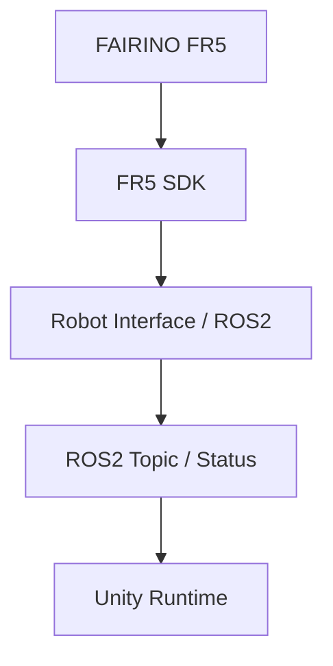
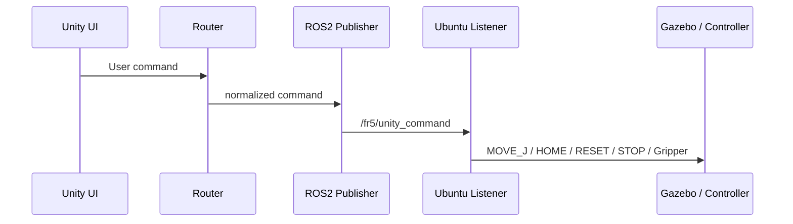
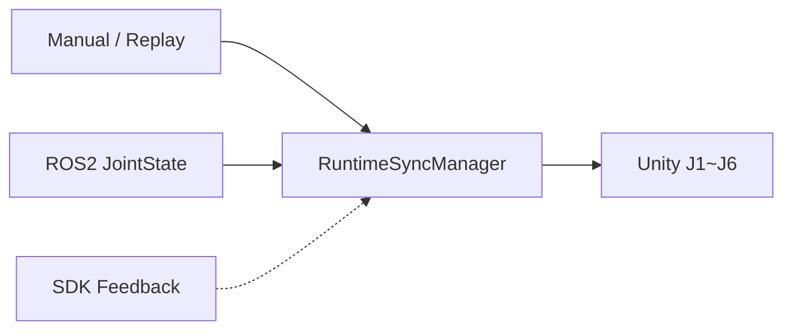

# 10. FR5 SDK Integration

> 실제 Robot은 Simulation과 별도 검증 계층으로 취급하며, **Read-only Feedback → Command → Safety** 순서로 확장합니다.

[문서 목차](README.md) · [프로젝트 README](../README.md) · [Deployment](14_deployment_and_handoff.md)

## 목적

Unity에서 실제 FR5에 곧바로 명령을 보내지 않고 Simulation, Read-only Feedback, Actual Command를 분리합니다.

## 계층 구조

이 그림은 실제 Hardware 통합 목표 구조이며 현재 Hardware PASS를 의미하지 않습니다.

## Read-only Feedback 우선

실제 장비 연결 시 우선 확인:

1. Robot connection
2. Joint Position / State
3. SDK Feedback
4. ROS2 Publish
5. Unity Joint 반영
6. STOP path 확인
7. 명시적 Command enable

## Simulation Command Path

Backend Status는 `/fr5/command_status` JSON으로 publish합니다.

## TAKE / STOP 경계

| 항목 | 상태 |
|:---|:---:|
| Master `FR5_TAKE=1..7/ALL` | Simulation에서 확인 |
| Listener `RUN_TAKE` | PENDING |
| TAKE request_id / correlation | PENDING |
| TAKE BUSY / complete | PENDING |
| legacy STOP hold trajectory | 구현 |
| active Master STOP | PENDING |
| Hardware Emergency Stop | Actual Robot 검증 PENDING |

legacy STOP을 Hardware E-Stop과 같은 기능으로 표현하지 않습니다.

## Runtime Source

현재 Source 하나만 Joint owner가 되도록 관리합니다.

## 검증 단계

| 단계 | 의미 | 상태 |
|:---|:---|:---:|
| Simulation | Gazebo/MoveIt Motion | PASS |
| Unity Visualization | Camera/GUI/Process | 구현/부분 PASS |
| ROS2↔Unity Live | Network JointState | PENDING |
| SDK Read-only | 실제 Robot state | PENDING |
| Actual Command | 실제 Robot motion | PENDING |
| Safety | 실제 stop/abort/speed | PENDING |

## 실제 Hardware 최종 확인 항목

- SDK Joint Feedback 지속 수신
- Actual Joint ↔ ROS2 JointState 일치
- Unity Joint 실시간 동기화
- Command Full Path
- Speed / Safety Parameter
- Workcell calibration
- Emergency / Abort

실제 FR5 최종 Hardware PASS는 위 검증 완료 전까지 확정하지 않습니다.

---

[↑ 맨 위로](#top) · [문서 목차](README.md) · [프로젝트 README](../README.md)
