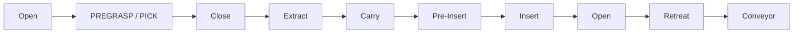
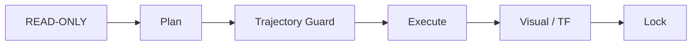

<a id="top"></a>

# 11. Motion & Slot Validation

> Slot별 Motion을 단계적으로 검증하고, 확인된 경로만 통합 실행 시퀀스에 반영했습니다.

[문서 목차](README.md) · [프로젝트 README](../README.md) · [ROS2 / Gazebo / MoveIt2](08_ros2_gazebo_moveit.md)

## 최종 운영 범위

| TAKE | Slot | 상태 |
|:---:|:---:|:---:|
| TAKE1 | Slot01 | PASS |
| TAKE2 | Slot02 | PASS |
| TAKE3 | Slot03 | PASS |
| TAKE4 | Slot04 | PASS |
| TAKE5 | Slot05 | PASS |
| TAKE6 | Slot06 | PASS |
| TAKE7 | Slot07 | PASS |
| TAKE8 | Slot08 | OUT OF SCOPE |

## Master

```text
src/fr5_moveit_config/scripts/slot01_to_slot08_final_one_take.py
```
## TAKE Selector

| 값 | 실행 |
|:---|:---|
| `1`~`7` | 해당 TAKE |
| `ALL` | TAKE1→TAKE7 |
| TAKE8 | 사용하지 않음 |

`--execute`는 Simulation execution을 의미합니다.

## Motion Sequence



## Slot01

- 초기 검증 기준 유지
- 확정 Pick Pose 재사용
- 이후 Slot 개발 때문에 재튜닝하지 않음

## Slot02 이상

- Magazine height 증가 고려
- PREGRASP
- 짧은 Cartesian Approach
- Negative-J6 seed family
- Final Pre-Insert / Straight Insert

## Negative-J6

```text
for every trajectory point:
    J6 < 0
```

End point가 아니라 모든 point를 검사합니다.

## Cartesian Validation

- Final Pick approach
- Extract
- Pre-Insert → Insert
- Release → Retreat

직선 구간은 endpoint뿐 아니라 실제 generated path를 확인합니다.

## Jig Follower

```text
T_tool_to_jig(initial)
≈
T_tool_to_jig(runtime)
```

Carry 중 relative pose가 유지되는지 확인합니다.

## ACTION 단계 기록 원칙

초기 운영 메모에는 ACTION05 범위를 Slot01~02로 제한한 표현이 있었지만, 최종 Laptop 실행 log에는 TAKE3~7 sequence에서도 ACTION05 단계가 관찰되었습니다.

ACTION05는 Slot 범위 전체에 하나의 규칙으로 단순화하지 않고 TAKE별 실행 시퀀스에 따라 적용합니다. 핵심 검증 대상은 Pick/Extract/Carry/Insert/Retreat, Negative-J6, Jig follower, collision validity입니다.

## Laptop Final Revalidation

```text
Laptop HEAD

통합 모션 시퀀스 SHA
```

Final result:

```text
TAKE1 → TAKE7 순차 실행 완료
FINAL_MASTER_RETURN_CODE=0
TAKE1_TO_TAKE7_SIMULATION=COMPLETE
```

Performance 문제를 이유로 Motion Pose를 다시 튜닝하지 않았습니다.

## 검증 절차



실패 경로가 아니라 최종 PASS 기준을 Master에 남깁니다.

---

[↑ 맨 위로](#top) · [문서 목차](README.md) · [프로젝트 README](../README.md)
