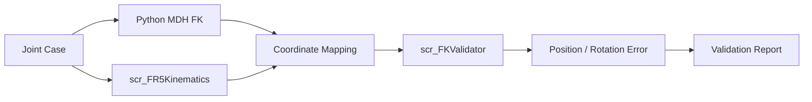

# 12. 핵심 Script Reference

실제 Runtime과 Engineering Validation에 사용한 코드만 분류합니다.
Unity .cs는 원본 .meta와 함께 보존하며 ROS2 source는 별도 저장소에 연결합니다.
공개 묶음의 기존 tracked Runtime과 개발 Scene의 상세 binding은 [Project Structure](07_project_structure.md)에 구분했습니다.

## 1. ROS2 / Simulation

| 파일 | 핵심 역할 | 입력 / 출력 |
|---|---|---|
| [slot01_to_slot08_final_one_take.py](https://github.com/seongyeop-dev/fr5_ros2_ws/blob/feat/fr5-gazebo-jig-attach-detach/src/fr5_moveit_config/scripts/slot01_to_slot08_final_one_take.py) | `Master`, TAKE1~TAKE7 sequence | Slot config·JointState·TF → 계획·실행·Jig pose |
| [Slot config](https://github.com/seongyeop-dev/fr5_ros2_ws/blob/feat/fr5-gazebo-jig-attach-detach/src/fr5_moveit_config/config/slot01_to_slot08_final_one_take_v1.yaml) | Slot pose, seed, 속도, 서비스 | Master의 공통 실행 데이터 |
| [fr5_workcell.launch.py](https://github.com/seongyeop-dev/fr5_ros2_ws/blob/feat/fr5-gazebo-jig-attach-detach/src/fr5_gazebo/launch/fr5_workcell.launch.py) | Workcell 실행 구성 | world/control launch |
| [fr5_gazebo_control.launch.py](https://github.com/seongyeop-dev/fr5_ros2_ws/blob/feat/fr5-gazebo-jig-attach-detach/src/fr5_gazebo/launch/fr5_gazebo_control.launch.py) | Gazebo 및 controller 구성 | URDF·controller YAML → Simulation |
| [move_group.launch.py](https://github.com/seongyeop-dev/fr5_ros2_ws/blob/feat/fr5-gazebo-jig-attach-detach/src/fr5_moveit_config/launch/move_group.launch.py) | MoveIt2 node 실행 | 모델·planning/controller 설정 |
| [fr5_unity_command_listener.py](https://github.com/seongyeop-dev/fr5_ros2_ws/blob/feat/fr5-gazebo-jig-attach-detach/src/fr5_ros2_bridge/fr5_ros2_bridge/fr5_unity_command_listener.py) | 기존 Unity 명령 처리 | `/fr5/unity_command` → trajectory / status |
| [fr5.urdf.xacro](https://github.com/seongyeop-dev/fr5_ros2_ws/blob/feat/fr5-gazebo-jig-attach-detach/src/fr5_description/urdf/fr5.urdf.xacro) | 모델·관절·tool 정의 | Gazebo/MoveIt 모델 |
| [fr5_controllers.yaml](https://github.com/seongyeop-dev/fr5_ros2_ws/blob/feat/fr5-gazebo-jig-attach-detach/src/fr5_gazebo/config/fr5_controllers.yaml) | Arm/Gripper 및 JointState broadcaster | ros2_control interface |
| [fr5_workcell.sdf](https://github.com/seongyeop-dev/fr5_ros2_ws/blob/feat/fr5-gazebo-jig-attach-detach/src/fr5_gazebo/worlds/fr5_workcell.sdf) | 설비·world 구성 | Gazebo 및 PlanningScene 형상 근거 |

Master의 `prepare_planning_scene`가 설비 collision을 구성합니다.
`live_tool_tf_pose`, `capture_current_jig_follow_transform`,
`set_current_jig_from_tool`, `stop_following`, `conveyor_release`가
Tool-Jig 상대관계와 release 이후 흐름을 담당합니다.
최종 follower를 단순 physics attach/detach만으로 설명하지 않습니다.

ROS2 listener의 실제 command 집합은 MOVE_J/HOME/RESET/STOP/Gripper입니다.
TAKE 실행 설명은 별도 Master entry point를 사용합니다.

## 2. Unity Runtime Sync

| 파일 / 클래스 | 연결 | 역할 |
|---|---|---|
| [scr_FR5Ros2JointStateClient](../Assets/Project/Scripts/RuntimeSources/ROS2/scr_FR5Ros2JointStateClient.cs) | ROSConnection Subscribe → pose sample | JointState 이름 매핑·radian→degree |
| [scr_FR5RuntimeSyncManager](../Assets/Project/Scripts/Core/Runtime/scr_FR5RuntimeSyncManager.cs) | serialized source → Virtual Controller | source 선택·polling·유효 sample 적용 |
| [scr_VirtualJointController](../Assets/Project/Scripts/Robot/Control/scr_VirtualJointController.cs) | serialized J1~J6 Transform | 기존 axis/sign·초기 local rotation 기반 적용 |
| [IFR5RuntimePoseSource](../Assets/Project/Scripts/Core/Runtime/IFR5RuntimePoseSource.cs) | source 공통 interface | 연결·poll·sample 계약 |
| [FR5SdkPoseSample](../Assets/Project/Scripts/Core/Runtime/FR5SdkPoseSample.cs) | 공통 데이터 | joint 및 pose/state 필드 |
| [scr_FR5UnityReplayJointStateSource](../Assets/Project/Scripts/RuntimeSources/Replay/scr_FR5UnityReplayJointStateSource.cs) | replay JSON → RuntimeSync | 기록된 joint 재생 |

ROS2에서는 `/joint_states` feedback을 사용합니다.
테스트 publisher `/fr5/joint_states`와 구분하며,
실제 모델 적용 클래스는 `scr_VirtualJointController`입니다.

## 3. Unity Command / Status

| 파일 / 클래스 | 연결 | 역할 |
|---|---|---|
| [scr_FR5UICommandRouter](../Assets/Project/Scripts/UI/Actions/scr_FR5UICommandRouter.cs) | UI event → 기존 Publisher/source API | 의도된 명령 entry point |
| [scr_FR5Ros2CommandPublisher](../Assets/Project/Scripts/RuntimeSources/ROS2/scr_FR5Ros2CommandPublisher.cs) | ROSConnection Publish | `/fr5/unity_command` JSON |
| [scr_FR5Ros2CommandStatusClient](../Assets/Project/Scripts/RuntimeSources/ROS2/scr_FR5Ros2CommandStatusClient.cs) | ROSConnection Subscribe; `StatusReceived` event | `/fr5/command_status` 수신·해석 |
| [scr_FR5RuntimeStatusPanelUI](../Assets/Project/Scripts/UI/Panels/scr_FR5RuntimeStatusPanelUI.cs) | Runtime/source reference | 상태·값 표시 |
| [scr_FR5JointPanelUI](../Assets/Project/Scripts/UI/Panels/scr_FR5JointPanelUI.cs) | input/slider → 기존 preview | 관절 입력 표시 |

보존된 Publisher/Router/StatusPanel을 최신 개발 버전으로 교체하지 않았습니다.
StatusClient는 수신 API로 포함되며 기존 Publisher에 event를 자동 연결하는 installer가 아닙니다.
개발 Scene의 Workcell Text binding 역시 새 class 파일 추가와 구분합니다.

## 4. Unity Workcell

| 파일 / 클래스 | 연결 | 역할 |
|---|---|---|
| [EquipmentProcessSequenceController](../Assets/Project/Scripts/Workcell/EquipmentProcessSequenceController.cs) | 외부 Jig API, serialized 경유점·Lift·filledSlots | 동일 Jig의 전체 SMT cycle |
| [EquipmentStackLightController](../Assets/Project/Scripts/Workcell/EquipmentStackLightController.cs) | Process → serialized lens Renderer | Ready/Processing/Fault 표시 |

핵심 method:

- `TryAcceptFr5InsertedJig`: sourceSlot·중복·busy·Finish 상태를 검사하고 동일 instance 수락.
- `RunExternalJig`: 3초 dwell 및 한 cycle의 완료/Finish 증가 검사.
- `RunJigCycle`: Conveyor01, Mounter, Inspection, Conveyor02, Unloader.
- `MoveTransform`: Jig translation의 거리/공통 속도 duration.
- `InsertExternalJigIntoFinishSlot`: Lift 정렬·무회전 삽입·placeholder 전환.

ExternalFr5와 LegacyGenerated 모드는 분리되어 있습니다.
외부 입력에서는 자동 Jig Instantiate와 Mounter 이후 자동 다음-cycle 시작을 차단합니다.
공정 Controller는 FR5 joint나 Camera의 motion owner가 아닙니다.

## 5. Unity Camera

| 파일 / 클래스 | 연결 | 역할 |
|---|---|---|
| [FR5PortfolioCameraDirector](../Assets/Project/Scripts/Camera/FR5PortfolioCameraDirector.cs) | serialized Main/shot 배열·AudioListener | 수동 선택, Main 복귀, 시간 기반 sequence |
| [FR5PortfolioCameraFollow](../Assets/Project/Scripts/Camera/FR5PortfolioCameraFollow.cs) | serialized target; GetComponent Camera | 관찰 target을 향해 자기 Camera만 이동 |
| [scr_FR5CameraTopBarUI](../Assets/Project/Scripts/UI/Panels/scr_FR5CameraTopBarUI.cs) | 기존 RenderTexture binding → RawImage | 기존 Camera UI 전환 |

Director는 RenderTexture Camera를 Game View 선택 대상에서 제외합니다.
Follow의 `SetTarget`은 관찰 대상을 지정하는 API이며 Jig 공정의 소유권을 이전하지 않습니다.

## 6. Mathematical / Kinematic Validation

| 파일 | 역할 |
|---|---|
| [fr5_mdh_params.py](../Python/Phase1_Kinematics/Python_MDH/fr5_mdh_params.py) | 프로젝트 canonical 6축 MDH table |
| [fr5_fk_solver.py](../Python/Phase1_Kinematics/Python_MDH/fr5_fk_solver.py) | degree 입력, 행렬 누적, canonical FK 결과 |
| [transform_utils.py](../Python/Phase1_Kinematics/Common/transform_utils.py) | 회전/이동 행렬과 RPY |
| [fr5_pose_cases.json](../Python/Phase1_Kinematics/Python_MDH/fr5_pose_cases.json) | 네 joint case |
| [fr5_pose_case_runner.py](../Python/Phase1_Kinematics/GroundTruth/fr5_pose_case_runner.py) | case 실행 및 export 호출 |
| [groundtruth_single_runner.py](../Python/Phase1_Kinematics/GroundTruth/groundtruth_single_runner.py) | Unity joint TXT/CSV 입력과 LIVE 결과 |
| [groundtruth_output_writer.py](../Python/Phase1_Kinematics/GroundTruth/groundtruth_output_writer.py) | JSON/CSV/TXT 출력 |
| [scr_FR5Kinematics](../Assets/Project/Scripts/Core/Kinematics/scr_FR5Kinematics.cs) | Unity C# FK 및 중간 구조점 |
| [scr_FR5CoordinateMapper](../Assets/Project/Scripts/Core/Kinematics/scr_FR5CoordinateMapper.cs) | raw pose→Unity frame |
| [scr_PythonAutoRunner](../Assets/Project/Scripts/Core/Validation/scr_PythonAutoRunner.cs) | 기존 joint export·Python process·load 연계 |
| [scr_TCPCompareManager](../Assets/Project/Scripts/Core/Validation/scr_TCPCompareManager.cs) | Python readable case load/map |
| [scr_FR5ValidationManager](../Assets/Project/Scripts/Core/Validation/scr_FR5ValidationManager.cs) | 비교 실행 조정 |
| [scr_FKValidator](../Assets/Project/Scripts/Core/Validation/scr_FKValidator.cs) | 위치·Euler 오차와 tolerance |
| [scr_ValidationReportWriter](../Assets/Project/Scripts/Core/Validation/scr_ValidationReportWriter.cs) | case별 오차·판정 TXT 기록 |
| [scr_FR5AxisCompareDebugger](../Assets/Project/Scripts/Robot/Debug/scr_FR5AxisCompareDebugger.cs) | FK/Shadow의 basis 방향 비교 |

Python canonical MDH와 C# FK의 transform order 차이를 유지한 상태에서,
독립 비교 구조와 개발 과정의 joint/axis/coordinate 검증을 설명합니다.
현재 모든 FK case의 완전 정합을 의미하지 않습니다.
테스트 source와 오차 단위·허용치는 [Validation](05_validation.md)에 정리했습니다.

## 7. FR5 SDK Interface

| 파일 | 역할 |
|---|---|
| [Bridge Program.cs](../BridgeTools/FR5_CSharp_Bridge/FR5_CSharp_Bridge/Program.cs) | SDK read-only joint feedback / mock JSON |
| [Bridge project](../BridgeTools/FR5_CSharp_Bridge/FR5_CSharp_Bridge/FR5_CSharp_Bridge.csproj) | 외부 SDK DLL을 지정하는 최소 build |
| [Bridge config](../BridgeTools/FR5_CSharp_Bridge/config/fr5_bridge_config.json) | IP, polling, readOnly, output 이름 |
| [scr_FR5CSharpBridgeClient](../Assets/Project/Scripts/Core/Runtime/scr_FR5CSharpBridgeClient.cs) | JSON feedback → Runtime pose source |

SDK DLL과 생성물은 수록하지 않습니다.
실제 FR5 제어 경험은 [Cocktail Robot Demo](../demos/README.md),
Digital Twin의 feedback/command 경계는 [SDK Interface](10_fr5_sdk_integration.md)에서 설명합니다.

---

## 문서 목차

[프로젝트 README](../README.md) · [문서 목록](README.md) · [맨 위로](#top)

**기본 문서**
[01 Overview](01_overview.md) · [02 Architecture](02_architecture.md) · [03 Features](03_features.md) · [04 Data Flow](04_data_flow.md) · [05 Validation](05_validation.md) · [06 Scope](06_project_scope.md) · [07 Structure](07_project_structure.md)

**상세 기술 문서**
[08 ROS2/Gazebo/MoveIt2](08_ros2_gazebo_moveit.md) · [09 Unity](09_unity_digital_twin.md) · [10 FR5 SDK](10_fr5_sdk_integration.md) · [11 Motion](11_motion_and_slot_validation.md) · [12 Scripts](12_script_reference.md) · [13 Decisions](13_design_decisions_and_issues.md) · [14 Deployment](14_deployment_and_handoff.md) · [15 Simulation](15_laptop_ros2_simulation_runtime.md) · [16 Camera](16_unity_camera_and_recording.md)
