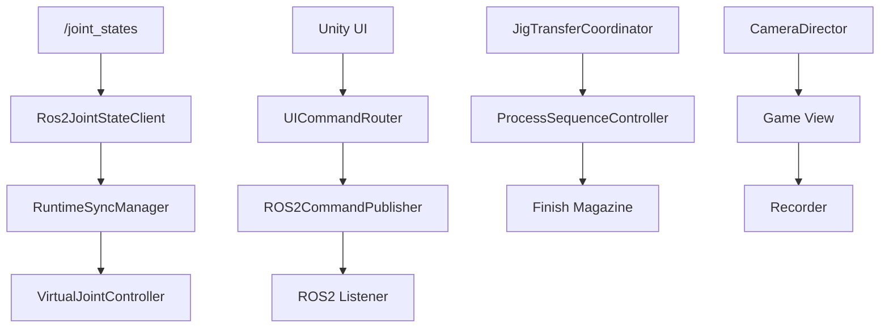

<a id="top"></a>

# 12. Script Reference

> 저장소의 모든 파일을 나열하지 않고 **실제 Runtime 책임이 있는 핵심 파일**만 정리합니다.

[문서 목차](README.md) · [프로젝트 README](../README.md) · [Project Structure](07_project_structure.md)

## ROS2 / Motion

| 파일 | 책임 |
|:---|:---|
| `slot01_to_slot08_final_one_take.py` | Final TAKE1~07 Motion Master |
| `slot01_to_slot08_final_one_take_v1.yaml` | Slot Motion 설정 |
| `fr5_workcell.launch.py` | Workcell launch / headless |
| `fr5_gazebo_control.launch.py` | Gazebo control / command listener |
| `fr5_workcell.sdf` | Workcell World |
| `move_group.launch.py` | MoveIt2 |
| `moveit_rviz.launch.py` | RViz visualization |

### Final Master

입력:

```text
FR5_TAKE=1..7 / ALL
Current Joint State
Slot Config
Planning Scene
```

주요 책임:

- Preflight
- PREGRASP / PICK
- Cartesian
- Gripper
- Jig follower
- J6 guard
- Release / Conveyor

## ROS2 Command Backend

### `fr5_unity_command_listener.py`

```text
src/fr5_ros2_bridge/fr5_ros2_bridge/fr5_unity_command_listener.py
```

현재:

- `/fr5/unity_command` subscriber
- MOVE_J / HOME / RESET / STOP / Gripper
- `/fr5/command_status` publisher

PENDING:

- `RUN_TAKE`
- TAKE request_id
- BUSY / completion correlation
- active Master STOP

## Unity Runtime Sync

| Script | 책임 |
|:---|:---|
| `scr_FR5Ros2JointStateClient.cs` | `/joint_states` 수신 |
| `scr_FR5RuntimeSyncManager.cs` | Source owner |
| `scr_VirtualJointController.cs` | J1~J6 Transform |
| `scr_FR5Ros2CommandPublisher.cs` | Command publish |
| `scr_FR5Ros2CommandStatusClient.cs` | Status client |
| `scr_FR5UICommandRouter.cs` | UI routing |
| `scr_FR5RuntimeStatusPanelUI.cs` | Runtime / Workcell status |

## Unity Workcell

| Script | 책임 |
|:---|:---|
| `MagazineConveyorController.cs` | Magazine conveyor |
| `MagazineSupplyController.cs` | Source supply |
| `FR5JigTransferCoordinator.cs` | Jig ownership |
| `EquipmentProcessSequenceController.cs` | SMT sequence |
| `EquipmentStackLightController.cs` | Equipment state |
| `FR5InsertedJigTestTrigger.cs` | External input / Finish validation |

## Unity Camera / Portfolio

| Script | 책임 |
|:---|:---|
| `FR5PortfolioCameraDirector.cs` | Shot switching / sequence / Main fallback |
| `FR5PortfolioCameraFollow.cs` | target follow |
| `FR5PortfolioSetup.cs` | Camera/UI/STOP setup & read-only verify |
| `FR5RecorderSetupWindow.cs` | Recorder package query/install helper |

### Recorder

```text
com.unity.recorder@5.1.7
```

Runtime Source가 아니라 Editor recording tool로 사용합니다.

## Unity Editor / Audit

| Script | 책임 |
|:---|:---|
| `FR5SourceFinishSetup.cs` | Source/Finish no-save setup |
| `FR5LiveSceneAlignmentAudit.cs` | Transform / component / UI binding audit |
| `FR5WorkcellEditLayoutTool.cs` | Workcell edit support |
| `FR5RobotCellCriticalTool.cs` | Robot cell protection |
| `FR5SmtCellLayoutTool.cs` | SMT layout |

## 핵심 연결



---

[↑ 맨 위로](#top) · [문서 목차](README.md) · [프로젝트 README](../README.md)
