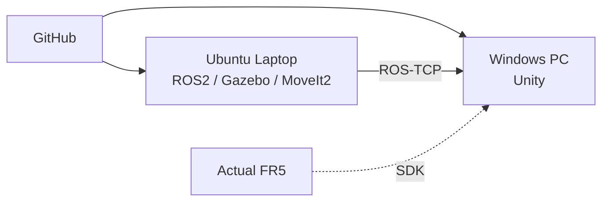
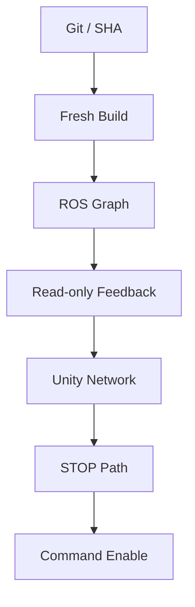

<a id="top"></a>

# 14. Deployment & Laptop Handoff

> Source, build artifact, Runtime environment를 구분하고 **Workspace ?? + 기준 파일 + fresh build**로 Simulation 기준을 노트북에 재현했습니다.

[문서 목차](README.md) · [프로젝트 README](../README.md) · [Laptop Runtime](15_laptop_ros2_simulation_runtime.md)

## 기준 구성

| 항목 | 구성 |
|:---|:---|
| Ubuntu | 24.04.4 LTS |
| ROS2 | Jazzy |
| Simulation | Gazebo 8, MoveIt2, RViz2 |
| Workspace | `~/fr5_ros2_ws` |
| Unity | Windows / Unity 6000.3.x |
| Network Integration | ROS-TCP |

개발 PC에서 검증한 Motion과 Workcell 구성을 노트북 Ubuntu에서 fresh build로 재구성하고, Gazebo·MoveIt2·Planning Scene·TAKE1~TAKE7 실행까지 다시 확인했습니다. 실제 FR5 장비 검증은 Simulation 결과와 분리해 진행합니다.

## 주요 Motion 구성

| 구성 | 경로 | 역할 |
|:---|:---|:---|
| Motion Script | `src/fr5_moveit_config/scripts/slot01_to_slot08_final_one_take.py` | Slot01~07 Pick & Place 실행 |
| Slot Config | `src/fr5_moveit_config/config/slot01_to_slot08_final_one_take_v1.yaml` | Slot별 Pose와 Motion 설정 |
| Workcell World | `src/fr5_gazebo/worlds/fr5_workcell.sdf` | Gazebo 설비 배치 |
| Workcell Launch | `src/fr5_gazebo/launch/fr5_workcell.launch.py` | Gazebo Runtime 실행 |

## Deployment Topology



## Laptop Migration

1. 기존 Workspace 상태 확인
2. Workspace와 의존성 상태 확인
3. 안전한 fast-forward만 수행
4. 불확실하면 기존 Workspace 보존
5. 기준 파일 확인
6. `build/install/log` 복사 금지
7. fresh `colcon build --symlink-install`
8. read-only preflight
9. Simulation execute

## Runtime Environment

```text
Ubuntu 24.04.4
ROS2 Jazzy
Gazebo Sim 8
MoveIt2
ROS_DOMAIN_ID=90
```

Gazebo Python binding:

```text
python3-gz-msgs10
python3-gz-transport13
```

Headless:

```bash
ros2 launch fr5_gazebo fr5_workcell.launch.py \
  gz_args:="-s -r"
```

## ROS2 Command Contract

Listener:

```text
src/fr5_ros2_bridge/fr5_ros2_bridge/fr5_unity_command_listener.py
```

Topics:

| Topic | Type / 역할 |
|:---|:---|
| `/fr5/unity_command` | `std_msgs/msg/String` JSON command |
| `/fr5/command_status` | `std_msgs/msg/String` JSON status |
| `/joint_states` | Robot joint feedback |

Legacy commands:

```text
MOVE_J
HOME
RESET
STOP
GRIPPER_OPEN
GRIPPER_SMALL_CLOSE
GRIPPER_NORMAL_CLOSE
GRIPPER_RETURN_OPEN
```

## TAKE Boundary

| 계층 | 상태 |
|:---|:---:|
| Master `FR5_TAKE=1..7` | PASS |
| Master `ALL` | PASS |
| TAKE8 | OUT OF SCOPE |
| Listener `RUN_TAKE` | 후속 통합 단계 |
| request/status correlation | 후속 통합 단계 |
| active Master STOP | 후속 통합 단계 |

Unity Slot UI의 존재와 Backend RUN_TAKE의 존재를 같은 것으로 취급하지 않습니다.

## Development PC / Laptop 역할

### Laptop

- Gazebo
- MoveIt2
- RViz
- Final Motion Master
- ROS-TCP Endpoint

### Windows Development PC

- Unity Digital Twin
- GUI
- Camera / Recorder
- SDK Runtime 구조
- 최종 Integration 촬영

## Pre-Hardware Validation



Build 성공이나 Simulation `--execute`는 Actual Robot command 허가가 아닙니다.

## 현재 남은 Integration

- ROS-TCP Endpoint ↔ Windows Unity Live
- `/joint_states` live sync
- Camera framing / simultaneous filming
- Recorder sample MP4
- `RUN_TAKE` dispatch / correlation
- active Master STOP
- Actual FR5 feedback / command / safety

노트북에서는 fresh build와 Simulation Runtime 재검증까지 완료했으며, 실제 FR5 장비 검증은 별도 단계로 남아 있습니다.

---

[↑ 맨 위로](#top) · [문서 목차](README.md) · [프로젝트 README](../README.md)
