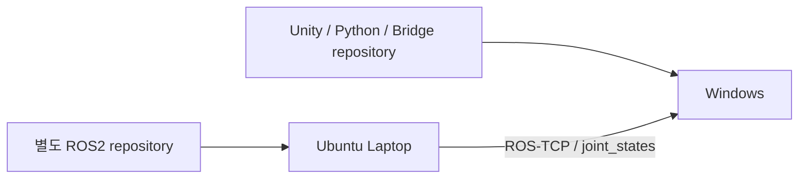

<a id="top"></a>

# 14. Deployment / 실행 환경

## 배포 구성

| 환경 | 역할 |
|---|---|
| Windows / Unity 6000.3.15f1 | Digital Twin, GUI, Camera |
| Python + NumPy | offline MDH case 계산 및 export |
| Windows / .NET Framework 4.8.1 | C# read-only Bridge |
| Ubuntu 24.04.4 / ROS2 Jazzy | Gazebo Sim 8, MoveIt2, ros2_control, ROS-TCP |
| Cocktail Robot Demo | 실제 FR5 SDK 제어 경험과 시연 |



ROS2 source는 [feat/fr5-gazebo-jig-attach-detach](https://github.com/seongyeop-dev/fr5_ros2_ws/tree/feat/fr5-gazebo-jig-attach-detach)에 있습니다.
개발 PC의 build/install/log를 복사하지 않고 노트북에서 source 기반 fresh build했습니다.

## ROS2 실행 환경

```text
Ubuntu 24.04.4 LTS
ROS2 Jazzy / Gazebo Sim 8 / MoveIt2
ROS_DOMAIN_ID=90
python3-gz-msgs10
python3-gz-transport13
```

Workcell, controller, MoveIt2, Planning Scene이 먼저 구성된 Simulation 환경에서
Master의 `FR5_TAKE=1..7/ALL`과 명시적 `--execute`를 사용합니다.
TAKE8은 사용하지 않습니다.

headless 실행 구성:

```bash
ros2 launch fr5_gazebo fr5_workcell.launch.py \
  gz_args:="-s -r"
```

[노트북 실행 결과](15_laptop_ros2_simulation_runtime.md)

## ROS2 / Unity topic 계약

| Topic | Type / 역할 |
|---|---|
| `/joint_states` | sensor_msgs/JointState, Gazebo feedback |
| `/fr5/unity_command` | std_msgs/String JSON, 기존 명령 |
| `/fr5/command_status` | std_msgs/String JSON, 명령 응답 |
| `/fr5/joint_states` | 별도 테스트 publisher |

Unity ROS-TCP Connector와 Endpoint의 network 설정을 대응시킵니다.
ROS2 listener의 command 집합과 별도 TAKE Master entry point를 분리합니다.

## Python subset

저장소 root에서:

```powershell
python -m pip install -r Python/requirements.txt
python -B -m unittest discover -s Python/Phase1_Kinematics/Tests -p "test_*.py"
python -B Python/Phase1_Kinematics/GroundTruth/fr5_pose_case_runner.py --output-dir "$env:TEMP/FR5_MDH_Results"
```

`groundtruth_single_runner.py`는 `Assets/StreamingAssets/Input/current_joint.txt`의
6개 degree를 읽어 기존 readable TXT를 출력합니다.
공개 root/Assets와 개발 root/Unity/FAIRINO_FR5_DigitalTwin/Assets 배치를 지원합니다.
이 명령은 output 파일을 갱신하므로 단순 source 검토와 구분합니다.

## Bridge

.NET Framework 4.8.1 targeting 환경과 .NET SDK,
외부 FAIRINO DLL을 지정해 build합니다.
[SDK Interface](10_fr5_sdk_integration.md)에 build/mock 명령과 dependency를 설명했습니다.
Bridge source에는 로봇 motion 명령이 없으며 JSON feedback producer 역할만 수행합니다.

## Unity source / Scene 구성

이 묶음은 기존 tracked Scene·Runtime을 보존하고 누락 핵심 source를 추가한 저장소입니다.
Camera 배열, UI binding, Workcell 경유점은 Scene serialized reference이며
파일 존재만으로 개발 Scene의 모든 연결이 재구성되지는 않습니다.
기존 joint mapping·Scene·Prefab을 source 정리 과정에서 변경하지 않습니다.

## 생성물과 실행 결과

Library, Temp, Logs, Python cache/output, SDK bin/obj 및 recording은 source와 분리합니다.
FHD 1080p30 Recording 구성과 Camera 사용 방법은
[Camera & Recording](16_unity_camera_and_recording.md)에 정리했습니다.

---

## 문서 목차

| 구분 | 바로가기 |
| --- | --- |
| **프로젝트** | [프로젝트 README](../README.md) · [전체 문서 인덱스](README.md) |
| **기본 문서** | [01 Overview](01_overview.md) · [02 Architecture](02_architecture.md) · [03 Features](03_features.md) · [04 Data Flow](04_data_flow.md) · [05 Validation](05_validation.md) · [06 Scope](06_project_scope.md) · [07 Structure](07_project_structure.md) |
| **상세 기술 문서** | [08 ROS2 / Gazebo / MoveIt2](08_ros2_gazebo_moveit.md) · [09 Unity Digital Twin](09_unity_digital_twin.md) · [10 FR5 SDK](10_fr5_sdk_integration.md) · [11 Motion & Slot Validation](11_motion_and_slot_validation.md) · [12 Script Reference](12_script_reference.md) · [13 Design Decisions](13_design_decisions_and_issues.md) · [14 Deployment](14_deployment_and_handoff.md) · [15 Simulation Runtime](15_laptop_ros2_simulation_runtime.md) · [16 Camera & Recording](16_unity_camera_and_recording.md) |
| **수학 · 기구학 검증** | [Validation 문서](05_validation.md) · [Motion Validation](11_motion_and_slot_validation.md) · [MDH Parameters](../Python/Phase1_Kinematics/Python_MDH/fr5_mdh_params.py) · [Python FK Solver](../Python/Phase1_Kinematics/Python_MDH/fr5_fk_solver.py) · [Kinematics Tests](../Python/Phase1_Kinematics/Tests/) |
| **실제 FR5 · Cocktail Demo** | [Demo Hub](../demos/README.md) · [FR5 SDK Cocktail Robot Demo](../demos/01_fr5_sdk_cocktail_robot_demo/README.md) |
| **ROS2 Simulation** | [ROS2 / Gazebo / MoveIt2 문서](08_ros2_gazebo_moveit.md) · [fr5_ros2_ws Repository](https://github.com/seongyeop-dev/fr5_ros2_ws) |

[문서 목록으로 이동](README.md)
