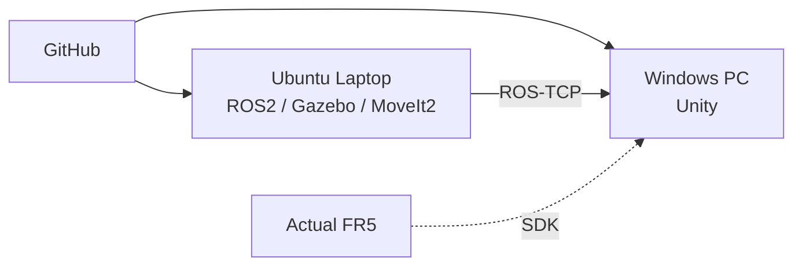
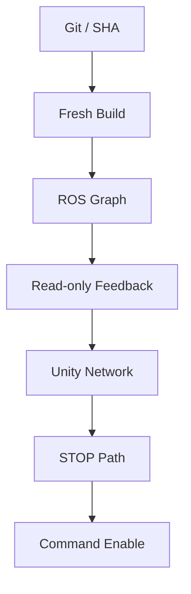

<a id="top"></a>

# 14. Deployment & Laptop Handoff

> Source, build artifact, Runtime environment를 구분하고 **Git lineage + 보호 SHA + fresh build**로 Simulation 기준을 노트북에 재현했습니다.

[문서 목차](README.md) · [프로젝트 README](../README.md) · [Laptop Runtime](15_laptop_ros2_simulation_runtime.md)

## Source of Truth

| 항목 | 기준 |
|:---|:---|
| ROS2 Repository | `git@github.com:seongyeop-dev/fr5_ros2_ws.git` |
| Branch | `feat/fr5-gazebo-jig-attach-detach` |
| Workspace | `~/fr5_ros2_ws` |
| Development baseline | `46cf3ace69154e8befb2fb3a78686cd931c3428a` |
| Laptop Final HEAD | `f02799cfd3126210ef72238990861c9c027c84af` |
| Local / Remote parity | PASS |
| Unity Repository | `fr5-unity-digital-twin` |

## Locked Motion Assets

| Asset | SHA256 |
|:---|:---|
| Motion Master | `80009dda5e196e8afbc4242bd859a35b5982d0efef531fdcc9286293f4ae59be` |
| Slot YAML | `b823401d6c77037ec35502a8e11ac35692f6f4a86ff7bf6c8efb8825a3f486e6` |
| Workcell World | `dac1c53f068aa56dd497cf3f66e64559dda1af010584566c71d96bf95104be65` |
| Workcell Launch | `a6b8c094d9653ae3bc65fcd56df2714d912f5fee78bec51dd1e7c56b50daead6` |
| Gazebo Control Launch | `d2fd8e715b99ea1d65e1519b1cb8f198dfb09f8f48e61e31f13ded0f7edb907f` |

## Deployment Topology



## Laptop Migration

1. 기존 Workspace 상태 확인
2. Git lineage / remote / branch / dirty 확인
3. 안전한 fast-forward만 수행
4. 불확실하면 기존 Workspace 보존
5. 보호 SHA 확인
6. `build/install/log` 복사 금지
7. fresh `colcon build --symlink-install`
8. read-only preflight
9. Simulation execute

## Runtime Environment

```text
Ubuntu 24.04.4
ROS2 Jazzy
Gazebo Sim 8
MoveIt2
ROS_DOMAIN_ID=90
```

Gazebo Python binding:

```text
python3-gz-msgs10
python3-gz-transport13
```

Headless:

```bash
ros2 launch fr5_gazebo fr5_workcell.launch.py \
  gz_args:="-s -r"
```

## ROS2 Command Contract

Listener:

```text
src/fr5_ros2_bridge/fr5_ros2_bridge/fr5_unity_command_listener.py
```

Topics:

| Topic | Type / 역할 |
|:---|:---|
| `/fr5/unity_command` | `std_msgs/msg/String` JSON command |
| `/fr5/command_status` | `std_msgs/msg/String` JSON status |
| `/joint_states` | Robot joint feedback |

Legacy commands:

```text
MOVE_J
HOME
RESET
STOP
GRIPPER_OPEN
GRIPPER_SMALL_CLOSE
GRIPPER_NORMAL_CLOSE
GRIPPER_RETURN_OPEN
```

## TAKE Boundary

| 계층 | 상태 |
|:---|:---:|
| Master `FR5_TAKE=1..7` | PASS |
| Master `ALL` | PASS |
| TAKE8 | OUT OF SCOPE |
| Listener `RUN_TAKE` | PENDING |
| request/status correlation | PENDING |
| active Master STOP | PENDING |

Unity Slot UI의 존재와 Backend RUN_TAKE의 존재를 같은 것으로 취급하지 않습니다.

## Development PC / Laptop 역할

### Laptop

- Gazebo
- MoveIt2
- RViz
- Final Motion Master
- ROS-TCP Endpoint

### Windows Development PC

- Unity Digital Twin
- GUI
- Camera / Recorder
- SDK Runtime 구조
- 최종 Integration 촬영

## Pre-Hardware Validation



Build 성공이나 Simulation `--execute`는 Actual Robot command 허가가 아닙니다.

## 현재 남은 Integration

- ROS-TCP Endpoint ↔ Windows Unity Live
- `/joint_states` live sync
- Camera framing / simultaneous filming
- Recorder sample MP4
- `RUN_TAKE` dispatch / correlation
- active Master STOP
- Actual FR5 feedback / command / safety

노트북 Source 복원과 Simulation Runtime 검증은 더 이상 Pending이 아닙니다.

---

[↑ 맨 위로](#top) · [문서 목차](README.md) · [프로젝트 README](../README.md)
