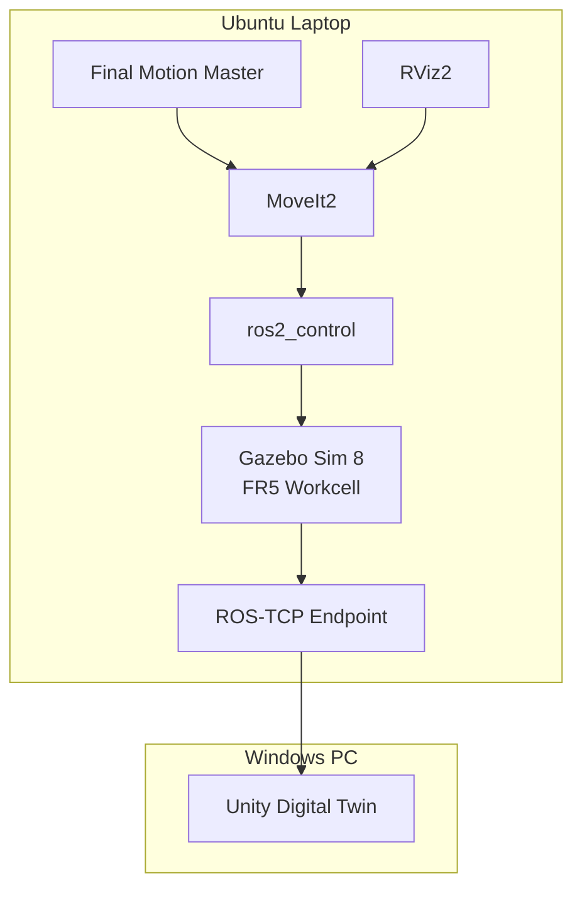

<a id="top"></a>

# 15. Laptop ROS2 Simulation Runtime

> 개발 PC에서 확정한 FR5 Simulation 기준을 Ubuntu Laptop에서 **fresh build → headless Runtime → Planning Scene → TAKE1~TAKE7** 순으로 다시 검증했습니다.

[문서 목차](README.md) · [프로젝트 README](../README.md) · [Deployment](14_deployment_and_handoff.md)

## 핵심 결과

| 항목 | 결과 |
|:---|:---|
| OS | Ubuntu 24.04.4 LTS |
| ROS2 | Jazzy |
| Gazebo | Gazebo Sim 8 |
| MoveIt2 | PASS |
| Laptop HEAD | `f02799cfd3126210ef72238990861c9c027c84af` |
| Remote parity | PASS |
| Fresh build | PASS |
| true headless RTF | `0.998` |
| headless + MoveIt2 RTF | `0.997` |
| TAKE1→TAKE7 | PASS |
| Final return code | `0` |
| Slot08 | EMPTY / TAKE8 unused |

## Runtime Architecture



## Source / Build Migration

개발 PC의 `build/`, `install/`, `log/`를 복사하지 않고 Laptop에서 source 기준으로 fresh build했습니다. 기존 local backup과 untracked 파일은 삭제하지 않고 보존했습니다.

Final Runtime commit:

```text
f02799cfd3126210ef72238990861c9c027c84af
```

## Gazebo Python Dependency

Final Master `--execute` 경로:

```python
from gz.msgs10.boolean_pb2 import Boolean
from gz.msgs10.pose_pb2 import Pose
from gz.transport13 import Node
```

필요 package:

```text
python3-gz-msgs10
python3-gz-transport13
```

Import와 `Node()` 생성까지 확인했습니다.

## True Headless Runtime

Gazebo GUI + RViz 동시 실행에서 Simulation RTF가 낮아 Master wall-clock timeout이 먼저 발생했습니다. Robot이 최종 target에 도달하는 것을 확인해 Motion 문제와 performance 문제를 분리했습니다.

Motion을 재튜닝하지 않고 `gz_args` 전달을 추가했습니다.

```bash
ros2 launch fr5_gazebo fr5_workcell.launch.py \
  gz_args:="-s -r"
```

실제 process:

```text
gz sim -s -r .../fr5_workcell.sdf
```

| Runtime | RTF |
|:---|---:|
| Gazebo true headless | `0.998` |
| Gazebo true headless + MoveIt2 | `0.997` |

## Planning Scene

| Object | Elements |
|:---|---:|
| `gazebo_fr5_robot_table_v2` | 6 |
| `gazebo_fr5_magazine_visual_probe` | 46 |
| `gazebo_fr5_magazine_conveyor_probe` | 7 |
| `gazebo_fr5_jig_place_conveyor_probe` | 200 |

```text
OBJECT_COUNT=4
UNEXPECTED_WORLD_OBJECTS=NONE
```

ACM:

```text
table <-> link1 = True
table <-> base_link/link2~link6/tool0 = False
```

## Source Magazine Inventory

```text
Slot01 : Jig
Slot02 : Jig
Slot03 : Jig
Slot04 : Jig
Slot05 : Jig
Slot06 : Jig
Slot07 : Jig
Slot08 : EMPTY
```

Slot08 bracket geometry는 존재하지만 Jig model은 spawn하지 않습니다.

## Final TAKE Revalidation

Master:

```text
src/fr5_moveit_config/scripts/slot01_to_slot08_final_one_take.py
```

SHA256:

```text
80009dda5e196e8afbc4242bd859a35b5982d0efef531fdcc9286293f4ae59be
```

Result:

```text
FINAL ONE-TAKE TAKE1 -> TAKE7 PASS
FINAL_MASTER_RETURN_CODE=0
TAKE1_TO_TAKE7_FINAL_SIMULATION=PASS
```

Motion 기준은 개발 PC에서 검증한 Master를 유지했고 Laptop 성능 문제 해결을 위해 Pose / IK / Slot Motion을 다시 튜닝하지 않았습니다.

## Locked Runtime Assets

| Asset | SHA256 |
|:---|:---|
| Final Motion Master | `80009dda5e196e8afbc4242bd859a35b5982d0efef531fdcc9286293f4ae59be` |
| Slot YAML | `b823401d6c77037ec35502a8e11ac35692f6f4a86ff7bf6c8efb8825a3f486e6` |
| Workcell World | `dac1c53f068aa56dd497cf3f66e64559dda1af010584566c71d96bf95104be65` |
| Workcell Launch | `a6b8c094d9653ae3bc65fcd56df2714d912f5fee78bec51dd1e7c56b50daead6` |
| Gazebo Control Launch | `d2fd8e715b99ea1d65e1519b1cb8f198dfb09f8f48e61e31f13ded0f7edb907f` |

## Validation Boundary

현재 PASS:

- Source migration / Git parity
- Fresh ROS2 build
- Gazebo / ros2_control
- `/clock`, `/joint_states`
- MoveIt2 / Planning Scene
- RViz 표시
- Slot01~07 / Slot08 EMPTY
- true headless
- TAKE1~TAKE7 execute

다음:

```text
Laptop Gazebo / MoveIt / RViz
        ↓ ROS-TCP
Windows Unity Digital Twin
        ↓
동시 화면 / 촬영
```

그 이후:

```text
Actual FAIRINO FR5
        ↓ SDK
Unity Digital Twin
```

Simulation PASS, Unity Live Integration PASS, Actual Robot PASS는 서로 다른 검증 상태입니다.

---

[↑ 맨 위로](#top) · [문서 목차](README.md) · [프로젝트 README](../README.md)
