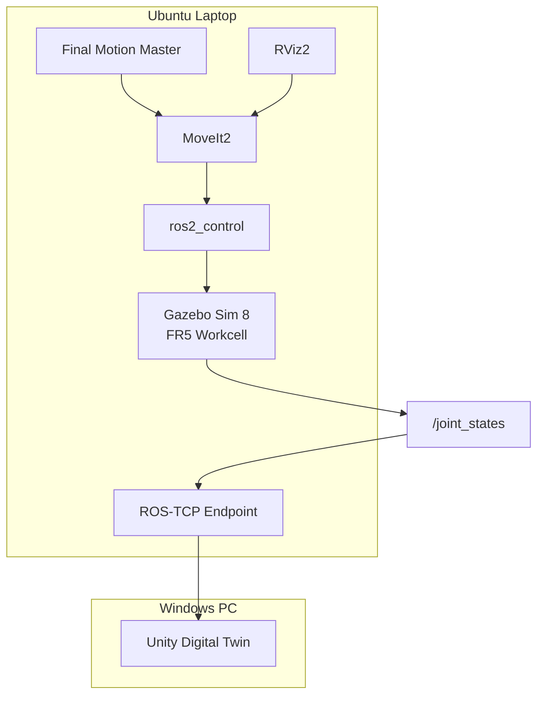

<a id="top"></a>

# 15. Laptop ROS2 Simulation Runtime

> 개발 PC에서 확정한 FR5 Simulation 기준을 Ubuntu Laptop에서 **fresh build → headless Runtime → Planning Scene → TAKE1~TAKE7** 순으로 다시 검증했습니다.

[문서 목차](README.md) · [프로젝트 README](../README.md) · [Deployment](14_deployment_and_handoff.md)

## 핵심 결과

| 항목 | 결과 |
|:---|:---|
| OS | Ubuntu 24.04.4 LTS |
| ROS2 | Jazzy |
| Gazebo | Gazebo Sim 8 |
| MoveIt2 | PASS |
| Remote parity | PASS |
| Fresh build | PASS |
| true headless RTF | `0.998` |
| headless + MoveIt2 RTF | `0.997` |
| TAKE1→TAKE7 | PASS |
| Final return code | `0` |
| Slot08 | EMPTY / TAKE8 unused |

## Runtime Architecture



## Source / Build Migration

개발 PC의 `build/`, `install/`, `log/`를 복사하지 않고 Laptop에서 source 기준으로 fresh build했습니다. 기존 local backup과 untracked 파일은 삭제하지 않고 보존했습니다.
## Runtime 구성

[최종 ROS2 branch](https://github.com/seongyeop-dev/fr5_ros2_ws/tree/feat/fr5-gazebo-jig-attach-detach)의 source를 사용합니다.

## Gazebo Python Dependency

통합 모션 시퀀스 `--execute` 경로:

```python
from gz.msgs10.boolean_pb2 import Boolean
from gz.msgs10.pose_pb2 import Pose
from gz.transport13 import Node
```

필요 package:

```text
python3-gz-msgs10
python3-gz-transport13
```

Import와 `Node()` 생성까지 확인했습니다.

## True Headless Runtime

Gazebo GUI + RViz 동시 실행에서 Simulation RTF가 낮아 Master wall-clock timeout이 먼저 발생했습니다. Robot이 최종 target에 도달하는 것을 확인해 Motion 문제와 performance 문제를 분리했습니다.

Motion을 재튜닝하지 않고 `gz_args` 전달을 추가했습니다.

```bash
ros2 launch fr5_gazebo fr5_workcell.launch.py \
  gz_args:="-s -r"
```

실제 process:

```text
gz sim -s -r .../fr5_workcell.sdf
```

| Runtime | RTF |
|:---|---:|
| Gazebo true headless | `0.998` |
| Gazebo true headless + MoveIt2 | `0.997` |

## Planning Scene

| Object | Elements |
|:---|---:|
| `gazebo_fr5_robot_table_v2` | 6 |
| `gazebo_fr5_magazine_visual_probe` | 46 |
| `gazebo_fr5_magazine_conveyor_probe` | 7 |
| `gazebo_fr5_jig_place_conveyor_probe` | 200 |

```text
OBJECT_COUNT=4
UNEXPECTED_WORLD_OBJECTS=NONE
```

ACM:

```text
table <-> link1 = True
table <-> base_link/link2~link6/tool0 = False
```

## Source Magazine Inventory

```text
Slot01 : Jig
Slot02 : Jig
Slot03 : Jig
Slot04 : Jig
Slot05 : Jig
Slot06 : Jig
Slot07 : Jig
Slot08 : EMPTY
```

Slot08 bracket geometry는 존재하지만 Jig model은 spawn하지 않습니다.

## TAKE Revalidation

Master:

```text
src/fr5_moveit_config/scripts/slot01_to_slot08_final_one_take.py
```
Result:

```text
FINAL ONE-TAKE TAKE1 -> TAKE7 PASS
FINAL_MASTER_RETURN_CODE=0
TAKE1_TO_TAKE7_FINAL_SIMULATION=PASS
```

Motion 기준은 개발 PC에서 검증한 Master를 유지했고 Laptop 성능 문제 해결을 위해 Pose / IK / Slot Motion을 다시 튜닝하지 않았습니다.

## 주요 Runtime 구성

| 구성 | 역할 |
|:---|:---|
| Gazebo Workcell | FR5와 설비 물리 시뮬레이션 |
| MoveIt2 | Motion Planning과 Trajectory 실행 |
| ros2_control | Arm / Gripper Controller |
| Planning Scene | Robot 주변 설비 Collision 구성 |
| Motion Script | TAKE1~TAKE7 순차 실행 |

## 실행 결과 요약

노트북 source 기반 build, Gazebo/ros2_control, clock/joint_states, MoveIt2/Planning Scene,
Slot01~07/Slot08 EMPTY, true headless 및 TAKE1~TAKE7 실행을 확인했습니다.

Unity 연결은 ROS-TCP의 JointState 기반 Runtime 연동 구조로 설명합니다.
실제 FR5 SDK 제어 경험은 [Cocktail Robot Demo](../demos/README.md)에 별도로 정리했습니다.

---

## 문서 목차

| 구분 | 바로가기 |
| --- | --- |
| **프로젝트** | [프로젝트 README](../README.md) · [전체 문서 인덱스](README.md) |
| **기본 문서** | [01 Overview](01_overview.md) · [02 Architecture](02_architecture.md) · [03 Features](03_features.md) · [04 Data Flow](04_data_flow.md) · [05 Validation](05_validation.md) · [06 Scope](06_project_scope.md) · [07 Structure](07_project_structure.md) |
| **상세 기술 문서** | [08 ROS2 / Gazebo / MoveIt2](08_ros2_gazebo_moveit.md) · [09 Unity Digital Twin](09_unity_digital_twin.md) · [10 FR5 SDK](10_fr5_sdk_integration.md) · [11 Motion & Slot Validation](11_motion_and_slot_validation.md) · [12 Script Reference](12_script_reference.md) · [13 Design Decisions](13_design_decisions_and_issues.md) · [14 Deployment](14_deployment_and_handoff.md) · [15 Simulation Runtime](15_laptop_ros2_simulation_runtime.md) · [16 Camera & Recording](16_unity_camera_and_recording.md) |
| **수학 · 기구학 검증** | [Validation 문서](05_validation.md) · [Motion Validation](11_motion_and_slot_validation.md) · [MDH Parameters](../Python/Phase1_Kinematics/Python_MDH/fr5_mdh_params.py) · [Python FK Solver](../Python/Phase1_Kinematics/Python_MDH/fr5_fk_solver.py) · [Kinematics Tests](../Python/Phase1_Kinematics/Tests/) |
| **실제 FR5 · Cocktail Demo** | [Demo Hub](../demos/README.md) · [FR5 SDK Cocktail Robot Demo](../demos/01_fr5_sdk_cocktail_robot_demo/README.md) |
| **ROS2 Simulation** | [ROS2 / Gazebo / MoveIt2 문서](08_ros2_gazebo_moveit.md) · [fr5_ros2_ws Repository](https://github.com/seongyeop-dev/fr5_ros2_ws) |

[문서 목록으로 이동](README.md)
