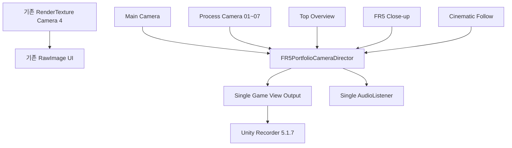
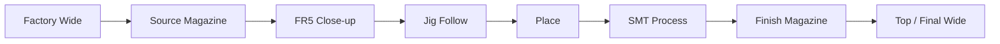

<a id="top"></a>

# 16. Unity Camera & Recording

> 최종 포트폴리오 촬영을 위해 기존 Process Camera를 재사용하고 **10-shot Camera Director + Follow + Unity Recorder** 구조를 추가했습니다.

[문서 목차](README.md) · [프로젝트 README](../README.md) · [Unity Digital Twin](09_unity_digital_twin.md)

## 목적

외부 Screen Capture만 사용하면 다음 장면을 각각 깨끗하게 확보하기 어렵습니다.

- 전체 Workcell
- Source Magazine Pick
- FR5 Arm Close-up
- Jig Follow
- Conveyor Place
- SMT Process
- Finish Magazine

따라서 두 촬영 방식을 분리합니다.

| 촬영 | 목적 |
|:---|:---|
| Unity Recorder | Clean B-roll / 공정별 Shot |
| 외부 Screen Capture | Gazebo + RViz + Unity 동시 Integration 화면 |

## Camera Architecture



기존 RenderTexture Camera UI를 삭제하거나 Director 대상에 넣지 않습니다.

## Camera Inventory

Scene Verify 기준:

```text
Total Camera = 15
4 RenderTexture Cameras
1 Main Camera
10 Portfolio Shot Cameras
```

Portfolio shot:

| Key | GameObject | 용도 |
|:---:|:---|:---|
| `1` | `Cam_01_FR5_Cell` | 전체 공정 / FR5 Cell |
| `2` | `Cam_02_Source_Magazine` | 공급 매거진 |
| `3` | `Cam_03_Jig_Insert` | 지그 삽입 |
| `4` | `Cam_04_Mounter` | 마운터 |
| `5` | `Cam_05_Inspection` | 검사 |
| `6` | `Cam_06_Conveyor02` | 컨베이어 02 |
| `7` | `Cam_07_Unloader` | 언로더 / Finish 흐름 |
| `8` | `Cam_08_Top_Overview` | 전체 상단 |
| `9` | `Cam_09_FR5_Closeup` | FR5 근접 |
| `0` | `Cam_10_Cinematic_Follow` | 지그 / Tool 추적 |
| `` ` `` | Main | 기본 화면 |

## Camera Director

`FR5PortfolioCameraDirector.cs`

책임:

- manual shot selection
- Main fallback
- 한 번에 하나의 Game View Camera
- AudioListener 하나 유지
- keyboard shortcuts
- 관찰 전용 sequence
- RenderTexture Camera 보존

Camera sequence는 Robot / Conveyor / RUN_TAKE 명령을 호출하지 않습니다.

## Cinematic Follow

`FR5PortfolioCameraFollow.cs`

- target reference
- position offset
- look offset
- damping
- target null safe
- Camera Transform만 변경

Robot, Jig, Process Transform을 Camera가 수정하지 않습니다.

## Scene Configuration Verify

Read-only Verify 결과:

```text
15 Cameras
4 RT + Main + 10 shots
1 Game View output
1 AudioListener
1 STOP listener
Workcell Text bound
```

Play Mode에서 `1~9`, `0`, Main 전환에 문제가 없는 것을 확인했습니다.

최종 Camera pose/FOV는 실제 ROS2 Integration 촬영 시 Jig와 Arm의 실제 Runtime motion을 보며 조정합니다.

## Unity Recorder

Package:

```text
com.unity.recorder@5.1.7
```

설정:

| 항목 | 값 |
|:---|:---|
| Recorder | Movie Clip |
| Source | Game View |
| Resolution | FHD 1080p |
| Aspect | 16:9 |
| Encoder | Unity Media Encoder |
| Codec | H.264 MP4 |
| Quality | High |
| Playback | Constant |
| Target FPS | 30 |
| Cap FPS | ON |
| Audio | OFF |
| File | `FR5_Portfolio_1080p30` |
| Output | `Project/Recordings` |

Game View editor viewport가 1920×1080이 아니어도 Recorder가 녹화 시 target resolution을 적용합니다.

현재 실제 5~10초 MP4 sample 생성/재생 확인은 PENDING입니다.

## Workcell Status UI

Camera 작업과 함께 Runtime Status text를 실제 Panel에 연결했습니다.

표시 범위:

- Process
- Phase
- 완료 수
- 최근 Source
- Finish 사용 수

`FR5`, `ROS2`, `SDK`, `TCP` 같은 고유 기술명은 영문을 유지하고 사용자 상태 표현은 한국어 중심으로 정리합니다.

## STOP Listener

기존 Scene에는 동일 STOP path가 두 번 연결된 상태가 있었습니다.

최종 Verify:

```text
Btn_StopMotion
→ scr_FR5UICommandRouter.OnClickStopMotion()

listener count = 1
```

legacy STOP의 의미는 ROS2 hold trajectory이며 Actual Hardware Emergency Stop으로 해석하지 않습니다.

## UI Button Audit

Read-only Live Scene Audit:

| 항목 | 결과 |
|:---|---:|
| Total Button | 96 |
| Persistent listener = 1 | 85 |
| Persistent listener = 0 | 9 |
| Persistent listener = 2 | 2 |
| Missing Target | 0 |
| Missing Method | 0 |
| Missing Script | 0 |

### 추가 source trace 대상

2 listeners:

```text
Btn_ResetToolOffset
Btn_RESET VIEW
```

wrapper와 `OnClickReset()`이 실제 중복 호출인지 source body 확인 후 판단합니다.

0 persistent listeners:

```text
Btn_OneTakeAll
Btn_Slot01
Btn_Slot02
Btn_Slot03
Btn_Slot04
Btn_Slot05
Btn_Slot06
Btn_Slot07
Btn_Slot08_EMPTY
```

이 버튼들은 Runtime `AddListener` 가능성이 있으므로 Edit Mode persistent listener 수만으로 “연결 끊김”으로 판정하지 않습니다.

`enableTakeDispatch=false` 기본값은 유지하며 Backend RUN_TAKE가 구현되기 전 실제 TAKE 실행 완료로 표시하지 않습니다.

## 촬영 계획



### Unity B-roll

- Factory Wide
- Robot Arm
- Source Magazine
- Jig Follow
- SMT Process
- Finish Magazine
- Cinematic sequence

### Integration Capture

- Gazebo
- RViz / MoveIt
- Windows Unity
- 동일 JointState 동작

### Hardware Capture

Actual FR5 SDK 연결 후 별도 촬영합니다.

## 검증 상태

| 항목 | 상태 |
|:---|:---:|
| Camera setup | PASS |
| Game View single output | PASS |
| AudioListener single | PASS |
| Camera switching | PASS |
| Follow code/static | PASS |
| Recorder install | PASS |
| Recorder config | PASS |
| MP4 sample | PENDING |
| final framing | PENDING |
| ROS2 Live filming | PENDING |
| Actual Robot filming | PENDING |

---

[↑ 맨 위로](#top) · [문서 목차](README.md) · [프로젝트 README](../README.md)
